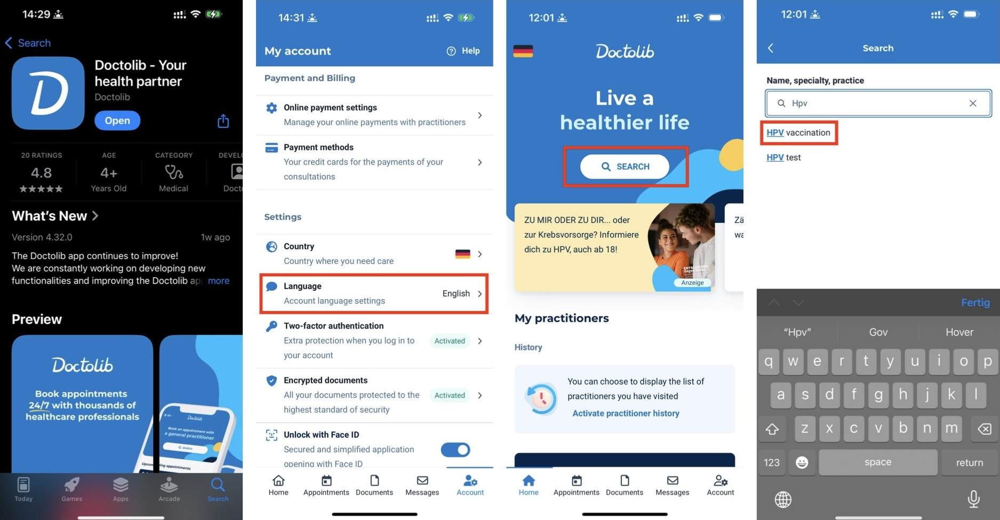
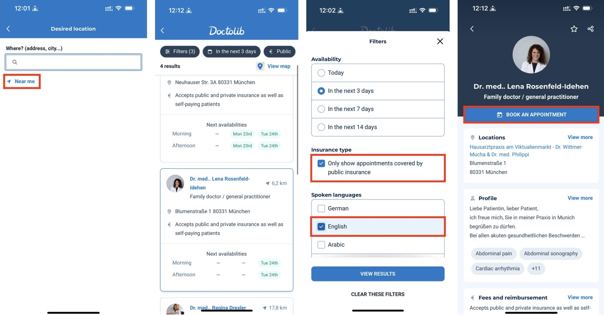
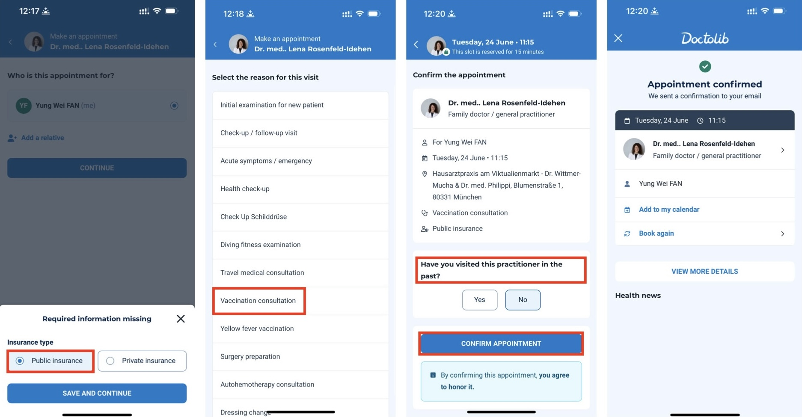
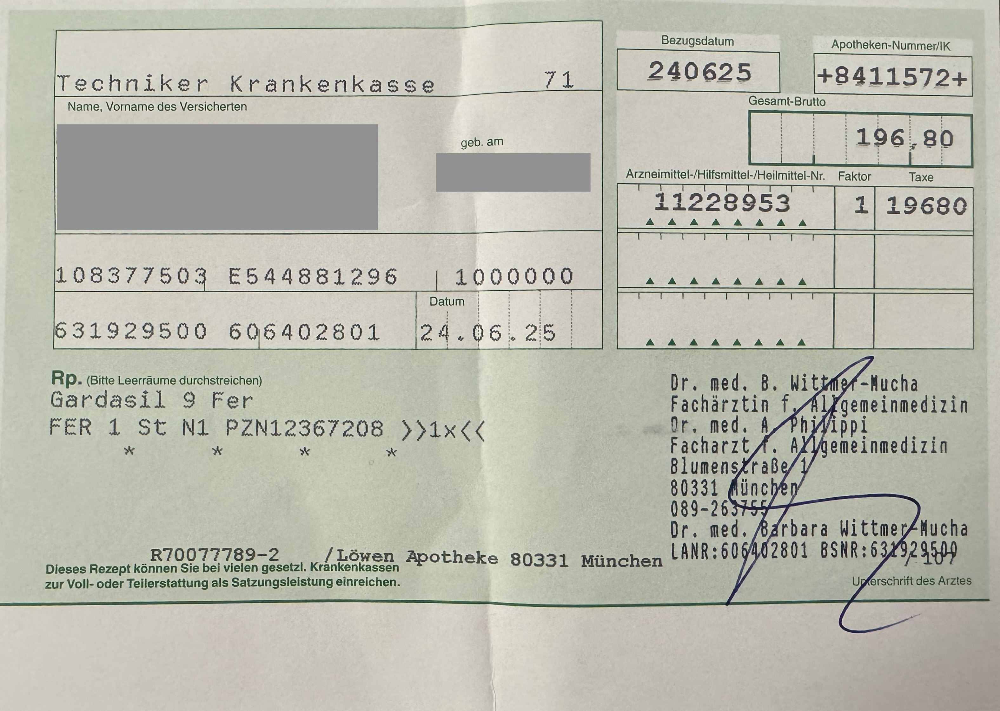
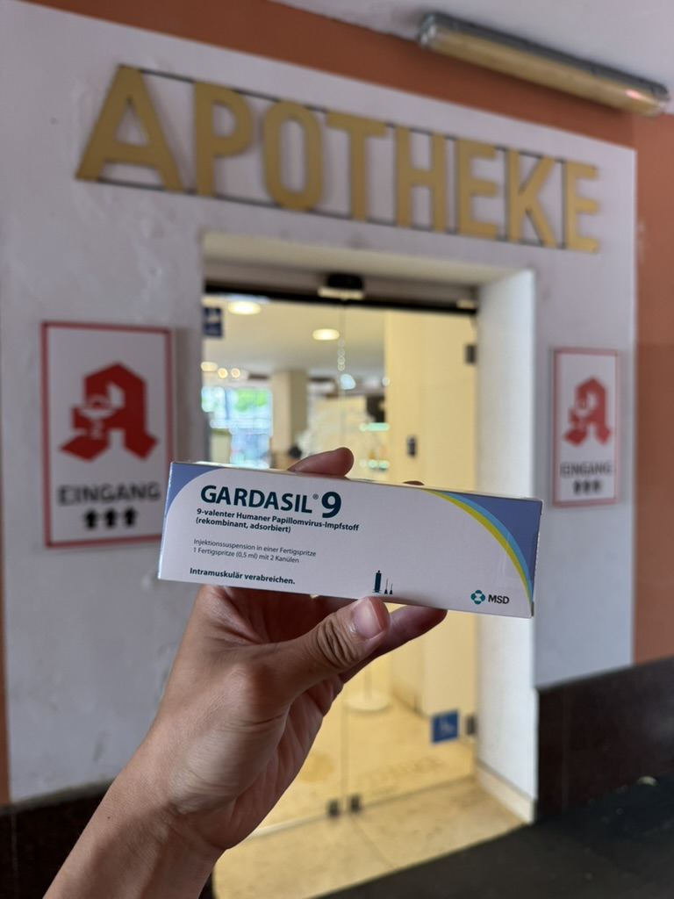
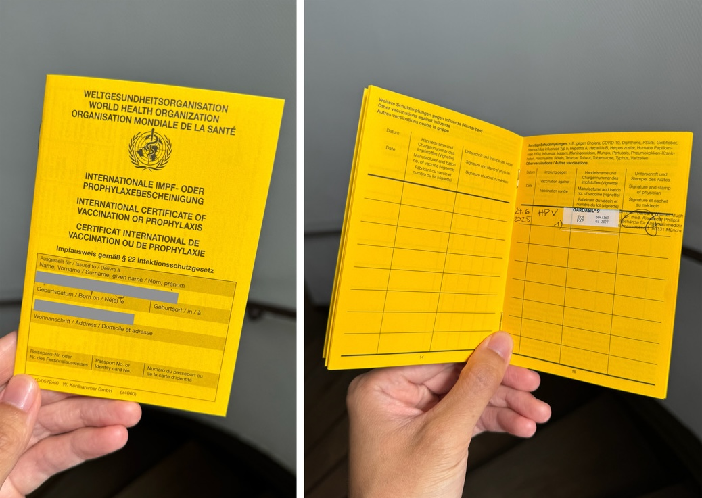
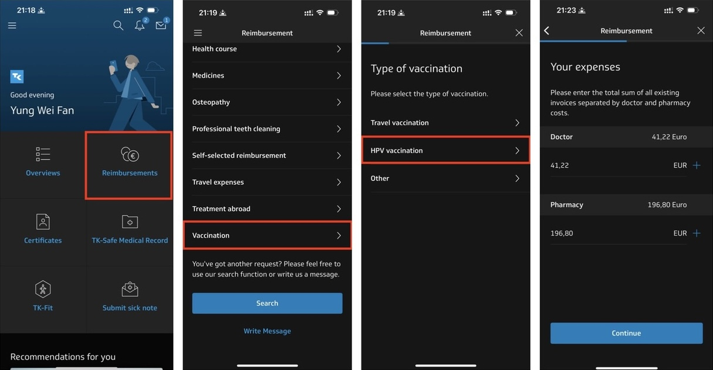
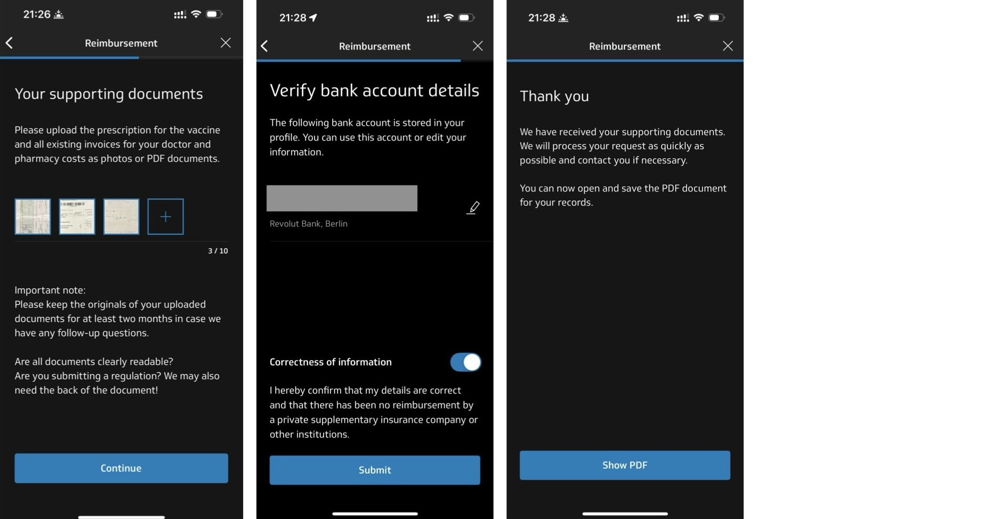

在德國留學或交換，**醫療保險（Krankenkasse）是強制性的**，不論是公保還是私保，每位學生都必須投保。而不同的保險公司所涵蓋的福利也略有差異。以我投保的 Techniker Krankenkasse（簡稱 TK）為例，除了基本醫療保障外，還包括疫苗接種、牙齒檢查等額外福利。其中最讓人驚喜的，就是**可以免費施打 HPV 疫苗**！

TK 每個月的保費高達 144 歐元，說實話不算便宜。既然已經繳了這麼多錢，當然要好好善用這些資源。更何況，**HPV 疫苗在台灣是需要全額自費的項目**，以九價疫苗為例，單劑價格約為新台幣 5,400 至 7,000 元，完整三劑療程下來的花費相當可觀。

## 💉 誰有資格免費接種？ 

只要你是 **26 歲以下、不論性別**，而且有投保主流公保（如 TK、DAK 等），**就可以全額報銷 HPV 疫苗的費用**。這項福利對留學生或年輕工作者來說非常實用。

## 💡 德國 vs 台灣 HPV 價格對比（以九價疫苗為例）

| 地區     | 單劑價格           | 三劑總價             | 是否健保補助         |
| ------ | -------------- | ---------------- | -------------- |
| 台灣     | NT$5,400～7,000 | NT$16,200～21,000 | ❌ 完全自費         |
| 德國（公保） | €0             | €0               | ✅ 全額核銷（26 歲以下） |

---

## 📋 實際流程總覽（從預約到核銷）

以下是 HPV 疫苗的整體施打流程，文章接下來也會針對每個步驟詳細說明：

（可點選快速跳轉）

1. [**線上預約家庭醫生**（建議使用 Doctolib）](#-1-線上預約家庭醫生建議用-doctolib)
2. [**前往看診**](#-2-實際看診流程分享)
3. [**向 TK 核銷疫苗費用**](#-3-tk-核銷費用步驟以-app-操作為例)

接下來會一步步帶你完成整個流程，就算完全不會德文也不用擔心！

---

### 🧭 1. 線上預約家庭醫生（建議用 Doctolib）
  
預約家庭醫生（Hausarzt）的方法有很多，若你能用德文溝通，**可以直接打電話或寄 email 向診所預約**，也可以透過 TK 健保的 [醫生搜尋頁面](https://www.tk-aerztefuehrer.de/TK/Suche_SN/index.js?a=FS1) 找到住家附近的診所。不過這些平台多為德文介面，**對初來乍到或不熟悉德國就醫流程的人來說，操作起來可能會有些困難**。

我自己實測後，**最推薦也最方便的方法就是使用 Doctolib 線上預約平台**。這是德國非常常見的看診工具，App 和網站都支援英文介面，操作清楚流暢，非常適合不懂德文的使用者。你可以根據城市或郵遞區號篩選地點，也能查看每間診所提供的語言（有些醫生會標示會說英文），挑選離你最近、時間也合適的診所即可預約。

👉 小提醒：雖然**家庭醫生（Hausarzt）和婦科醫生（Frauenarzt）原則上都可以施打 HPV 疫苗**，但實際上**並非每間診所都提供此服務**，有時可能會被轉診或需另行安排。使用 Doctolib 預約時，**直接選擇「HPV vaccination」服務類型**，可以幫你快速篩選出真正提供施打的診所，避免白跑一趟。

#### 📱 手機操作步驟如下：

1. **下載 Doctolib 並註冊帳號**：開啟 App 後註冊帳號，登入後可進入帳戶設定，將語言切換為英文，操作起來更方便。

2. **回到主頁搜尋「HPV vaccination」**

3. **選擇地點**：可手動輸入城市或郵遞區號，或點選「Near me」讓 App 自動定位，推薦你附近的診所。

4. **使用上方 Filters 篩選條件**

- **Availability（可預約時間）**：快速找到空位時段
- **Insurance type（保險類型）**：預設為勾選，建議保留 ✅，系統才會只顯示支援公保的診所
- **Spoken languages（語言）**：可勾選英文，方便與醫師溝通

5. **選擇診所後點選「Book an appointment」**：點進診所頁面後，點選「Book an appointment」，接著選擇 **Public insurance**（若你是 TK、DAK 等公保保戶）。

6. **選擇就診目的（Appointment reason）**：此選項依診所而異，我預約時選的是 **Vaccination consultation**，請依實際情況選擇。

7. **選擇時段並確認預約**：選定合適的時間後，點選 **Confirm appointment** 即可完成預約。

📌 預約完成後，Doctolib 會寄送確認信到你的 Email，也可以隨時在 App 中查看預約紀錄。當天只要準時前往診所報到即可！

---

### 🩺 2. 實際看診流程分享

#### 🧳 需要攜帶的東西

- ✅ **健保卡**（TK 保險卡）
- 💳 **信用卡或現金**（需要先自費購買近 €200 的疫苗和支付施打費）

#### 🏥 看診流程

1. **到診所報到**：前往櫃檯出示健保卡，並說明你是來接種 HPV 疫苗。
2. **初診填資料**：若是初次就診，會需要填寫一些基本資料。
3. **等待看診**：填完資料後等待叫號，進診間與醫生簡單說明情況。
4. **醫生問診與開處方**：醫生可能會問你是否曾接種過 HPV 疫苗等基本問題。確認後會開立一張**處方簽（Rezept）**，讓你自行前往附近藥局購買疫苗。 ▼

5. **前往藥局（Apotheke）購買疫苗**：我當時購買的九價 HPV 疫苗，價格為 **€196.80**，需要先自費。**記得妥善保存收據與處方簽，之後才能向保險公司申請核銷！** ▼

6. **回診所施打**：將疫苗交給櫃檯。如果你是首次施打，醫師會同時幫你開一本**疫苗接種本（Impfpass）**。我當時支付的施打費用加上疫苗本，共 **€41.22**，**這筆費用同樣需要先自費，也請記得保留收據。** ▼

7. **施打疫苗**：接下來就會由醫師或護理師為你施打。
  
#### 📅 預約下一劑

- **第 1 與第 2 劑間隔至少 1 個月**
- **第 2 與第 3 劑間隔至少 3 個月**
- **三劑需在 12 個月內完成**
- **每次就診都需攜帶健保卡與疫苗本**

> 因為只待在德國半年，加上一開始沒特別安排時程，我最後在德國只能打前兩劑。建議有打算施打的讀者**儘早規劃**，才不會錯過三劑的時程哦！

---

### 💶 3. TK 核銷費用步驟（以 App 操作為例）

打完疫苗後，需要將費用向 TK 健保申請報銷。我是使用 **TK App 操作，非常方便**，也可以透過 [TK 官網](https://www.tk.de) 申請。

以下是透過 App 申請的完整流程：

1. **打開 TK App，點選主頁的「Reimbursements」**
2. **進入頁面後，下滑點選「Vaccination」**
3. **選擇疫苗類別，點選「HPV vaccination」**
4. **填寫相關費用資訊**：包含你在診所施打疫苗的費用，以及藥局購買疫苗時支付的金額。

5. **上傳相關證明文件**

- **處方簽（Rezept）**
- **藥局開立的收據（疫苗費用）**
- **診所收據（施打費用與疫苗本費用）**

6. **填寫銀行帳戶資訊 IBAN**：確認核銷後，TK 會將金額直接匯入你提供的德國銀行帳戶。

💡 我實際申請退費的經驗：

我在提交申請後，**兩天內就收到 TK App 的通知**，確認核銷金額，**再隔一天款項就匯入我的德國帳戶**，效率非常高！

我總共支付的費用為 **€238.02**，**TK 最後退還了 €228.02**，其中 **€10 為自費的注射費用**。換算下來，**我只花了不到台幣 400 元就完成 HPV 疫苗接種**，真的非常划算，也推薦大家把公保福利用好用滿 💪。

---

## 🔗 參考連結

- [德國醫療經驗分享 | 線上預約醫生、公保 HPV 疫苗費用報銷](https://www.willstudy.tw/tk-hpv/)
- [德國公保給付 HPV子宮頸癌疫苗 施打介紹 / 醫療費用報銷流程 – 留學計畫](https://www.willstudy.tw/deu-share-01/)
- [如何在德国注射HPV疫苗9价？预约、看诊、报销全流程攻略](https://www.dealmoon.de/guide/627)
- [【HPV子宮頸癌疫苗】施打經驗分享&費用報銷教學 - 久拉德國日記](https://chusdiary.com/2021/11/14/hpv%E5%AD%90%E5%AE%AE%E9%A0%B8%E7%99%8C%E7%96%AB%E8%8B%97-%E5%BE%B7%E5%9C%8B%E5%85%AC%E4%BF%9D%E7%B5%A6%E4%BB%98/)
