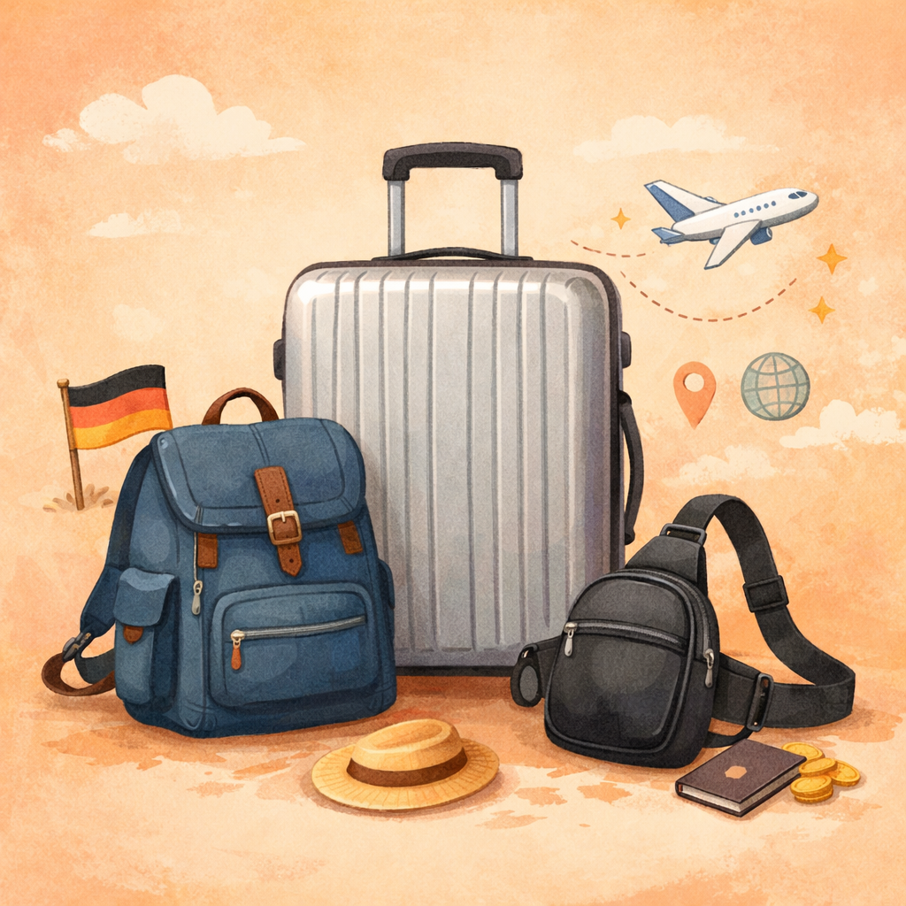

***拖了很久終於有第二篇了 XD，來看看出發前要準備些什麼吧！***

---

## 📍 出發背景簡介

- **交換時間**：2025 年 3 月 ～ 9 月（初春至夏末）
- **交換地點**：德國慕尼黑（位於南德，巴伐利亞州首府）

我是在 2025 年的夏季學期前往德國慕尼黑交換一學期，雖然學期從 4 月開始，但我大約 3 月初就啟程出發。這段期間橫跨了從**初春的濕冷**到**盛夏的高溫**，季節變化大，因此行李中同時準備了**厚外套與短袖衣物**。

這篇文章會依照我當時行前準備，以及抵達德國後的實際使用經驗，整理出一份**交換生行李清單**，幫助你在出發前做出更聰明的打包選擇。哪些東西是「**從台灣必帶**」、哪些是「**到德國再買就好**」的東西，特別是要如何在**有限的行李重量與空間中，帶齊真正需要的東西**，給你一些參考與靈感。

🧳 我的行李配置為：
- **29 吋託運行李箱**（限重 25 公斤）
- **一個後背包**（限重 7 公斤，登機隨身）
- **一個小胸包**（可放護照與貴重物品，防盜功能）

---

## 🧠 整理大原則：該帶的 vs. 到德國再買的

每個人的行李狀況當然不盡相同，以下是我在**德國生活後整理出的行李大原則與實例**，幫助你在猶豫是否該帶某件物品時**根據以下分類做出判斷**。

### 自己帶

- **必要文件與金錢**：護照、國際駕照、重要文件、歐元現金、信用卡...
- **亞洲人愛用**：小分裝瓶、可收納環保購物袋、免洗洗臉巾、密封夾、文具、痘痘貼、隨身面紙、摺疊衣架、環保筷、台灣調味料、歐洲轉接頭...
- **不想傷荷包**：厚外套、運動鞋、Wi-Fi 路由器、記憶卡、隱形眼鏡...
- **一落地就會用到的**：小份盥洗包、牙刷、毛巾、厚外套...
- **常備藥品**：感冒藥、止痛藥...

### 到德國再買

- **日常消耗品**：衛生紙、洗衣精、洗髮精、沐浴乳...
- **廚房與清潔**：鍋具、碗盤、菜瓜布、抹布、垃圾袋、靜電拖...
- **保健食品**：B 群、綜合維他命（dm 很多也便宜）...
- **家用電器**：[吹風機](#是否該帶吹風機)、熱水壺...
- **部分衣物**：夏季服裝、運動服...

<!--#### 哪裡買？

想知道德國生活用品採買更多細節： 👉 [交換生到德國後要做什麼](交換生到德國後要做什麼.md) #TODO-->

> 👉 想輕鬆準備到這邊就差不多了  
> 👉 但如果你想要看細節清單與更具體建議 → 請繼續看下一段！

---

## 🎒 行李清單與實際建議

分類如下（可點選跳轉，或直接看 👉 [完整清單](#-完整清單-)）：

- [📄 **必備證件與重要文件**](#-必備證件與重要文件)
- [👕 **衣物**](#-衣物)
- [🧴 **生活用品與盥洗備品**](#-生活用品與盥洗備品)
- [💊 **藥品與健康用品**](#-藥品與健康用品)
- [💻 **電子設備**](#-電子設備)
- [📦 **其他**](#-其他)

### 📄 必備證件與重要文件

像是**護照（含簽證）正本**、**信用卡**、**簽帳卡**、**歐元現金**、**重要文件影本**都是必備。重要文件舉例像是**入學許可**、**宿舍租賃合約**、**機票訂購證明**、**役男出境單等等**，可以參考我的 👉 [完整清單](#-完整清單-)。另外我也有準備**護照跟簽證影本**以備不時之需。

#### 📌 **實用建議**

- 建議將所有**重要文件印出收進文件袋，並放在隨身包**，方便入境查驗。
- 在還沒有學生證前，「**入學許可**」通常能臨時作為學生身分證明（例如購買學生票時）。
- 信用卡與簽帳卡務必**開通海外提款與刷卡功能**。
- 建議備幾張**證件照**，我當時有用在 ESN 卡上。（雖然幾乎沒用到那張卡的折扣，唉）
- 如有自駕需求，記得攜帶**國際駕照與台灣駕照正本**。

### 👕 衣物

依照季節與當地氣候準備，夏季學期的溫度變化大，從 0°C 的初春到 30°C 的盛夏都可能遇到。

#### 📌 **實用建議**

- 剛到時通常蠻冷，氣溫可能接近 0°C，但體感差不多是台灣寒流的濕冷，**保暖衣物建議準備齊全**。
- 亞洲人體型在歐洲不一定好買褲子，**建議長褲從台灣帶齊**。
- **牛仔褲耐穿**，旅行時也能穿多天再洗，推薦攜帶。
- 慕尼黑夏季最早大約六月中才會真正炎熱，**夏季衣物可視情況後期添購**；我則是為了省錢，選擇從台灣帶齊。
- **運動服與泳褲**可到德國後再去 Decathlon 買，便宜實用。
- **Uniqlo 在慕尼黑沒有分店**，最近的在斯圖加特，若習慣穿日系發熱衣褲，建議從台灣帶。（更新：Uniqlo 2025 年 11 月插旗慕尼黑了！）
- **機能鞋（防水、防滑、保暖）或跑鞋**，如果有登山、戶外活動或跑步需求，不想在當地再買，建議自備。
- **壓縮袋非常好用**，尤其適合收納羽絨外套、毛衣等厚重衣物，能大幅節省行李空間。

#### 📦 **我實際攜帶的數量參考**

- 厚羽絨外套 ×1
- 長袖毛衣 ×2、長袖上衣 ×2、薄外套 ×1
- 牛仔長褲 ×2、薄長褲 ×2
- 短袖上衣 ×3、短褲 ×2、短睡褲 ×2
- 運動服（上衣＋短褲）×1
- 發熱衣（長袖）×3、內衣（短袖）×2
- 內褲 ×6、襪子 ×6
- 毛帽 ×1、圍巾 ×1
- 休閒鞋 x1、機能鞋 x1、跑鞋 x1
- 拖鞋 x1

### 🧴 生活用品與盥洗備品

這邊項目多又雜，實用建議列了有點多項，詳細參考 👉 [完整清單](#-完整清單-)。

大部分在德國也都買得到，可以斟酌自行帶還是到當地再買，有些先帶著比較方便，有些沒必要。

#### 📌 **實用建議**

- **初期會用到的盥洗用品（牙刷、牙膏、浴巾、洗臉毛巾）建議自備**，雖然德國買得到，但剛到可能立即需要，可以帶**小條牙膏**、**旅行盥洗包**。
- **旅行盥洗包與小分裝瓶建議從台灣帶**，出遊裝洗髮沐浴乳等非常方便，記得隨身行李液體需低於 100ml。大罐的除非自己用習慣，否則都可到德國再買，省下佔用的行李空間。德國 dm 藥妝店洗頭、沐浴、護髮、洗面乳、乳液、護唇膏、牙膏、美妝保養品、防曬乳等等款式都很多。
- **洗衣袋（一大一小）與摺疊衣架**建議自備，外出晾毛巾好攜帶且實用；正常衣架或曬衣架可到當地購買。
- **清潔用抹布、菜瓜布、垃圾袋**等可到當地 dm 購買，不需從台灣帶。
- **環保購物袋強烈建議自備**，**可收納**那種去超市採買很方便。
-  **大容量行李袋**可視需求攜帶，我後來習慣一個後背包就旅行，輕便很多（看到廉航加登機行李的價格可以比機票本身貴後就會強迫適應，少一個大袋子也比較方便行動）。剛開始大採買的時候有用它來裝大型生活、廚房用具。
- **密封夾、橡皮筋**大推，很常需要封食物。
- **環保筷**推薦攜帶（吃泡麵超方便）；其餘刀叉、湯匙、碗盤等餐具可在德國購買。
- **頸枕**除了來回搭長途飛機時會用到，其餘旅行搭長途巴士時都覺得佔空間又麻煩，後來都丟在宿舍角落。
- **隱形眼鏡使用者務必自備足量**，雖然這邊也買得到但還是自備自己習慣用的，我自己出遊會戴，後悔只帶 30 天份，建議日拋者多備。使用角膜塑型片者也請帶齊相關清潔用品。
- **鎖（密碼鎖）建議自備**，青旅置物櫃用得到，開口建議選大一點的款式以免無法扣上。
- **隨身面紙可多備些**，德國雖有販售，但可能不合習慣或較難找到方便的隨身包裝。
- **免洗洗臉巾**體積小，機場過夜好用。

#### 📎 **文具建議帶齊**

文具在德國仔細找也是買得到，但較貴且不一定好用。

- 黑／藍／紅筆、自動鉛筆＋筆芯
- 立可帶＋補充帶、美工刀、剪刀、膠帶、尺
- 資料夾、迴紋針、長尾夾
- 工程用計算機（如需考試使用）
- 空白 A4 紙（有些考試可以帶大抄）

> 我自己很少使用文具，畢竟現在都電子化，大概只有期末考會用到。但有些物品（如**資料夾、剪刀、膠帶、空白 A4 紙**）會在某些時候覺得「幸好有帶」XD。

### 💊 藥品與健康用品

到國外最怕的就是生病，尤其是需要在當地生活半年以上的情況。

#### 📌 **實用建議**

- **個人藥品務必自備**，**常備藥品**則建議**出發前先到台灣藥局詢問**「出國半年建議攜帶哪些藥品和份量」，並一次備齊。沒人想在人生地不熟的地方生病，還得查德文藥品說明或臨時跑藥局。
- **保健食品如 B 群、綜合維他命在德國便宜又多元**，可以先從台灣帶一些過渡用，其餘到 dm、Rossmann 補齊就好。
- **口罩不用帶太多**，我自己六個月只用了不到十個，通常是搭飛機或感冒時才會用到。
- **痘痘貼**自己帶，我沒在德國找過，但感覺不好找。

#### 🩹 **常備藥品建議**

綜合感冒藥、胃藥、止痛藥、高山藥、暈車藥、外傷藥膏、棉花棒、OK 蹦等。

### 💻 電子設備

這類型物品單價較高，大部分建議直接從台灣帶過去。要特別注意的是 **[電壓跟插頭規格](#-關於插頭與電壓)** 的問題，**家用電器反而建議當地買**（ 👉 [是否該帶吹風機？](#是否該帶吹風機)），下面會詳細介紹。

#### 📌 **實用建議**

- 注意**行動電源與鋰電池類不能託運，要放隨身行李**。
- 有拍照需求的話建議從台灣自備**記憶卡**，**歐洲售價較高**。
- 若會住青年旅館，有些床位只提供 USB-A 插孔，**可準備一條 USB-A 線備用**。
- **Wi-Fi 路由器需視宿舍網路狀況**，有些房間僅提供網路孔，若不想當地購買可自行準備。
- **胸包可放小充電頭與線材**，方便在機場或火車上有插座時使用。

#### 🔌 **關於插頭與電壓**

")

歐洲電壓為 **220–240V／50Hz**，與台灣的 110V／60Hz 不同。多數歐盟國家使用**雙圓孔插座（Type C、E、F）**。

- **英國與愛爾蘭則使用英規三腳方型（Type G）**，若有計劃到該國旅遊，建議多準備一個英規或**萬國轉接頭**。
- **歐規插座有深度**，轉接頭建議買「插腳夠長」的版本，尤其是體積大的萬國轉接頭有些會設計不良。
- **德標插座孔徑為 4.8 mm，歐標插座則為 4.0 mm**。選購轉接頭時要留意規格，建議 **選擇 4.0 mm（歐標 Type C）** 插腳才通用，避免因太粗而插不進去其他國家的插座。
- **建議攜帶 2~4 個**，有些宿舍用，有些外出用，依據電子產品數量調整。

⚠️ 接上電源前，**務必檢查台灣帶來的電子設備變壓器是否支援 100–240V 輸入電壓**。否則可能會燒毀。手機、筆電、相機充電器基本上都支援 100–240V，只需要歐規轉接頭即可使用。

> [!tip] 關於吹風機
> ##### **是否該帶吹風機？**
> 因為台灣吹風機通常僅支援 110V，**必須搭配支援高功率的變壓器，體積大又笨重**，因此**更建議直接在當地購買**（例如在德國電子賣場如 Saturn 都能買到 NT$400 內的平價款式）。<!--TODO 連結到下一篇文章 Saturn 9.99 歐吹風機並改括號內文字：Saturn €9.99 吹風機看這裡-->

⚠️ 吹風機、電熱水壺等**高功率電器建議直接插牆壁插座**，不要接延長線。

> [!tip] 關於延長線
> ##### **是否該帶延長線？**
> 如果歐規轉接頭數量足夠，**建議直接在當地購買延長線**；若打算從台灣攜帶延長線，請特別注意以下事項：
> - 挑選**額定電壓 100-240V 的版本**，否則上面的 LED 或保護開關會燒掉。
> - 如果硬要帶台灣常見的 125V 延長線，可以[參考這篇](https://wildbird.pixnet.net/blog/posts/1026802612)。我當初就是帶**最陽春**的 125V 延長線（無燈號、無保護開關），實測是可以的，但**如果再去一次我會選擇在當地買**。

### 📦 其他

除了主用品外，也可以適量帶一些零食或帶有台灣味的小物，不僅能在異鄉解解鄉愁，也很適合拿來和新朋友分享、拉近距離。

#### 📌 **實用建議**

- **台灣零食**像是義美小泡芙、王子麵、旺旺仙貝等，拿來交朋友或交換分享都不錯。
- **台灣調味料**：雖然德國大多城市都有亞洲超市（可買到維力炸醬麵 XD），但價格通常偏高，選擇也不一定齊全。若有習慣的品牌調味料（如小磨坊），體積不大的話都建議自備。
- **小伴手禮**像是明信片、小徽章、鑰匙圈等台灣特色小物，適合送給室友、交換活動認識的新朋友。

### 🔥 完整清單 🔥

> 我覺得必帶的用**粗體**標示，其餘視情況可能非必要，可自己帶也可到當地再購買。

| [*📄 證件文件類*](#-必備證件與重要文件) | [*👕 衣物類* ](#-衣物) [*👉 數量*](#-我實際攜帶的數量參考) | [*🧴 生活類*](#-生活用品與盥洗備品) | [*💊 保健類*](#-藥品與健康用品) | [*💻 電子類*](#-電子設備) [*👉 歐規*](#-關於插頭與電壓) | [*📦 其他類*](#-其他) |
| :------------------------ | :---------------------------------------- | :---------------------- | :-------------------- | :-------------------------------------- | :--------------- |
| **護照（含簽證）正本**             | **厚羽絨外套**                                 | **牙膏、牙刷**               | **個人藥品**              | **手機**                                  | 台灣零食             |
| **信用卡、簽帳卡**               | **厚／薄長袖**                                 | **浴巾、洗臉毛巾**             | [**常備藥品**](#-常備藥品建議)  | **耳機**                                  | **台灣調味料**        |
| **歐元現金、錢包**               | 薄外套                                       | **旅行盥洗包**               | **生理用品**              | 筆電、平板                                   | 伴手禮              |
| **護照影本**                  | **牛仔 / 薄長褲**                              | **小分裝瓶**                | 保健食品                  | **相機、相機電池**                             |                  |
| **簽證影本**                  | 短袖                                        | **洗衣袋**                 | 口罩                    | **記憶卡**                                 |                  |
| **入學許可**                  | 短褲                                        | **摺疊衣架**                | **眼藥水**               | **行動電源（隨身）**                            |                  |
| 宿舍租賃合約                    | 睡褲                                        | **環保購物袋**               | **痘痘貼**               | **充電器、線**                               |                  |
| 機票訂購證明                    | 運動服                                       | 大容量行李袋                  |                       | **歐規轉接頭**                               |                  |
| 旅館訂購證明                    | **發熱衣**                                   | 刮鬍刀                     |                       | 萬國轉接頭                                   |                  |
| 註冊完成證明                    | **內衣褲襪**                                  | 指甲剪                     |                       | USB-C 轉接 Hub                            |                  |
| 杜拜轉機簽證                    | 毛帽                                        | 梳子                      |                       | **行李秤**                                 |                  |
| 限制提領帳戶證明                  | 圍巾                                        | **密封夾、橡皮筋**             |                       | [⚠️ 延長線](#是否該帶延長線)                      |                  |
| 保險證明                      | **休閒鞋**                                   | 夾鏈袋                     |                       | Wi-Fi 路由器                               |                  |
| **役男出境單**                 | 機能鞋                                       | 水壺、**環保筷**              |                       | 網路線                                     |                  |
| **國際駕照**                  | 跑鞋                                        | 頸枕                      |                       | AirTag                                  |                  |
| **台灣汽車駕照**                | 拖鞋                                        | 眼罩、耳塞                   |                       |                                         |                  |
| 身分證                       | **壓縮袋**                                   | **隱形眼鏡**                |                       |                                         |                  |
| **備用證件照**                 |                                           | 眼鏡盒、布                   |                       |                                         |                  |
|                           |                                           | 墨鏡、**備用眼鏡**             |                       |                                         |                  |
|                           |                                           | **鎖**                   |                       |                                         |                  |
|                           |                                           | **隨身包面紙**               |                       |                                         |                  |
|                           |                                           | 隨身酒精擦巾                  |                       |                                         |                  |
|                           |                                           | **免洗洗臉巾**               |                       |                                         |                  |
|                           |                                           | 免洗內褲                    |                       |                                         |                  |
|                           |                                           | [**文具**](#-文具建議帶齊)      |                       |                                         |                  |
|                           |                                           | 雨傘                      |                       |                                         |                  |

---

## 🔗 參考連結

- [🧭交換學生行前說明會 — 行李清單🧳出國就帶這些!🌍](https://medium.com/@antheachuu/%E4%BA%A4%E6%8F%9B%E5%AD%B8%E7%94%9F%E8%A1%8C%E5%89%8D%E8%AA%AA%E6%98%8E%E6%9C%83-%E8%A1%8C%E6%9D%8E%E6%B8%85%E5%96%AE%E5%87%BA%E5%9C%8B%E5%B0%B1%E5%B8%B6%E9%80%99%E4%BA%9B-83ad85b9ac20)
- [【德國交換學生】歐洲交換學生行李帶什麼？ | 2023半年行李 | 23kg+7kg打包攻略 | 提供完整收納表格下載！](https://vocus.cc/article/64b713b1fd89780001b7eea4)
- [德國交換：事前準備 5【冬天行李準備】 – April Yang](https://aprilyang.home.blog/2023/06/07/pack-for-exchange-student/)
