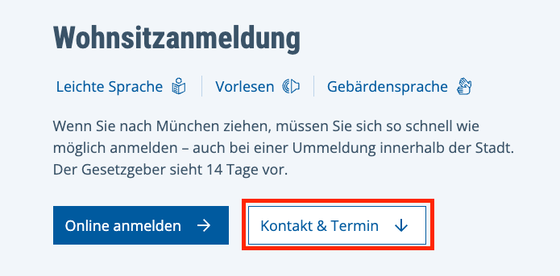
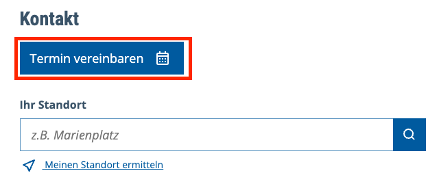
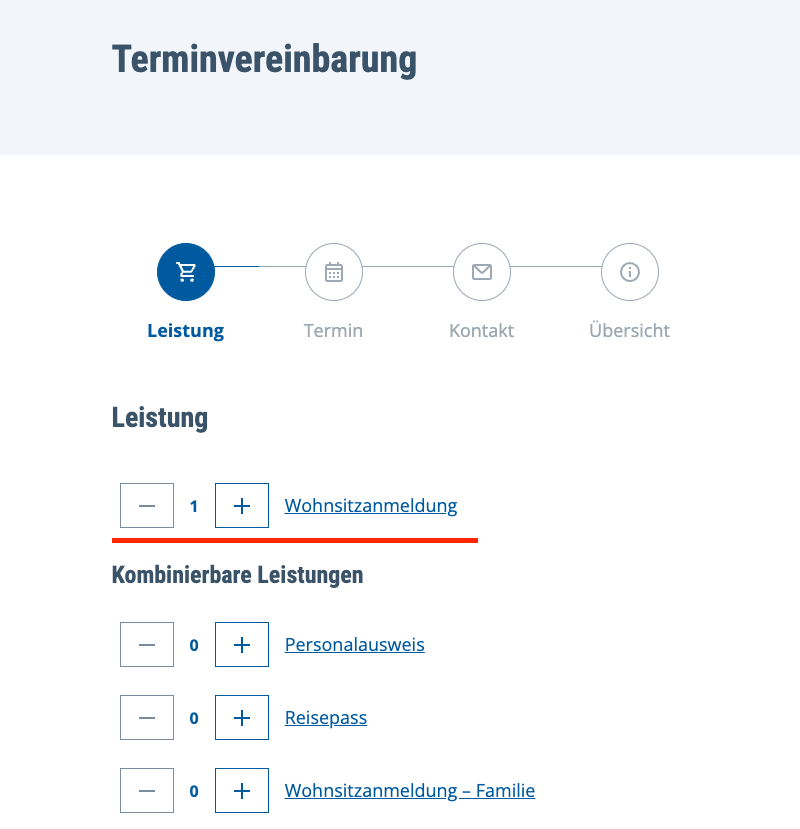
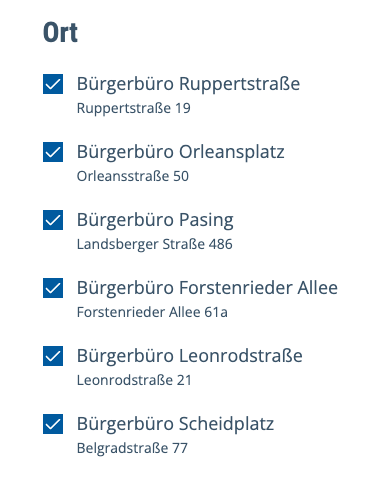
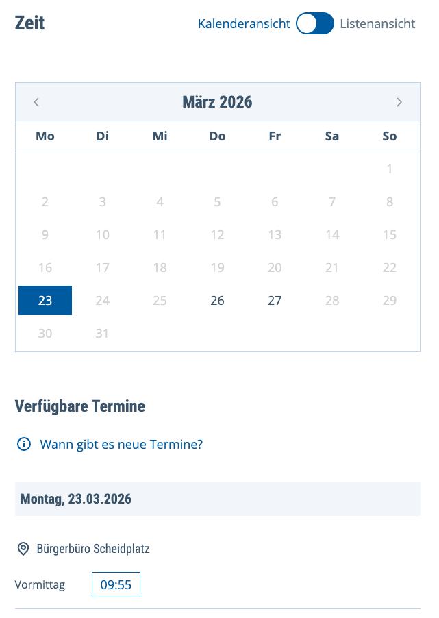
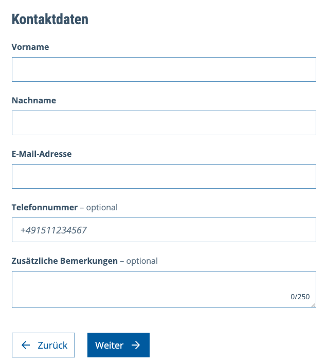
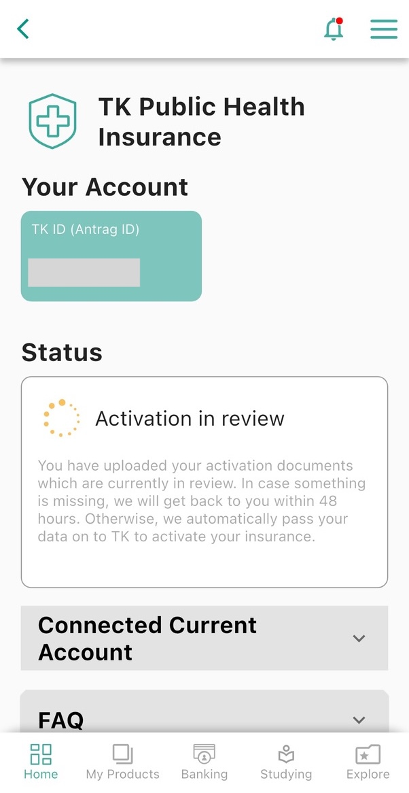
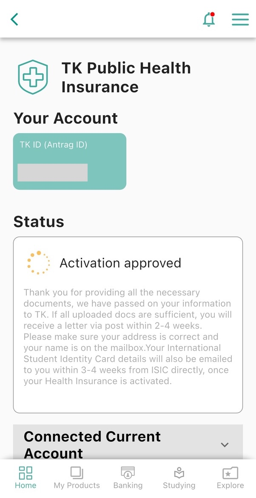
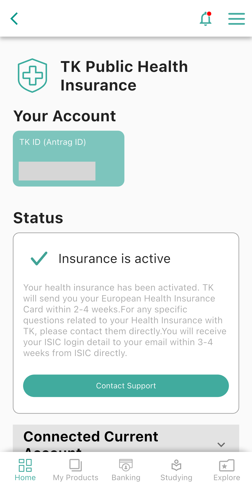

***飛越四分之一圈地球終於來到德國了！第一週手忙腳亂不知所措？來看有什麼待處理事項～***

---

## ✨ 前言

剛到**德國**的前兩週，最重要的是先完成各項行政手續。本篇整理交換生抵達後必須優先處理的事項，希望能幫助你順利展開在德國的生活。

👉 延伸閱讀（撰寫中待更新）：

- 🏠 **日常生活篇**（**電信**、**網銀帳戶**、**交通月票**、**生活用品採買**等等）
- 🎓 **TUM 學校篇**（針對**慕尼黑工業大學**的時間線）

<!--
- 🏠 [**日常生活篇**](/posts/exchange-student-survival-guide-3-2-daily-life-after-arrival-in-germany/)（**電信**、**網銀帳戶**、**交通月票**、**生活用品採買**等等）
- 🎓 [**TUM 學校篇**](/posts/exchange-student-survival-guide-3-3-tum-university-guide-after-arrival-in-germany/)（針對**慕尼黑工業大學**的時間線）
#TODO-->

---

## 🗂️ 行政事項篇

**入籍**、**開通公保**，以及**啟用限制提領帳戶**，是抵達德國後前一至兩週最重要的行政事項。當初的我對處理順序感到困惑，但實際上三者之間**並沒有嚴格的依賴關係，可以同時進行**。

在準備文件時，通常需要具備以下條件：「德國電話號碼」、「德國住址」、「銀行帳戶」，以及「已正式抵達德國」這個條件。關於德國門號與銀行帳戶的申辦，可參考 **日常生活篇（待更新）**。

<!--
可參考 [**日常生活篇**](/posts/exchange-student-survival-guide-3-2-daily-life-after-arrival-in-germany/)。
#TODO-->

---

### 1. 遞簽險

還記得在申辦 Expatrio 留學大禮包時，其中包含的「遞簽險證明（落地保險）」嗎？這份文件同時也是申請學生簽證時的必備資料之一，可視為一種「**過渡型短期醫療保險**」。

此保險會依照你在 Expatrio 填寫的抵達日期自動生效，**無需手動啟用**。





遞簽險（落地保險）自動生效。





之後完成學校註冊並[啟用公保](#4-啟用公保)後，遞簽險將會自動轉換為公保囉。

---

### 2. 入籍＆廣電費

大家常常說的「**Anmeldung**」，就是指**入籍**，是到德國後要馬上做的事喔。

#### A. 預約 Termin：

建議大家提早預約入籍（Anmeldung）。依德國規定，需於**抵達後兩週內完成入籍**，但因預約名額有限，往往不易取得時段。因此，通常會在入住前一至兩週先**線上預約刷時段**；若抵達德國後立即入住學生宿舍，則**可在台灣先行預約**（雖然稍微超過兩週通常也不會怎樣 XD）。





不一定要像我一樣那麼早預約，通常可在入住前一至兩週再預約即可；我個人則是預約了 4/8 辦理。







👉 [**慕尼黑入籍預約網址**](https://stadt.muenchen.de/service/info/wohnsitzanmeldung/1063475/n0/)

請注意需將網站切換為**德文介面**，預約按鈕才會顯示（到 2026 年依然如此呢，唉）。


  
  


預約類型請選擇 **Wohnsitzanmeldung**，接著選擇時間與地點，填寫聯絡資訊後送出即可。


  
  
  
  


#### B. 準備文件＆辦理過程：

- **護照**
- **居住提供證明（Wohnungsgeberbestätigung）**
	- 注意**非**先前收到的 **Tenancy Agreement（租賃合約）**。
	- **若在外租屋，可向房東索取**。我的宿舍是在可入住日前一天寄送此文件，我下載到手機後再到 dm 列印紙本。
- ~~[**戶籍登記表（Meldeschein）**](https://stadt.muenchen.de/dms/Home/Stadtverwaltung/Kreisverwaltungsreferat/fachspezifisch/HA-II/Buergerbuero/Dokumente/anmeldung_meldebehoerde)~~
	- 我當時也有事先印出並攜帶，但現場發現其實不需要；辦事人員會口頭詢問相關問題並代為填寫。





<b>Wohnungsgeberbestätigung</b>，中文為「居住提供證明」或「住宅提供者確認書」，是入籍時必備的文件之一。







這是我宿舍的最早可入住日期，但實際情況是我當時人正在希臘，於是請了同樣去交換的同學幫我拿鑰匙 XD。





當天我提早了約二十分鐘到現場等待叫號（收到的預約確認信裡面有號碼）。辦理的過程大概十分鐘而已，對方也能用英文溝通，整體還算順利。







#### 後續一、稅號：

完成入籍後，過一陣子會收到一封內含稅號（Identifikationsnummer, IdNr）的信件。

收到稅號後，記得手動補填至 **Revolut** 與 **Expatrio App**：

- **Revolut**：進入 Account → Personal details → Additional information，找到 Tax residency 相關欄位，Edit IdNr 新增德國稅號。
- **Expatrio**：進入 Personal Data，在原本的台灣稅號下方新增一筆德國稅號。











#### 後續二、廣電費：

接著會收到廣電費（Rundfunkbeitrag）的繳費通知。

由於我的宿舍是 WG（合租公寓）形式，**只需由一位室友代表繳納一筆廣電費**，因此分攤下來費用其實不高。以我為例，8 人 WG 平均每人每三個月大約只需 8 歐元左右（支付給主繳人即可）。

通常最早入住的人會成為主繳人；後續入住的人在收到通知信後，只需上網**聲明該 WG 已有人負責繳納**即可。

信件右上角會標示**案件編號（Aktenzeichen）**，另外也需要向主繳人取得**繳費號碼（Beitragsnummer）**。接著可掃描信上的 QR code，進入[德國廣播電視費官方網站](https://www.rundfunkbeitrag.de/buergerinnen-und-buerger/formulare/antworten#step_aktenzeichen)，再依照[這個教學](https://www.willstudy.tw/rundfunkbeitrag-2023/) 操作即可完成申報。











---

### 3. 啟用限制提領帳戶

這也是抵達德國後需要盡快完成的事項之一，畢竟七個月的生活費都存放在這個帳戶中。當時我誤以為必須先完成入籍才能開通，但實際上只需要具備「德國門號」、「銀行帳戶」和「德國地址」即可。

值得注意的是 Expatrio 亦提供自有銀行帳戶，可依個人需求選擇是否使用；而我則選擇了便於與朋友之間轉帳的 Revolut 網銀。

#### A. 事先準備：

- **手機 Expatrio App**：做身份驗證
- **護照＆簽證**
- **德國電話號碼**：我是用 Fraenk<!--👉 Fraenk 傳送門#TODO-->
- **網銀帳戶 IBAN**：我是用 Revolut<!--👉 [我是在出發前就辦好網銀（有簽證跟德國地址後即可申請）Revolut 開戶流程與心得](Revolut%20開戶流程與心得.md) #TODO-->
- **德國地址**：準備宿舍地址相關證明文件即可，入籍後[三個月內需於 App 中補上稅號](#後續一稅號)。

#### B. 線上開通過程：

開通限制提領帳戶必須透過 **Expatrio 手機 App** 進行。首先需**上傳簽證（Visa）掃描檔**，並**完成真人驗證**（流程與開通 Revolut 類似），因此建議於其上班時間內操作。

完成驗證後，幾分鐘內 App 便會顯示開通成功。Expatrio 會提供一組專屬銀行帳號（IBAN），可自行決定是否使用；亦可在 Expatrio App 中手動輸入銀行帳戶的 IBAN 與轉帳金額，或**設定為預設匯入帳戶**。我完成設定後，往後每次撥款皆會自動匯入 Revolut。





上傳相關文件後，發現非真人驗證時段，只好等到隔天上班時間再弄 XD。







真人驗證需準備護照和上述文件，並可選擇英文服務；接線員一臉厭世，講話也很快但就照他指示出示護照、唸號碼與生日等資訊就行，整個流程約五分鐘。







實際入帳速度相當快，當天完成開通後約半小時便收到第一筆凍結金，甚至第二、第三筆也在當天入帳。







後續款項則固定於每月 25 日發放，因此無需擔心生活費未能按時入帳。







---

### 4. 啟用公保

最後一關是當初 Expatrio 大禮包所包含的 **TK 公保**。抵達德國並**完成學校註冊**後即可啟用，同樣透過 **Expatrio App** 進入 Activate TK 頁面操作，並填寫以下資訊：

- **銀行帳戶 German Bank Account IBAN & BIC**：用於每月自動扣款公保費
- **註冊證明 Certificate of Enrollment**：以我來說是去 TUMonline 上更新德國地址後下載
- **德國地址 German Address**
- **德國電話號碼 German Phone Number**：我是用 Fraenk

啟用公保後，理論上會收到電子版 **ISIC 國際學生證**。不過我等了非常久才收到，幾乎可以當作沒有（？

有興趣可參考這篇整理：[學生證、ISIC 卡、ESN 卡：歐洲交換留學必備的三種國際學生卡](https://hypothermarea.com/2019/06/24/eu-student-cards/)





上傳完成後，會收到以下 email，等待資料審核。







Expatrio App 上的 TK 公保狀態欄也會逐步更新，從左圖顯示的處理中狀態，變為右圖的啟用完成狀態。









信中會說明接下來將寄出實體信件與開通碼（可用於線上註冊 TK 帳號），同時過陣子也會收到 EHIC 歐盟健保卡；ISIC 則會另外以 email 形式寄送。







雖然當初就知道學生公保的費用不低，但實際看到每月保費 **144 歐元**，還是覺得有點貴。不過轉換為私保流程較為複雜，因此最後還是維持公保。如果想善用公保資源，也推薦考慮施打**公保全額給付的 HPV 疫苗**，詳細經驗可以參考 👉 [德國公保 HPV 疫苗施打教學](/posts/2025-germany-tk-hpv-vaccination-complete-guide/)。





後續陸續收到幾封實體信件，包括先前 email 收到的四份文件紙本、上傳健保卡大頭貼的說明、銀行帳戶綁定確認信，以及含有個人保險號碼（Versicherungsnummer）的通知信；保險號碼那封建議妥善保存。







註冊 TK 需要使用開通碼，以及收到實體卡後卡片上的十位數保險號碼，而不是先前信件中的個人保險號碼（Versicherungsnummer），因此還需要再等實體卡寄到。







可下載 TK App（內建英文介面），再使用卡片上的號碼與先前收到的開通碼完成註冊，整個流程相當順利，沒有遇到什麼問題。



<!--
多放一張健保卡照片
#TODO-->





啟用公保後，會收到一封 email 通知，表示可申請領取 Expatrio 大禮包的 69 歐元返現，約一週後款項便入帳。







等了相當久，終於收到 ISIC 學生證的電子郵件。下載 App 後開通流程其實很快速簡單，不過實際上我幾乎沒有用到它 XD。







---

## 🔗 參考連結

**關於入籍，其他人的經驗可以參考：**

- [慕尼黑市政廳登記住址（入籍教學）Anmelden簡單迅速！](https://annie89339.pixnet.net/blog/post/404203754)
- [德國 Anmeldung 入籍教學 | 慕尼黑(München)篇 – 留學計畫](https://www.willstudy.tw/germany-anmeldung-munchen/)
- [德國交換 | 入籍證明 Anmeldung - 德國鬼的180天養成計畫 - Medium](https://medium.com/%E5%BE%B7%E5%9C%8B%E9%AC%BC%E7%9A%84180%E5%A4%A9%E9%A4%8A%E6%88%90%E8%A8%88%E7%95%AB/%E5%BE%B7%E5%9C%8B%E4%BA%A4%E6%8F%9B-%E5%85%A5%E7%B1%8D%E8%AD%89%E6%98%8E-anmeldung-7ddd971f052c)

**關於限制提領帳戶，其他人的經驗可以參考：**

- [【德國交換學生】初到德國篇 | 德國手機號碼、德國入籍、N26開戶、開通Blocked Account、開通保險TK](https://vocus.cc/article/64a5afe5fd89780001334a8e)
- [【德國交換學生】德國簽證申請 | 德國簽證預約、限制提領帳戶 | 2023德簽申請全紀錄 文件準備 & 經驗細節](https://vocus.cc/article/64a5444bfd8978000169ad58)

**關於 TK 公保，其他人的經驗可以參考：**

- [TK 公立保險 | 入境德國後開通保險須知](https://www.willstudy.tw/visa-deu-tk/)
