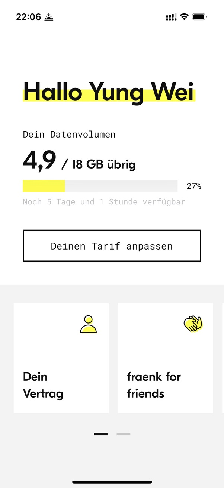
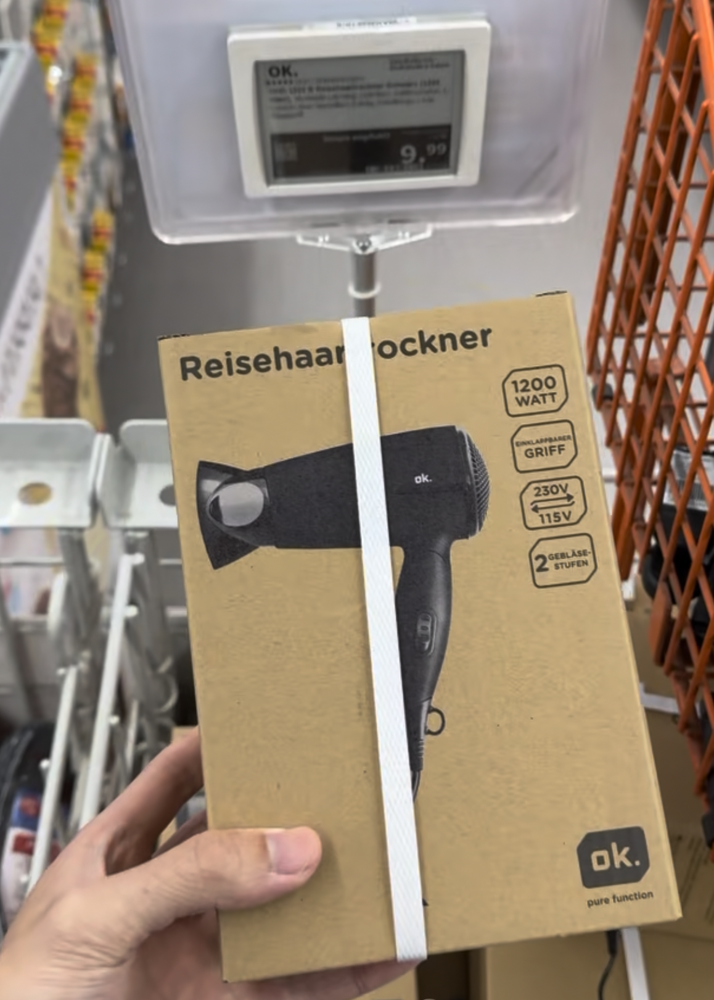
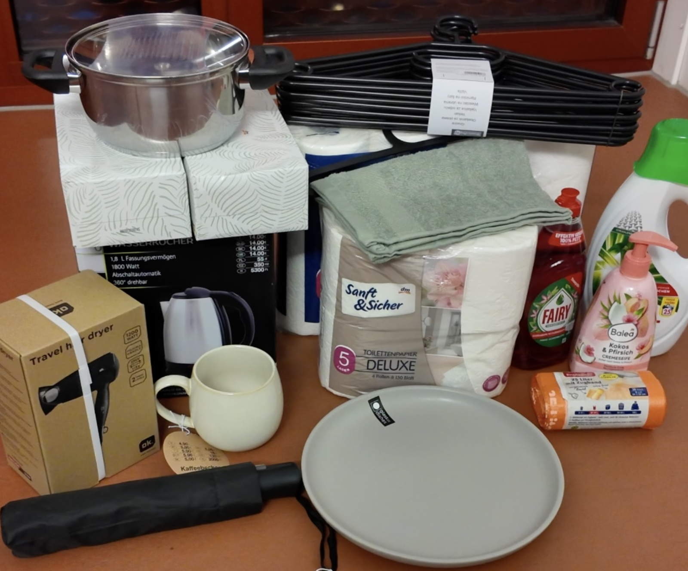
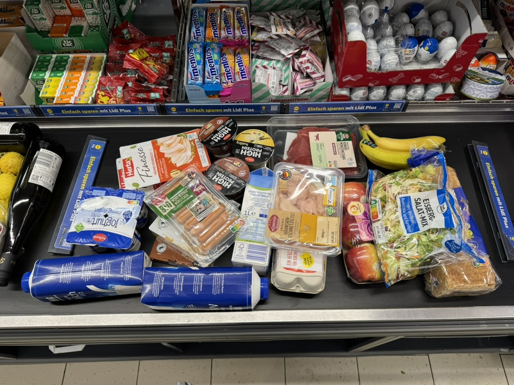

***抵達德國的前兩週，國外生活既緊張又期待！有哪些需要注意的大小事呢？一起來看看吧～***

---

## ✨ 前言

除了行政事項之外，本篇整理交換生在德國初期的日常生活重點，分享實用的經驗與小技巧，希望能幫助你快速適應環境，享受在德國的留學生活。

👉 延伸閱讀：

- 🗂️ [**行政事項篇**](/posts/exchange-student-survival-guide-3-1-administrative-matters-after-arrival-in-germany/)（**入籍**、**公保**、**啟用限制提領帳戶**等等）
- 🎓 **TUM 學校篇**（針對**慕尼黑工業大學**的時間線）

<!--
- 🎓 [**TUM 學校篇**](/posts/exchange-student-survival-guide-3-3-tum-university-guide-after-arrival-in-germany/)（針對**慕尼黑工業大學**的時間線）
#TODO-->

---

## 🏠 日常生活篇

抵達德國一開始要弄的主要有電信、交通月票、生活用品採買，網銀帳戶我則是在出發前就辦好，電信應該可以在台灣辦辦看、交通月票若能驗證學生生份說不定也可以出發前就弄好，因人而異。另外這篇還收錄了旅遊、看電影等等娛樂的經驗分享。

---

### 1. 德國電信門號＆網路

我在 4/6 還在希臘時辦理的，Fraenk 是全部網路作業很方便，介面也蠻漂亮的。雖然是全德文介面但是網路上查得到辦理步驟。

這篇寫得蠻清楚：[這篇](https://de.okuso.uk/blog/fraenk-esim)





直接 app 按一按綁 Revolut 帳戶後驗證一下就可以申請到 eSIM 了誒，也有門號。





申辦流程：

- 必須在 **德國 App Store 區域**下載 Fraenk App
- 申辦時需要：
    - 掃描護照
    - 拍護照頁面
    - 拍臉部辨識（身份驗證）
- ~~開通後會直接下載 eSIM~~
	- 點擊安裝後，eSIM 會自動下載並加入手機的行動網路設定中。

使用設定：

- iPhone 設定中：
    - **Default Voice Line（預設語音）** → 選 Fraenk eSIM
    - **Cellular Data（行動數據）** → 選 Fraenk eSIM
- 若到其他歐洲國家旅遊，有些情況需要開啟 **Data Roaming（數據漫遊）**

方案與流量：

- 我當時使用的方案是 **15GB + 3GB（推薦碼加贈）**
	- （⚠️ Fraenk 方案會不定期調整，依官方為準）
- 會有一組 +49 德國門號
- 即使 18GB，有時候如果整天在外面旅遊、不用宿舍 WiFi，還是會用完

👉 建議：

- 申辦時使用**朋友推薦碼**，可以額外增加流量（那時候是增加多少 +3）
- 你也可以用我的推薦碼（如果你要放在文章裡）

其他小提醒
- 有些人會把門號同步更新到 **Revolut** 等銀行帳戶
	- 我自己當時沒有特別改，也沒有遇到問題

### 2. Revolut 網路銀行

不同貨幣 Revolut 付款也都方便

### 3. MVG ~~29~~ 38 歐月票 Deutschland-Ticket





https://www.mvg.de/abos-tickets/abos/ermaessigungsticket.html

現在是 63/43

上 MVG 網站，過程中要跑去申請 M-Login 的帳號用來驗證學生身份（會跳轉到 TUM online 登入介面很酷），最後綁一下 Revolut IBAN 就可以了，印象中不久後就會開通。可以載 MVGO App 登入 M login 就會看到月票的 QRcode，上車基本不用幹嘛，查票時再拿出來就好。不會立即扣款也不知道他什麼時候扣。

要放一下網頁截圖跟連結好了，手機月票畫面

選擇學生身份、學校（會需要驗證學生身份）、開始結束月份、票種我是選裝在手機比較方便，晶片卡還要兩週寄送時間，下載 MVGO 登入 M-Login 做綁定即可。最後填一下基本資料、網銀 IBAN（每個月會自動從中扣款）





沒出現的話可以試著重新登入，我因為緊張無法證明有票被罰錢過

簡介 DB
聽說近幾年有得鐵月票可以到處跑，以前頂多是州票
簡介德鐵月票可以做的事

慕尼黑工業大學沒有附，有些大學會像是德勒斯登工業大學或波昂大學

有些學校會包含在學雜（期）費，但 TUM 沒有，需要另外自行購買。
==三月可以先用？？？==

DB 月票是 49 歐元，而巴伐利亞邦學生（像是慕尼黑），可以透過慕尼黑運輸公司 (MVG) 申請更符合學生族需求的 29 歐元德國月票，並享有相同福利。

今年變 58 歐了哭，學生票也已經變 38 歐了，不知道明年 2026 會不會再漲

非高速鐵之類的都能搭

下載 MVGO App 做綁定

- [DB 德鐵 49 歐元月票 | 2024 環遊德國最佳幫手 ，2 分鐘快速辦理](https://www.willstudy.tw/deutschland-ticket-2023/)
- [【德國】49歐月票是什麼？最詳細攻略！適用範圍？使用限制？如何購買？](https://holanora.com/deutschland-ticket/#%E4%BD%BF%E7%94%A8%E7%AF%84%E5%9C%8D%EF%BC%9F)
- [[🚃 49歐月票來啦！] 最詳細的Deutschland-Ticket百科全書](https://berlinanthropology.medium.com/49%E6%AD%90%E6%9C%88%E7%A5%A8%E4%BE%86%E5%95%A6-%E6%9C%80%E8%A9%B3%E7%B4%B0%E7%9A%84deutschland-ticket%E7%99%BE%E7%A7%91%E5%85%A8%E6%9B%B8-8e3804f7ccf5)

### 4. 生活採買相關

#### 日常用品

剛到宿舍空空如也，如果剛好有 FB 社團或宿舍群組在出清物品，也是個不錯的選擇，可以買到一些便宜的二手家具、電器、廚具等等。如果沒有，可以去以下店家採購～。關於每一家該買什麼，我那時候都直接查小紅書推薦最方便 XD。

**dm / Rossmann：**

德國最常見的連鎖藥妝店，生活日用品、洗沐用品、保健食品都能一次買齊，價格實在又常有折扣。交換生日常補貨幾乎離不開這兩家。回台灣前也會爆買一波。

洗頭、沐浴、護髮、洗面乳、乳液、護唇膏、牙膏、美妝保養品、防曬乳

推薦靜電拖
靜電拖可以買 dm

**Saturn / MediaMarkt**：

德國大型電子連鎖賣場，從電腦、耳機到吹風機都買得到，價格透明也常有特價活動。個人很推薦 Saturn 的 9.99 歐吹風機，便宜又夠用。

**Lidl / Woolworth**：

Lidl 是超市但常有期間限定生活用品，Woolworth 則像德國版的大創，能挖到便宜廚房用品與居家小物，CP 值很高。

**C&A / H&M**：

平價服飾品牌，基本款外套、發熱衣或冬季保暖單品都很好入手，適合剛到德國需要補齊四季衣物的交換生。

**Decathlon**：

運動用品價格親民，從跑鞋、健身裝備到登山外套都能找到高 CP 值選擇，運動愛好者一定會常去。

**Temu**：

主打極低價格的網購平台，生活小物與雜貨種類非常多，適合不急用、願意等待物流時間時再下單。

亞超可以買到啥
筷子這邊有

放我實際買的東西的圖片

含生活用品採買、超市推薦（亞超、德超）、dm 可以影印

#### 超市食材

德國超市其實有分等級，有些東西真的很便宜，生活開銷控制得好其實不會太高。常見的超市包括：**Edeka、REWE、Lidl、Aldi、Netto、Penny**。

**Edeka、REWE**：

選擇最多、商品種類完整，品質普遍不錯，但價格相對高一點。如果想買比較好的肉品或特殊食材，通常會來這兩家。

**Lidl、Aldi**：

平價連鎖超市代表，CP 值高，很多自有品牌商品便宜又實用，是學生族群很常去的地方。

**Netto、Penny**：
 
價格通常更低，但選擇較少。Penny 要稍微注意一下品質與品項完整度。

像我自己日常的餅乾、早餐麥片、飲料，蠻常在 Netto 買，價格感覺比較划算。

如果想買中式食材（醬油、泡麵、亞洲調味料等），可以到 **Go Asia**，算是德國常見的亞洲超市。

另外，德國超市 **星期天全部不營業**（法律規定），

只有**車站內的超市**或極少數特殊地點會開門，所以週六記得先補貨，不然真的會餓一天 😂

放些超市圖片 gallery

#### 外食餐廳

外食貴、多貴、推薦幾家
Max ChiaChia
學餐多貴，味道看人，加上我住的地方離學校也不近，只有去上課會吃學餐，剩下時間就在家自己煮
需要自己煮飯

### 5. 旅遊相關

德鐵

機場
慕尼黑只有大機場、廉航要跑到哪
舉例到克羅埃西亞很便

巴士

### 其他

宿舍網路？
放宿舍照片？或下一篇再放。
#### 宿舍地址信箱

#### 台灣學費繳費

IKEA 有便宜餐具（慕尼黑的比較遠建議一群人去），但我後來一次都沒去
可以去 Wool 什麼的
衣服Primark C&A 我自己都沒買所以不了解

喝水幾本都可以生飲 不會像我在加拿大機場有奇怪味道，喝不習慣好不放心可能當地買個 Brita 濾水器

0 樓開始

信箱貼名字
信箱貼名字（看情況）

含生活用品採買、超市推薦（亞超、德超）、dm 可以影印
Pfand, Temu 取貨
這篇會比較長，可以簡介宿舍

旅遊

先講假期有哪些，或是沒在上課的我天天都是放假

國內 DB FlixBus

國外？
RejioJet
到各地近的話 Flix Bus 早買便宜，較遠的話飛機 RyanAir 便宜，但要到紐倫堡或薩爾斯堡才有，慕尼黑機場太大沒有這個廉航
RyanAir Wizz

ESN 卡不太推薦，雖然有（講一下有什麼主要優惠跟我沒用到的故事）
但大推 Student Beans
ISIC, Unidays 沒用到

電影院
字幕

---

## 🔗 參考連結

**關於 Fraenk，其他人的經驗可以參考：**

- [Fraenk 德國電信 申辦教學 | 三大電信商比較、其他電信攜碼轉移](https://www.willstudy.tw/fraenk-germany-telekom/)
- [經驗分享 德國電信Fraenk eSIM 申辦 (附邀請碼） - 留學板 | Dcard](https://www.dcard.tw/f/studyabroad/p/256486065)
- [[Fraenk] 2025 eSIM直接取得！ 中文流程](https://de.okuso.uk/blog/fraenk-esim)
