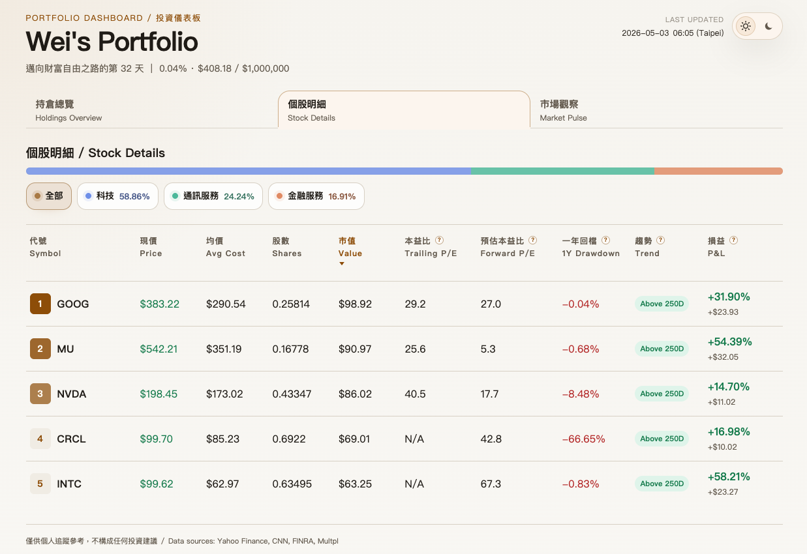
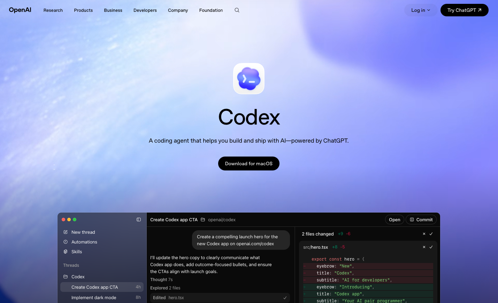
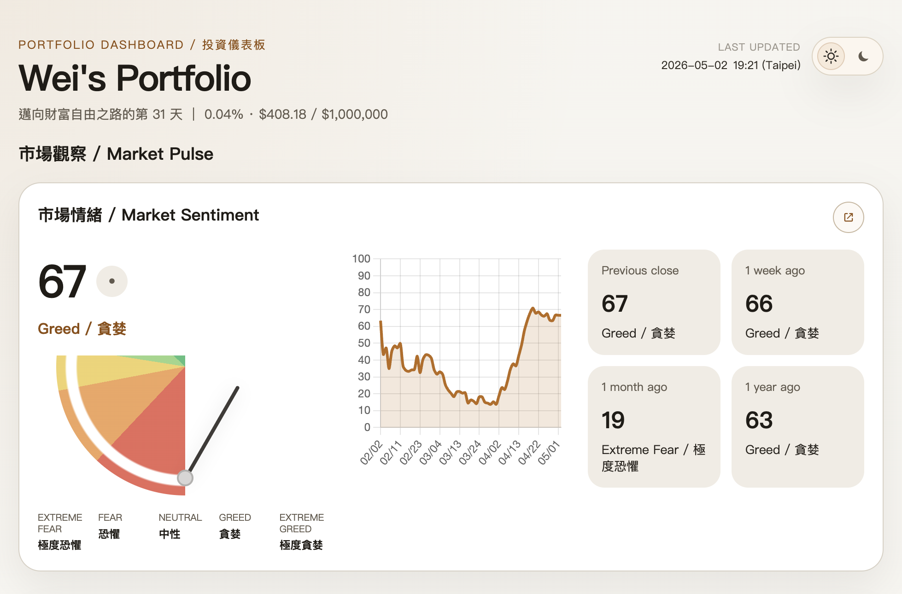
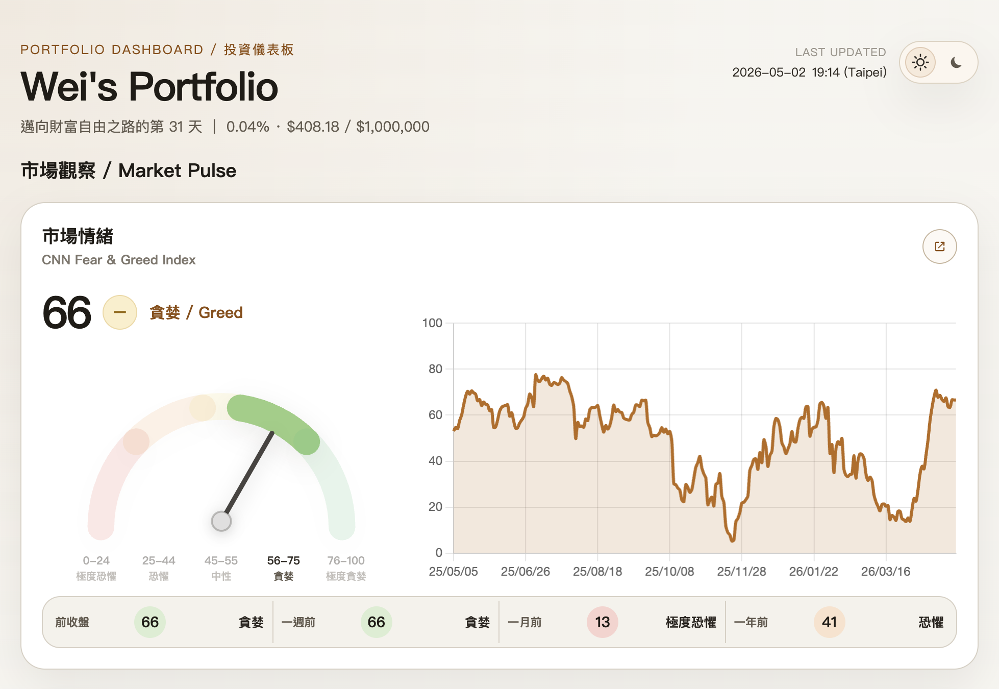

> 如果你也對使用 AI Agent 做 vibe coding 有點興趣，這篇想分享的是我第一次用 Codex 做專案的經驗和一些很初步的感想。

我目前也還在摸索如何跟 AI 協作，這篇不是什麼完整教學，比較像是我真的拿它做了一個 side project 之後，回頭整理一下：**它哪裡讓我驚艷、哪裡還是會跟想像有落差，以及我目前覺得哪些做法比較有幫助**。

---

## 前言

我一直想做一個自己的[投資組合網站](https://portfolio.weiweifan.com)，主要是拿來追蹤個人投資績效，也順便把一些市場資訊整理在同一個地方。



但如果要我完全從零開始弄，老實說很難這麼快做出來。甚至不要說做到現在這樣，**光是產出第一版雛形對我來說就蠻困難的**。因為我對網頁程式設計懂得很淺，只在大三修過一門，然後現在只記得期末專案做得很爛。

剛好最近 vibe coding 蔚為風潮，加上我本來就有訂閱 ChatGPT Plus，有一定的 Codex 使用額度，也就是大家常說的「又在燒 token」、「token 又用完了」的那個額度。於是這次就想說，不然真的拿 Codex 來做一個自己會用的專案看看，反正也不虧。

這次比較完整地用 Codex 做 side project 之後，才真的感受到 AI Agent 最有用的地方，是它能夠**讓你擱置很久，想做但沒空、也還沒能力完整做出來的專案，用一杯咖啡的時間從 0 變成 1**。

聽起來很令人興奮吧！我只能說真的會上癮，要小心。那麼這個神奇的東西，也就是 AI Agent，到底是何方神聖？

### AI Agent 是什麼？跟 ChatGPT 的差別？

簡單來說，ChatGPT 比較像你問它答；AI Agent 則是在你給目標任務後，能自己拆步驟、讀寫檔案、呼叫工具、執行指令，並根據結果調整下一步的 AI 系統。

技術細節這邊就不多提，網路上已經有很多介紹。總之，它比較像是一個專門協助開發的 AI 工程師。**而 Codex、Claude Code 就可以算是其中偏向寫程式的 AI Coding Agent 代表**。

---

## 一、如何開始一個新專案？

首先可以先去 OpenAI 官方頁面[下載 Codex App](https://openai.com/zh-Hant/codex/)。相比於 [Codex CLI](https://developers.openai.com/codex/cli) 這種終端介面，Codex App 把對話區、檔案目錄、結果預覽、工作狀態都放在同一個介面裡，我覺得對新手友善很多。



**接著你只需要打開它，然後叫它做你想做的事。就這樣。**

當然，這句話聽起來有點太美好。

---

## 二、真的這麼美好嗎？想像都能成真？

現階段我自己的答案是：**它並不完美，但它給我的驚艷是多過失望的。**

前面說「你只需要打開它，然後叫它做你想做的事」，那只是最基本的入口。真正做下去會發現，**AI Agent 的產出很吃上下文，也就是它目前知道多少新舊資訊、理解多少專案狀態，以及你有沒有把需求講清楚**。

**它能力很強，但使用它的人也要能清楚表達需求。**

這其實跟請一個工程師幫你做事有點像，你會給他規格、跟他開會討論、確認細節。總不會一句話交代完專案就消失，剩下全部憑工程師自己的想像。那最後做出來的東西，跟你想的有落差也很合理。

舉個例子，我一開始叫 Codex 加一版市場情緒區塊，但沒有描述得非常仔細，只說希望有情緒指針、趨勢圖，以及過去不同時間點的分數資訊：



雖然資訊都有抓到，但指針有夠怪、排版有夠糟，一年前的恐懼貪婪指數也抓錯。

在一陣激烈溝通後（具體內容我沒有記錄下來，反正很像工程師吵架 XD），最後它確實有能力慢慢修到我希望的樣子：



令人驚艷吧！前提是我要把需求講清楚，畢竟它不知道我腦中想要的排版長什麼樣子。

---

## 三、怎麼做比較加分？以及我目前使用下來的心得

上網查的話，可能會看到數十種提升 Codex 成果品質的方法。下面整理的是我在這個專案中實際嘗試過，並且覺得有幫助的幾個做法。

我不是這方面的專家，也沒有設計嚴謹的對照組，所以不能保證這些方法一定有效。不過以我自己的使用經驗來看，它們確實讓 Codex 的輸出更穩定，也更接近我想要的方向。

如果只講一個重點，我覺得會是：**先對齊想法，再開始實作**。

### 1. 一開始先做 code review，不要急著改

雖然 AI Agent 有能力從零開始一個新專案，但我不太想一開始就花大量時間描述完整產品規格，所以我選了一個比較務實的方式：先拿[同學做過的類似專案](https://github.com/huangchink/portfolio)當起始點，再慢慢跟 Codex 一起改成自己想要的樣子。

因此第一步，我不是叫 Codex 直接改畫面或加功能，而是先請它理解專案架構，並且明確要求「不要改程式碼」。

```text
我要做一個「個人投資儀表板」專案，
以 https://github.com/huangchink/portfolio 為起始點，
幫我先理解這個專案的架構，不要急著改程式碼。
```

這一步對我來說很有幫助，因為它讓我先知道目前專案大概長什麼樣子：哪些地方負責資料、哪些地方負責 UI、哪些邏輯耦合太高、哪些部分應該先模組化等等。

換句話說，這不是在「盲改畫面」，而是先讓 Codex 搞清楚狀況，也讓我知道自己接下來到底在改什麼。

### 2. 補上文件和協作規範

接著，我讓 Codex 幫專案補文件，並建立 `AGENTS.md`，把之後合作時希望它遵守的工程規則先寫下來，例如：

- 優先考慮可讀性、可維護性、可擴充性
- 註解與 docstring 一律用英文
- 盡量分離資料邏輯、UI 邏輯、外部 API 存取
- 每次修改前先說明計畫，修改後摘要說明原因

這一步看似多餘，但我後來覺得有幫助。因為一旦規則寫進 `AGENTS.md`，之後很多回合的修改就比較不會飄掉，也不用每次都重新提醒同樣的事情。

### 3. 版本級改動時用 plan mode

等到架構和規則比較清楚後，我才開始用 plan mode 處理比較大的版本改動。對我來說，plan mode 最有價值的地方，是它會先把需求拆成計畫，再進入實作，也就做到了跟使用者先「對齊想法」的關鍵步驟。

目前我最常用的流程大概是：

1. 我先描述這一版想要什麼
2. Codex 幫我拆成 plan
3. 我確認方向後讓它 implement
4. 改完後我看畫面，再繼續下一輪

### 4. 用 ChatGPT 先整理給 Codex 的指示

有時候我知道自己想要什麼，但很難快速寫出一段明確的指示。這時候我會先用 ChatGPT 幫我整理 prompt，再貼給 Codex。

像前面提到的 code review、補文件與協作規範、使用 plan mode 做版本級改動，其實我也都是先在 ChatGPT 裡整理過想法，確認語氣、目標和限制條件之後，才把比較完整的指示交給 Codex。

這聽起來有點繞，但其實蠻實用的。因為自然語言雖然很方便，但需求寫得越模糊，Agent 就越容易往自己的理解走。先把需求整理清楚，本質上也是在降低溝通成本。

### 5. 可重複的流程做成 skill

Skill 可以理解成給 Agent 看的 SOP，讓你不用每次都把相同的規則重新交代一遍。它能讓 Agent 的行為更穩定，也能在需要時才讀取對應的說明，避免一開始就把所有規則都塞進上下文裡，進而節省 context 和 token 用量。

如果有些事情會一再重複，例如 code review、撰寫版本更新文件、統一前端風格、建立測試環境，其實就很適合整理成 skill。

---

## 結語

以我這次的感受，Codex 已經很像一個有資深工程師能力的協作者。它的正確性有一定水準，也有自己解決問題的能力，所以非常容易幫你把專案從 0 推到 1。

但如果要從 1 到 100，真的做到你心中那個最終想像，目前還是需要人和 AI 彼此溝通合作。畢竟 AI 還不能讀取你的大腦。未來如果可以，那也是蠻恐怖的哈哈。

最後我也還在學習路上，AI 發展真的很快，可能過一陣子人與 AI 的協作方式又會完全不一樣。所以現在對我來說，最重要的是保持開放態度，繼續學習怎麼把自己的想法更好地交給 AI，一起把想像化為現實。
