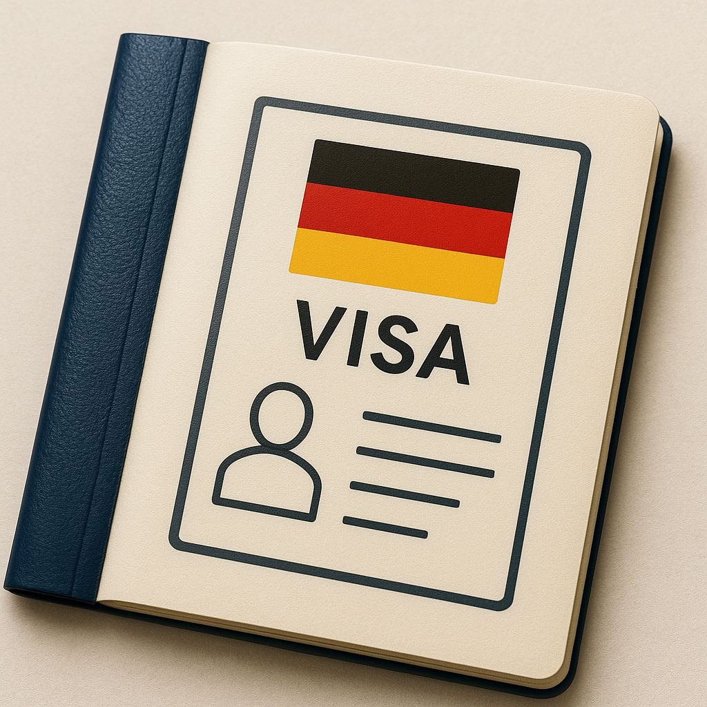

> 🔄 **更新資訊（2025 年 2 月起新制）**：  
> 根據 2025 年 2 月最新規定，學生簽證申請改為**出發前六個月內即可線上上傳所有資料**，無需搶現場預約時段。文件經審核後，系統會提供辦理時間，申請人只需到現場按壓指紋、提交護照照片並繳費即可。  
> 📌 官方說明：[德國在台協會 2025 最新簽證申請資訊](https://taipei.diplo.de/tw-zh-tw/service/visa-einreise/2699566-2699566)  
> 📌 延伸閱讀（有持續更新）：[德國長期簽證 完整教學 | 文件準備、辦理時程、2025 改制說明](https://www.willstudy.tw/visa-deu-02/)  
> 以下為 2025 年 1 月的**舊版申請過程**的經驗分享，所需文件與現場流程仍可參考本篇。

德國交換學生通常需要停留一學期以上，**超過 90 天即需申請學生簽證**。本篇將以實際經驗為基礎，針對**交換學生簽證**申請流程，說明以下四個階段：

1. [預約德協](#1-預約德協)
2. [線上填寫申請表格](#2-線上填寫申請表格)
3. [準備相關文件](#3-準備相關文件)
4. [現場辦理流程分享](#4-現場辦理流程分享)

💡 **補充**：若您為學位生，文件需求略有不同，可參考 [官方資訊頁面](https://taipei.diplo.de/tw-zh-tw/service/visa-einreise/2453292-2453292)。

## 申請德國交換學生簽證

---

### 1. 預約德協

***（更新：2025 年 2 月起無需搶預約，仍盡早線上上傳資料）***

申請學生簽證需要自己上德協網站搶預約時段，而且非常難搶，要時常刷網頁才能卡到位子。

以我自己為例，TUM 開學日是 4/1，根據德協規定，**最早可預約時間是開學前三個月內的日期**，也就是 1/1 開始。我在 12 月初開始密切注意德協網站，當時我與幾位同樣申請 TUM 的同校同學曾嘗試寫信詢問是否能申請團體預約，不過德協回覆：「當年不開放團體預約」，所以我們只好改為個別搶時段。

幸運的是，我在 12/6 下午刷到一波一月的預約釋出名額，成功預約到 1/13（週一）的簽證辦理時段。預約成功後，會收到一封 Email 確認信，裡面有一個連結，**要點進去「確認預約」**，才算真正保留成功。

---

### 2. 線上填寫申請表格

德國長期簽證的申請表格需透過官方網站線上填寫：[VIDEX 表格系統](https://videx.diplo.de/videx/visum-erfassung/videx-langfristiger-aufenthalt)。表格內容較為繁瑣，建議**預留一段完整時間填寫**，不過好消息是：系統支援「儲存草稿再匯入繼續填寫」，相當友善。

我當初自己是邊參考網路教學邊填寫，下面這兩篇教學搭配使用，對照著填應該就不會有問題：

- [德國交換學生簽證｜必備文件以及 2024 新版申請表格填寫教學 - Yun’s Dailyyyy](https://yunsdailyyyy.com/visa-application/)
- [德國長期簽證申請表格 2025｜中文對照填寫詳細教學 - Willstudy](https://www.willstudy.tw/application-for-a-national-visa/)

📌 **小提醒**：若當時還沒有德國地址，也可以**先填寫交換學校國際事務處的地址**。

---

### 3. 準備相關文件

***（更新：2025 年 2 月起改為線上上傳，但當天仍需攜帶紙本備查）***

以下為申請交換學生簽證時需準備的文件清單：

- 有效護照正本（已於簽名處簽名，且至少有兩頁空白頁）， 1 份
- 護照個人資料頁影本，1 份
- 線上填寫並列印的申請表格，1 份
- 兩吋證件照 **2 張**（須為三個月內拍攝）
- 入學許可（Admission Letter），1 份
- 英文版在學證明¹，1 份
- 英文版成績單，1 份
- 財力證明²，1 份
- 動機信（德文或英文皆可）³，1 份
- 遞簽險證明（落地保險）⁴，1 份
- 費用：75 歐元（可刷卡，但建議備妥現金）

**註¹**：交換學生不需提交語言能力證明與學歷證明，只要準備台灣學校開立的**英文版在學證明**與**英文成績單**即可。

**註²**：財力證明可使用 **Expatrio** 提供的 06 文件（凍結金額確認書），因此**收到入學許可後請儘快辦理**。 <!--👉 [Expatrio 留德大禮包申請教學](Expatrio%2520%E7%95%99%E5%BE%B7%E5%A4%A7%E7%A6%AE%E5%8C%85-%E9%99%90%E5%88%B6%E6%8F%90%E9%A0%98%E5%B8%B3%E6%88%B6%E5%92%8C%E4%BF%9D%E9%9A%AA%E7%94%B3%E8%AB%8B%E6%95%99%E5%AD%B8.md) #TODO-->

**註³**：動機信內容可簡單說明申請交換的原因，以及此行對你未來學業或職涯的幫助。

**註⁴**：遞簽險（Incoming Insurance）是簽證申請時需要的保險，**與入學後會用到的 TK 公保不同**，可於 Expatrio 申請流程中一併取得。

---

### 4. 現場辦理流程分享

我當天的簽證預約是 1/13（週一）。建議**提前約半小時到場**，流程如下：

1. 到台北 101 一樓的訪客機台，透過對講機聯繫 33 樓的德國在台協會，取得訪客證。
2. 搭電梯先上 35 樓轉換層，再下行至 33 樓。
3. 入內後，會有警衛收手機、要求將包包放入置物櫃，並請你準備好申請文件、護照、證件照與錢包。
4. 場內有張貼文件排列順序的指引，可以當場照著準備好。

若前面沒人，會提早叫號，整個辦理時間大約 10 ~ 15 分鐘。當天遇到兩位辦事人員，一男一女。女生相對親切，男生則較制式化，態度偏冷淡。

**我當天辦理流程（全程中文）：**

- 資料和護照交給辦事人員。
- 他會先確認你的基本資料、詢問去德國的目的（我有被問是去 TUM 哪個校區）。
- 接著繳交簽證費 €75（當時約合 NT$2,560），**建議攜帶現金**。
- 現場簽署快遞單與其他文件（若申請表格沒簽，也會請你當場補簽）。
- 完成後會按指紋，並領到辦理簽證的收據。

我有另外詢問：因為二月初要出國旅遊，擔心護照還沒寄回是否能先寫信辦理外借，但辦事人員說「通常兩到三週內就會收到」，我的情況不用急著辦外借，到時候日期接近再看看。

**後續：**

結果非常意外 ——**僅過一週（1/20）就收到了簽證與護照！**（可能因為非旺季）

寄送是以快遞方式寄回，記得準備好收件時的運費。

我申請的簽證起始日期是 3/1，實際拿到也是。當初申請時因為學期開始是 4/1，但辦事人員提醒「不能保證給這麼早的日期」，推測最終核發日可能依照：

- 我在申請表上填了 3/1 為入境日期；
- Expatrio 匯款也匯了 7 個月的生活費而非 6 個月，從 3 月開始一路到 9 月底學期結束。

因為順利在出國旅遊前拿到簽證與護照，最後也就沒有申請護照外借。如果你有類似需求，可以參考這篇詳細說明：[德國學生簽證 護照外借說明 | 如何申請（聯繫協會）、歸還說明](https://www.willstudy.tw/deutsche-visa-2023/)

---

✈️ 最後，希望這篇文章能幫助你更清楚掌握簽證申請的流程，順利踏上德國之旅！

---

## 參考連結

- ***（2025最新）***[德國長期簽證 完整教學 | 文件準備、辦理時程、2025 改制說明](https://www.willstudy.tw/visa-deu-02/)
- [2023德國學生簽證預約辦理過程全記錄！](https://medium.com/@hrt_exchangelife/%E5%BE%B7%E5%8D%94%E7%B0%BD%E8%AD%89%E9%A0%90%E7%B4%84%E8%BE%A6%E7%90%86%E9%81%8E%E7%A8%8B%E5%85%A8%E8%A8%98%E9%8C%84-b220f79b1cd8)
- [🇩🇪 2023 德國交換學生｜長期簽證申請經驗分享](https://medium.com/@lin0/2023-%E5%BE%B7%E5%9C%8B%E4%BA%A4%E6%8F%9B%E5%AD%B8%E7%94%9F-%E9%95%B7%E6%9C%9F%E7%B0%BD%E8%AD%89%E7%94%B3%E8%AB%8B%E7%B6%93%E9%A9%97%E5%88%86%E4%BA%AB-7290d7ccbcfd)
