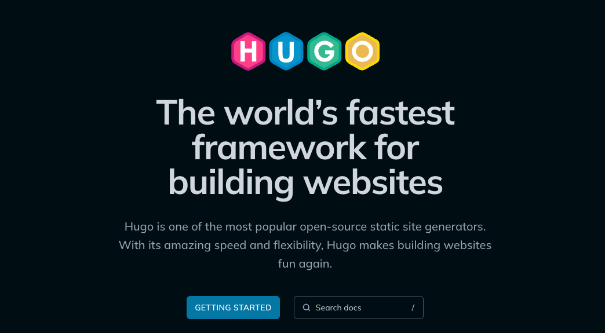
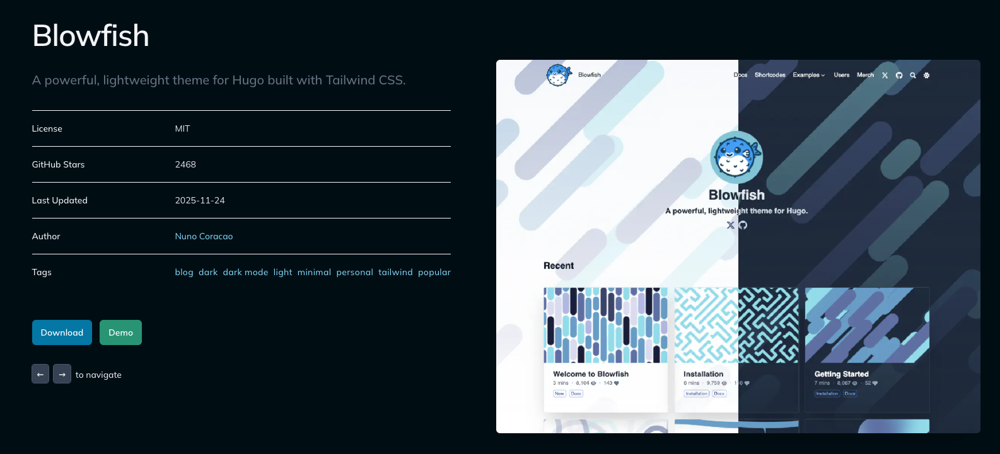
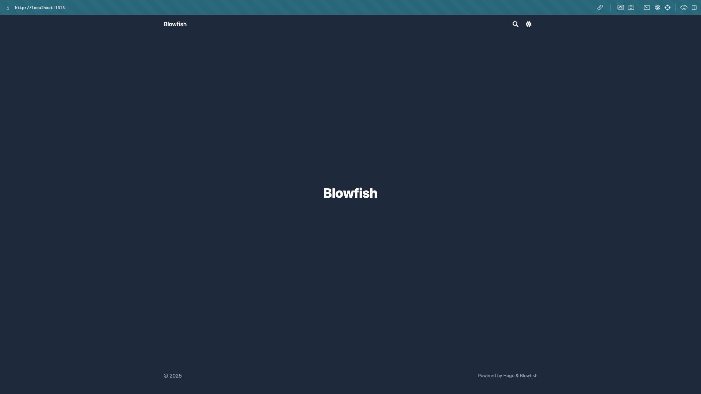
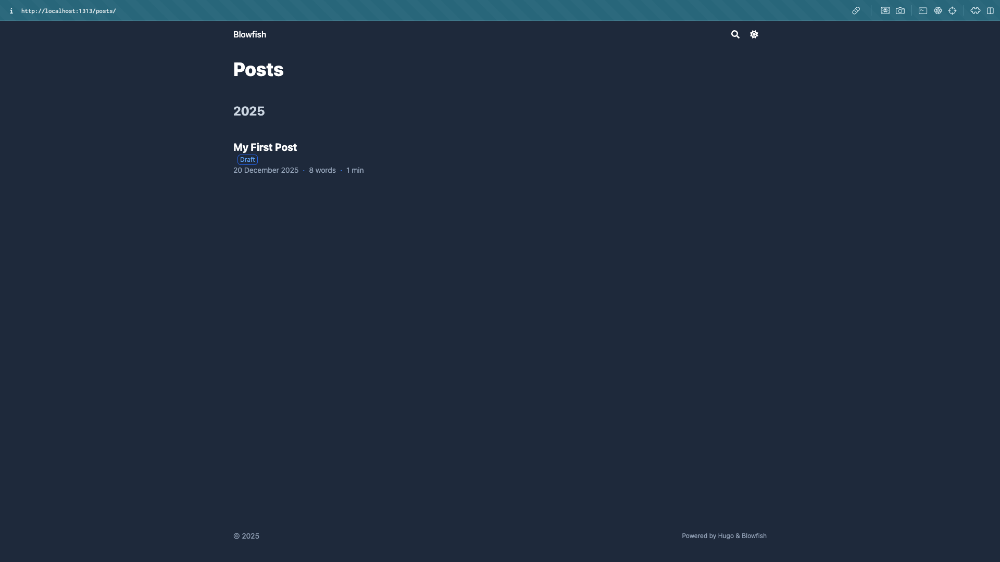
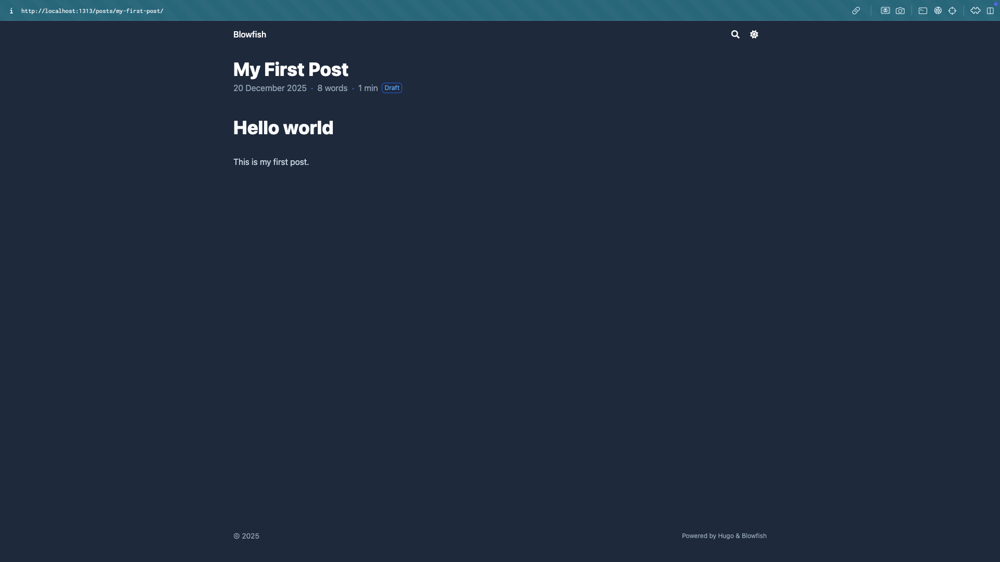

> In the previous article, I talked about the basic ideas behind building a static website.
> 
> 👉 [Hugo × GitHub Pages – Part 0: Core Concepts and Website Building Blocks](/en/posts/self-hosted-website-with-hugo-and-github-pages-part-0/)
> 
> In this article, we will create a Hugo project, set up a theme, and build our very first Markdown-based webpage locally.

## 1. What Is Hugo?



Hugo is a **static site generator (SSG)** that converts your written Markdown content into a complete website consisting of HTML, CSS, and JavaScript files that can be directly published online.

```
Markdown content + theme + configuration
            ↓
        Hugo builds
            ↓
A complete static website (HTML / CSS / JS)
```

On the [official Hugo website](https://gohugo.io/), Hugo describes itself with this line:

> *The world’s fastest framework for building websites*

Honestly, when I first saw this, my immediate reaction was:

**That’s a bold claim.**

But after actually using it, you’ll realize this isn’t just marketing language.

Hugo’s biggest strengths are that it is **fast, simple, and does not rely on a heavy frontend ecosystem**.

It is a single binary executable. There’s no need for Node.js, no need to install a large number of packages. As long as your content and configuration are ready, Hugo can quickly generate the entire website.

Compared to tools like [Hexo](https://hexo.io/zh-tw/) or [Jekyll](https://jekyllrb.com/), which require additional runtime environments, Hugo is much simpler to install and maintain, with very few dependency-related issues.

---

## 2. Creating a Local Website with Hugo

I’m using macOS in this guide. For Windows users, please refer to the [official documentation](https://gohugo.io/getting-started/quick-start/).

### (1) Prerequisites

We’ll use [Homebrew](https://brew.sh/) to install Hugo. If you’ve never used Homebrew before, install it first by opening Terminal and running:

```shell
/bin/bash -c "$(curl -fsSL https://raw.githubusercontent.com/Homebrew/install/HEAD/install.sh)"
brew update && brew upgrade && brew cleanup
```

If you don’t have [Git](https://git-scm.com/install/mac) installed, install it as well (you _can_ proceed without Git, but things will get much harder later):

```shell
brew install git
```

Install Hugo:

```shell
brew install hugo
```

Check the installation by running `hugo version`. If you see version information, Hugo is successfully installed:

```shell
hugo version
```

```shell
hugo v0.152.2+extended+withdeploy darwin/arm64 BuildDate=2025-10-24T15:31:49Z VendorInfo=brew
```

### (2) Create a Hugo Project

Create a new project using `hugo new site [project-name]`:

```shell
hugo new site mysite
cd mysite
```

You should now see the following directory structure:

```shell
mysite/
|--- archetypes/
|--- assets/
|--- content/   # Markdown pages and posts
|--- data/
|--- i18n/
|--- layouts/
|--- static/
|--- themes/    # Themes are stored here
|--- hugo.toml  # Main configuration file
```

We’ll go into more detail about these directories and advanced Hugo settings later. For now, just remember:

1. Themes live under `themes/`
2. Pages and posts (Markdown files) live under `content/`

#### Download a Hugo Theme

Before the site can render properly, we need to choose a theme. You can browse available themes on [Hugo Themes](https://themes.gohugo.io/). Popular choices include [PaperMod](https://themes.gohugo.io/themes/hugo-papermod/), [Stack](https://themes.gohugo.io/themes/hugo-theme-stack/), and [Blowfish](https://themes.gohugo.io/themes/blowfish/).

I personally use Blowfish. You can preview it on their [Demo Page](https://blowfish.page/).



You can further customize the theme later to create your own visual style. If you’re not sure which one to choose, Blowfish is a solid starting point. I plan to write a dedicated article about its customization options in the future.

Below, I’ll use Blowfish as an example. The installation process is similar for most themes, but it’s always recommended to follow the theme’s official documentation. The [Blowfish Installation Guide](https://blowfish.page/docs/installation/) is particularly clear.

Inside the `mysite/` directory, run:

```shell
git init
git submodule add -b main https://github.com/nunocoracao/blowfish.git themes/blowfish

# Use this command in the future to update the theme
# git submodule update --remote --merge
```

Next:

```shell
rm hugo.toml   # Remove Hugo’s default config file
cp -r themes/blowfish/config config
```

This creates a new `config/` directory. Open `config/_default/hugo.toml` and uncomment the following line (**not** the one under `themes/blowfish/config/_default/`):

```shell
theme = "blowfish" # UNCOMMENT THIS LINE`
```

#### Create Your First Post

Now let’s create our first post using `hugo new content [path]`:

```shell
hugo new content posts/my-first-post.md
```

The new file will appear under the `content/` directory.

Inside the file, you’ll see metadata wrapped in `+++`. We’ll explain this in more detail later. For now, let’s simply write some Markdown content (If you’ve never written Markdown before, you can ask ChatGPT to generate a sample, and there are also plenty of resources available online). For example:

```markdown
+++
date = '2025-12-20T17:21:59+08:00'
draft = true
title = 'My First Post'
+++
# Hello world

This is my first post.
```

Now let’s see what the site looks like.

### **(3) Local Preview**

At this stage, we can start building and previewing the site. Here are the three most important Hugo commands:

| **Command**      | **Purpose**       | **What It Does**                              | **Common Use Case**               |
| ---------------- | ----------------- | --------------------------------------------- | --------------------------------- |
| `hugo`           | Production build  | Generates the full static site into `public/` | Before deployment, GitHub Actions |
| `hugo server`    | Local development | Starts a local server with live reload        | Writing content, layout tweaking  |
| `hugo server -D` | Preview drafts    | Includes `draft = true` content               | Reviewing unpublished posts       |

Since our post is marked as `draft = true`, we need to run:

```shell
hugo server -D
```

**The generated `public/` directory is a complete static website!**

Based on the output, open the local URL in your browser—usually `http://localhost:1313/`:

```shell
Web Server is available at http://localhost:1313/ (bind address 127.0.0.1)
```



Because our post is under `content/posts/`, navigating to `http://localhost:1313/posts/` will show the newly created article.





Try editing the post and saving the file—you’ll see the preview update **instantly**, which makes writing extremely convenient.

> In the next article, we’ll complete the **first real deployment**, automatically deploying the Hugo site to **GitHub Pages**.
