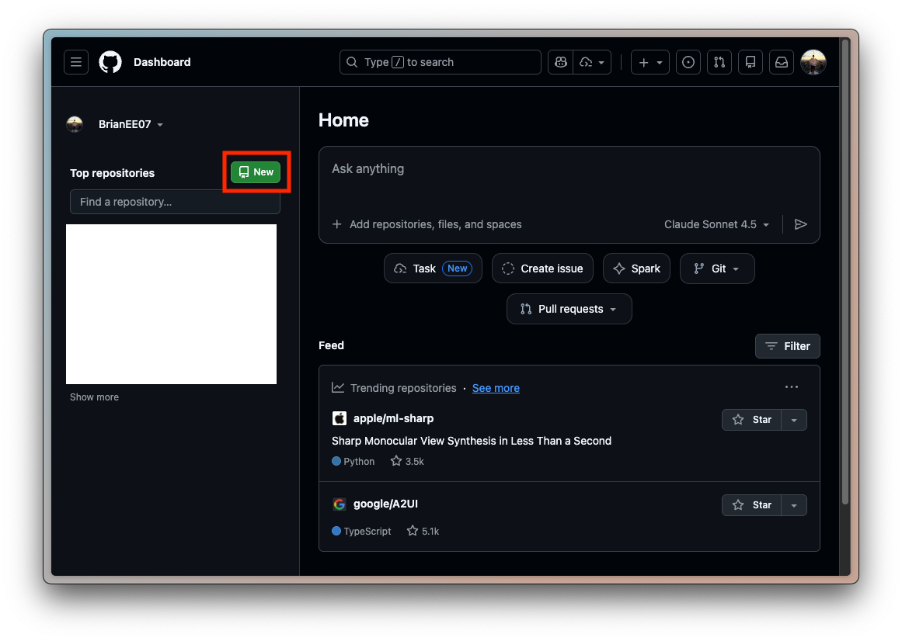
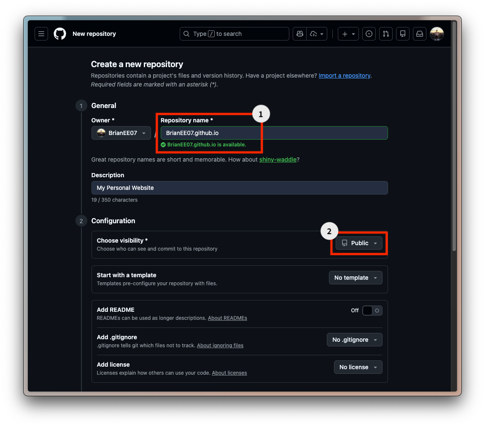
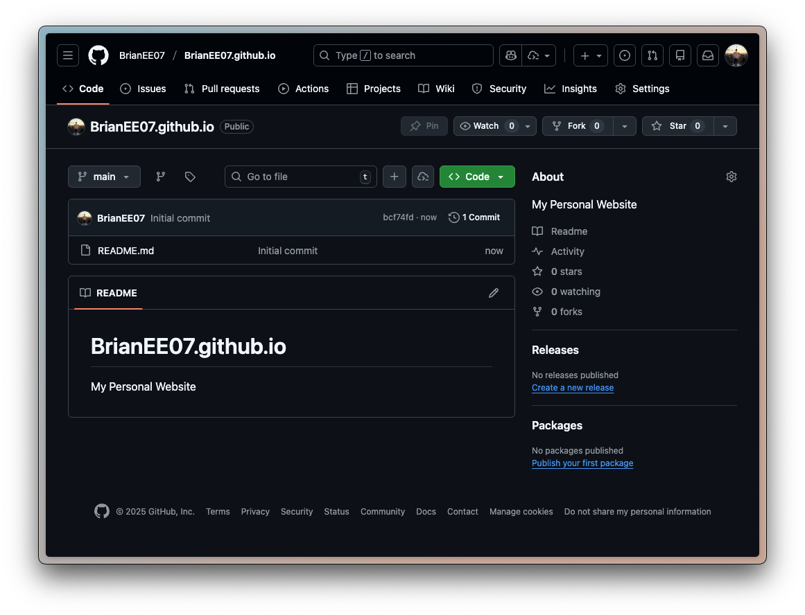
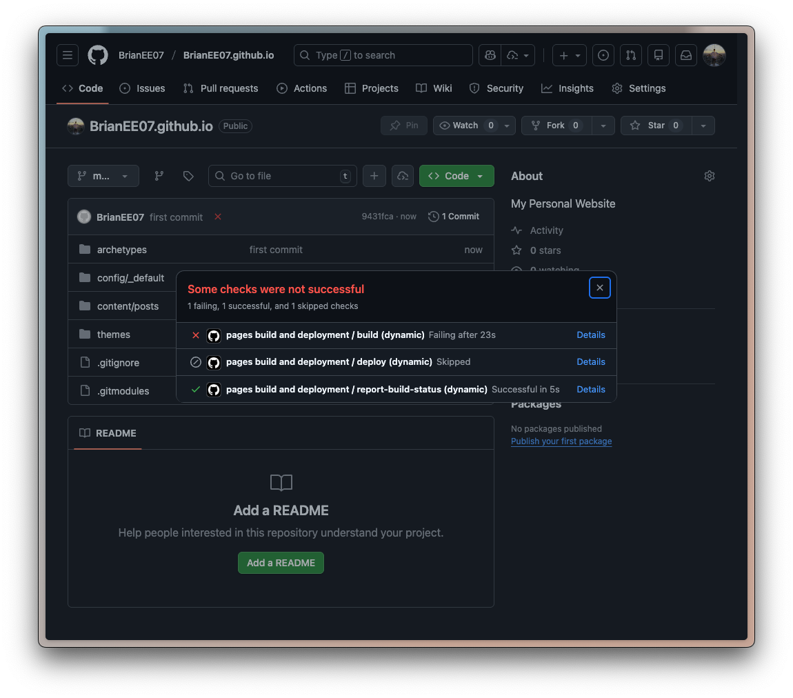
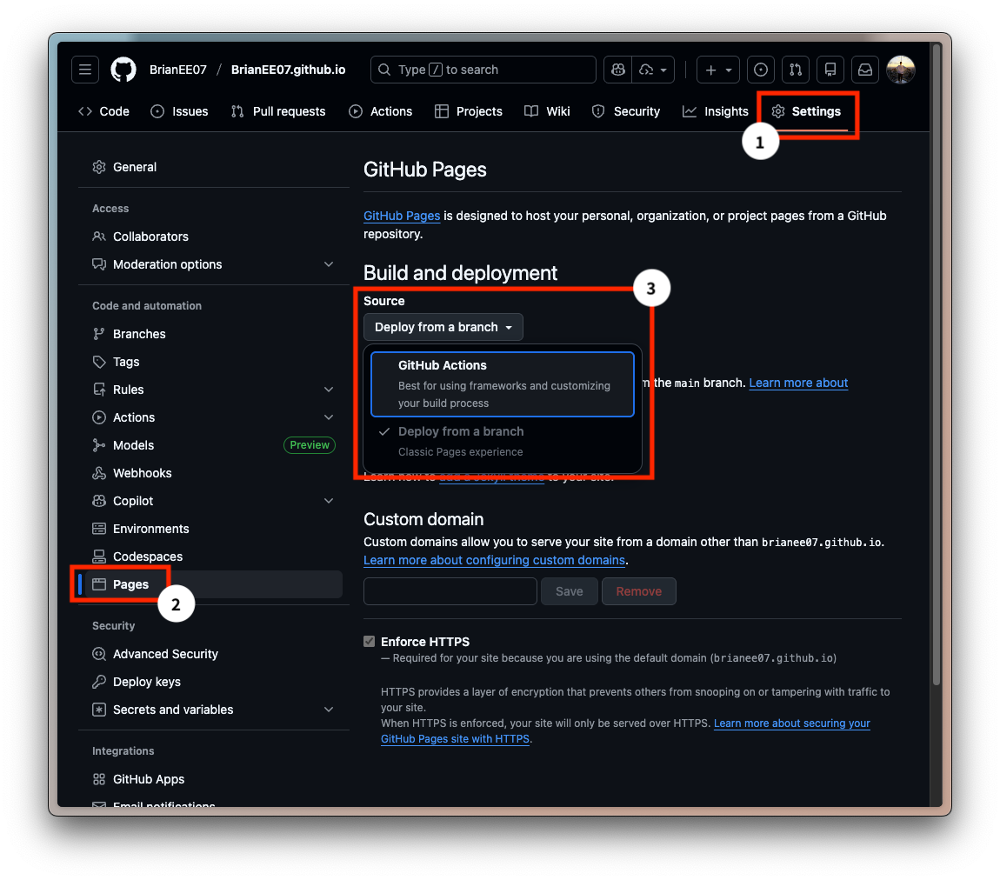
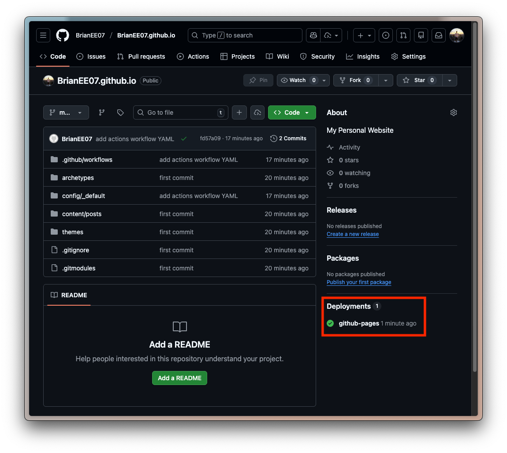
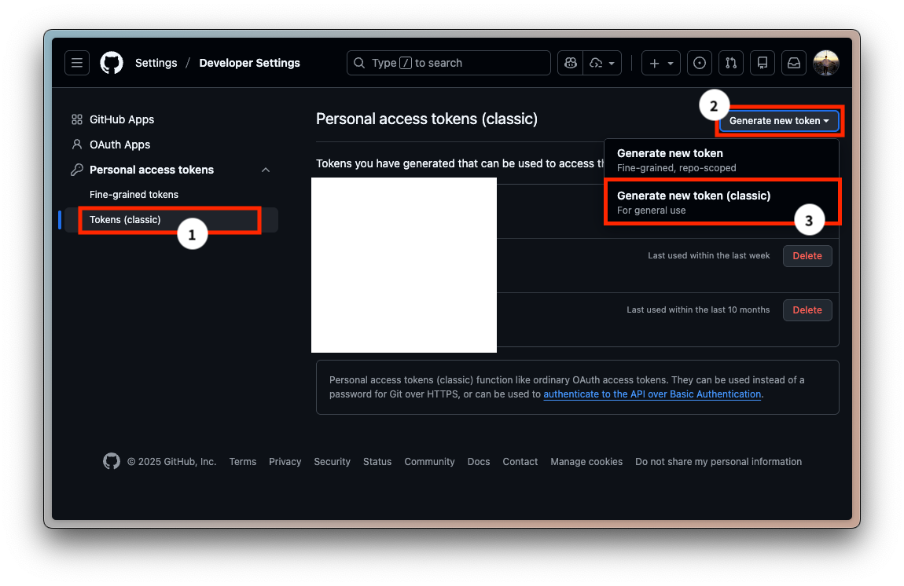
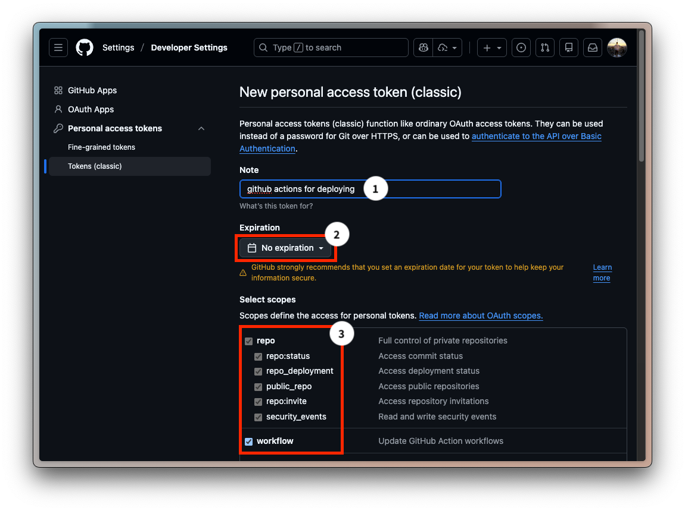

> 上一篇文章我們成功地在本地端運行了第一個網頁。
> 
> 👉 [手把手自架個人網站｜Hugo × GitHub Pages – Part 1：用 Hugo 在本地跑起第一個網站](/posts/self-hosted-website-with-hugo-and-github-pages-part-1/)
> 
> 本篇會介紹如何部署網頁到 GitHub Pages，並透過 GitHub Actions 簡化手動流程，要讓網頁上線真的不難！

## ㄧ、GitHub Pages 是什麼？

GitHub 提供的**免費靜態網站託管服務**，可直接從其平台上的儲存庫（repository）發佈網站。講白一點，如果我們把上一篇 `public/` 底下的網站內容比喻成**房子**，GitHub Pages 就是提供給房子的**土地**。免費的土地，還不香嗎？XD


---

## 二、開一個新的 GitHub Repo

首先我們需要建立一個 [GitHub](https://github.com) 儲存庫（以下稱 Repo），



這個 Repo 的名稱建議是 `<帳號名稱>.github.io`，就不需要多做設定，並且要**設成公開**。



GitHub Pages 的邏輯是：

| **類型**               | **網址**                               | **說明**     |
| -------------------- | ------------------------------------ | ---------- |
| **主站（User Site）**    | `https://<帳號名稱>.github.io/`          | 一個帳號只能一個   |
| **子站（Project Site）** | `https://<帳號名稱>.github.io/<Repo名稱>/` | 一個 Repo 一個 |

只要 Repo 名稱是 `<帳號名稱>.github.io`，對應的 GitHub Pages 就是**主站**，其他 Repo 名稱對應的 GitHub Pages 都是**子站**。

---

## 三、設定部署方式

接著有兩種方式，第一種舊式做法設定上比較簡單，但每次更新網站內容需要更多的手動步驟，所以 👉 [**較推薦第二種 GitHub Actions 的方法**](#%e6%96%b9%e6%b3%95%e4%ba%8cgithub-actions%e6%8e%a8%e8%96%a6)。

---

### 方法一：舊做法

在本地端 `mysite/` 旁邊也建一個 `<帳號名稱>.github.io` 的資料夾（這邊名稱就不強制），像是這樣：

```shell
mkdir BrianEE07.github.io
cd BrianEE07.github.io
```

照著 GitHub 上創完 Repo 的提示（用自己的帳號名稱），以我為例，

```shell
echo "# BrianEE07.github.io" >> README.md
git init
git add README.md
git commit -m "Initial commit"
git branch -M main
git remote add origin https://github.com/BrianEE07/BrianEE07.github.io.git
git push -u origin main
```

好了會長類似這樣：



然後回到本地 Terminal，

```shell
cd ../mysite
```

用前一篇介紹過「**正式編譯網站**」的指令 `hugo`：

```shell
rm -rf public # 清掉先前編譯後的輸出
hugo
```

複製產生的 `public/` 底下的所有檔案到 `<帳號名稱>.github.io` 這個資料夾，推送到 GitHub 上：

```shell
cp -r public/* ../BrianEE07.github.io
cd ../BrianEE07.github.io
git add .
git commit -m "add my first post"
git push
```

回到 GitHub，在 Repo 主頁上面看到 **Deployments** 綠色勾勾 ✅ 就表示部署完成。（可能要等一下下）


最後就可以去 `https://<帳號名稱>.github.io/` 看到你更新後的網頁了！以筆者為例就是 `https://brianee07.github.io/posts/`。（有問題可以嘗試用無痕瀏覽器開）

> [!tip]
> 注意如果文章 `draft = true`，`hugo` 指令是不會編譯的，要改成 `draft = false`，否則會看不到文章。

之後更新網頁就再**跑一次 `hugo` 編譯、複製和上傳流程即可**。

---

### 方法二（GitHub Actions）：推薦

我原先使用方法一，但每次推送之前都要手動複製，後來在網路上找到了可以**更自動化的方式**，[Hugo 官方文件](https://gohugo.io/host-and-deploy/host-on-github-pages/) 也是使用這個做法，算是一勞永逸吧。

> 其實簡單來說方法就是我們把 Hugo 專案 `mysite/` 推送到 `<帳號名稱>.github.io` 這個 Repo，並在推送完成後 GitHub 那邊會自動執行 Hugo 編譯跟部署流程。

首先在 Hugo 專案路徑 `mysite/` 底下創 `.gitignore`，

```shell
touch .gitignore
```

把不需要推上 GitHub 的路徑加進去，編輯 `.gitignore`：

```gitignore
# =========================
# Hugo
# =========================

# Hugo build output
public/
resources/

# Hugo build lock
.hugo_build.lock

# =========================
# OS / Editor
# =========================

# macOS
.DS_Store
```

可以發現本地的 `public/` 是我們要忽略的路徑，因為 GitHub 會在雲端自動執行編譯。

> [!important]
> 當然還是建議編輯文章時，先在本地跑 `hugo server` 編譯、預覽網頁沒問題後再做推送，節省不必要的來回 debug 時間。

推送到 GitHub（之前安裝主題已經 `git init` 過了所以不用再打一次）：

```shell
git add .
git remote add origin https://github.com/BrianEE07/BrianEE07.github.io.git
git branch -M main
git commit -m "Initial commit"
git push -u origin main
```

上去之後有 fail 是正常的，因為 Github Pages 會幫你用 Jekyll 推一次但我們是 Hugo 所以會錯。



這也表明了**只要自動化過程有錯，就會終止，確保網站一定是對的版本**。而我們可以透過查看 **Details** 來知道哪裡錯。

接下來要來建立自動化流程。首先，進到 `Settings` → `Pages` → `Build and deployment` → `Source` 改成 **Github Actions**。（相反地，方法一則是預設的 **Deploy from a branch**）



然後在本地 `mysite/` 底下創個 `.github/workflow/hugo.yaml`，

```shell
mkdir -p .github/workflows
touch .github/workflows/hugo.yaml
```

編輯內容如下，也可以去 [Hugo 官方文件](https://gohugo.io/host-and-deploy/host-on-github-pages/#step-4) 複製，簡單來說裡面就是給 GitHub Actions 做的自動化步驟：

```yaml
name: Build and deploy
on:
  push:
    branches:
      - main
  workflow_dispatch:
permissions:
  contents: read
  pages: write
  id-token: write
concurrency:
  group: pages
  cancel-in-progress: false
defaults:
  run:
    shell: bash
jobs:
  build:
    runs-on: ubuntu-latest
    env:
      DART_SASS_VERSION: 1.97.1
      GO_VERSION: 1.25.5
      HUGO_VERSION: 0.153.1
      NODE_VERSION: 24.12.0
      TZ: Europe/Oslo
    steps:
      - name: Checkout
        uses: actions/checkout@v5
        with:
          submodules: recursive
          fetch-depth: 0
      - name: Setup Go
        uses: actions/setup-go@v5
        with:
          go-version: ${{ env.GO_VERSION }}
          cache: false
      - name: Setup Node.js
        uses: actions/setup-node@v4
        with:
          node-version: ${{ env.NODE_VERSION }}
      - name: Setup Pages
        id: pages
        uses: actions/configure-pages@v5
      - name: Create directory for user-specific executable files
        run: |
          mkdir -p "${HOME}/.local"
      - name: Install Dart Sass
        run: |
          curl -sLJO "https://github.com/sass/dart-sass/releases/download/${DART_SASS_VERSION}/dart-sass-${DART_SASS_VERSION}-linux-x64.tar.gz"
          tar -C "${HOME}/.local" -xf "dart-sass-${DART_SASS_VERSION}-linux-x64.tar.gz"
          rm "dart-sass-${DART_SASS_VERSION}-linux-x64.tar.gz"
          echo "${HOME}/.local/dart-sass" >> "${GITHUB_PATH}"
      - name: Install Hugo
        run: |
          curl -sLJO "https://github.com/gohugoio/hugo/releases/download/v${HUGO_VERSION}/hugo_extended_${HUGO_VERSION}_linux-amd64.tar.gz"
          mkdir "${HOME}/.local/hugo"
          tar -C "${HOME}/.local/hugo" -xf "hugo_extended_${HUGO_VERSION}_linux-amd64.tar.gz"
          rm "hugo_extended_${HUGO_VERSION}_linux-amd64.tar.gz"
          echo "${HOME}/.local/hugo" >> "${GITHUB_PATH}"
      - name: Verify installations
        run: |
          echo "Dart Sass: $(sass --version)"
          echo "Go: $(go version)"
          echo "Hugo: $(hugo version)"
          echo "Node.js: $(node --version)"
      - name: Install Node.js dependencies
        run: |
          [[ -f package-lock.json || -f npm-shrinkwrap.json ]] && npm ci || true
      - name: Configure Git
        run: |
          git config core.quotepath false
      - name: Cache restore
        id: cache-restore
        uses: actions/cache/restore@v4
        with:
          path: ${{ runner.temp }}/hugo_cache
          key: hugo-${{ github.run_id }}
          restore-keys:
            hugo-
      - name: Build the site
        run: |
          hugo \
            --gc \
            --minify \
            --baseURL "${{ steps.pages.outputs.base_url }}/" \
            --cacheDir "${{ runner.temp }}/hugo_cache"
      - name: Cache save
        id: cache-save
        uses: actions/cache/save@v4
        with:
          path: ${{ runner.temp }}/hugo_cache
          key: ${{ steps.cache-restore.outputs.cache-primary-key }}
      - name: Upload artifact
        uses: actions/upload-pages-artifact@v3
        with:
          path: ./public
  deploy:
    environment:
      name: github-pages
      url: ${{ steps.deployment.outputs.page_url }}
    runs-on: ubuntu-latest
    needs: build
    steps:
      - name: Deploy to GitHub Pages
        id: deployment
        uses: actions/deploy-pages@v4
```

對我知道很長，但就複製就好。XD

編輯 `config/_default/hugo.toml`（預設是 `mysite/` 下有 `hugo.toml`，因為我們上一篇用了 Blowfish 主題，這個檔案路徑會是在 `config/_default/` 底下），找地方加入這些敘述：

```toml
[caches]
  [caches.images]
    dir = ':cacheDir/images'
```

最後一樣把這些東西推到 GitHub 上（有問題請看 👉 [錯誤排除](#%e9%8c%af%e8%aa%a4%e6%8e%92%e9%99%a4)）：

```shell
git add .
git commit -m "add actions workflow YAML"
git push
```

回到 GitHub，在 Repo 主頁上面看到 **Deployments** 綠色勾勾 ✅ 就表示部署完成。（可能要等一下下）



最後就可以去 `https://<帳號名稱>.github.io/` 看到你更新後的網頁了！以筆者為例就是 `https://brianee07.github.io/posts/`。（有問題可以嘗試用無痕瀏覽器開）

> [!tip]
> 注意如果文章 `draft = true` 是不會被編譯的，要改成 `draft = false`，否則會看不到文章。

之後更新網頁僅需**重新推送到 GitHub 上即可**。

#### 錯誤排除

如果 `git push` 時出現下列錯誤表示 token 權限不夠：

```shell
! [remote rejected] main -> main (refusing to allow a Personal Access Token to create or update workflow `.github/workflows/hugo.yaml` without `workflow` scope)
error: failed to push some refs to 'https://github.com/BrianEE07/BrianEE07.github.io.git'
```

去 GitHub 右上角個人頭像 → `Settings` → `Developer Settings` → `Personal access tokens` → `Tokens (classic)` → `Generate new token (classic)`。



**Repo** 和 **Workflow** 都要打勾，



然後 `Generate token`，複製 token（**只會顯示一次**），更新本機 Git 認證：

```shell
security delete-internet-password -s github.com
git push # 重新依序輸入 GitHub 帳號和剛剛的 Token
```

---

## 四、如果想換成自己的網址？

相信你點進這個網址， https://brianee07.github.io/ ，會發現網址跳轉到 https://weiweifan.com/ 。下一篇我會介紹怎麼**設定自己的網域名稱**～

> 👉 Coming Soon

---

## FAQ（方法二）

### Q1：為什麼要設定 caches.images？

```toml
[caches]
  [caches.images]
    dir = ':cacheDir/images'
```

用來**快取 Hugo 的圖片處理結果**。若使用 Resize、Fit、Fill 等功能，沒有快取時，每次 build 都會重新處理圖片。建議在 CI 環境（像是 GitHub Actions）時設定，本機影響不大。

### Q2：之後要換 Hosting 平台，會很麻煩嗎？

不會，因為**內容與部署是分離的**。內容不用動，改部署方式跟 DNS（若有自訂網域）即可。

部署方式可以改成：

- 修改 GitHub Actions，部署到新平台。
- 或改用平台內建的 build，直接刪除 `.github/workflows/` 就可以停用 GitHub Actions。
