> In the previous article, we placed our website content—the “house”—on the “land” provided by GitHub Pages.
> 
> 👉 [Hugo × GitHub Pages – Part 2: First Deployment with GitHub Actions](/en/posts/self-hosted-website-with-hugo-and-github-pages-part-2/)
> 
> In this article, we’ll go a step further by introducing the basics of domain names, how to purchase your own domain, and how to configure a custom domain for GitHub Pages.

## 1. What Is a Domain Name?

If we compare a website to a house, **then a domain name is like your home address**.

Its purpose is to replace hard-to-remember IP addresses with something more human-friendly, so users can find your website (house) more easily.

For example, computers communicate using IP addresses (such as `142.250.72.206`), which are not intuitive for humans. That’s why domain names like `example.com` exist.

The **DNS (Domain Name System)** mentioned later is responsible for the following task:

> Converting the domain name you enter into an IP address that computers can actually understand.

Before configuring a custom domain, a website hosted on GitHub Pages will have a default URL like this:

```
https://<username>.github.io
```

As soon as you see this URL, you know the site is hosted on GitHub Pages.

Once you have your own domain name, the URL becomes:

```
https://example.com
```

Not only does this look cleaner, it also feels much more like “your own” website.

### Domain Hierarchy Basics

A complete domain name can usually be broken down into the following levels:

| **Level**                 | **Example**                  | **Description**                                                                                   |
| ------------------------- | ---------------------------- | ------------------------------------------------------------------------------------------------- |
| Top-Level Domain (TLD)    | `.com`, `.io`, `.org`, `.tw` | The rightmost part of a domain, indicating its type or region                                     |
| Second-Level Domain (SLD) | `example.com`(`example`)     | The actual domain name you purchase and own; the main identifier of the site                      |
| Subdomain                 | `www.example.com`(`www`)     | An extension built on top of the second-level domain, often used to separate services or purposes |

As you can see, **domain names are extended by adding prefixes to the left**, while the top-level domain on the far right serves as the starting point of the entire structure.

### Why Use Your Own Domain Name?

Setting up a custom domain usually has several practical benefits:

- **More professional and recognizable**
    - A personal website, technical blog, or portfolio no longer looks tied to a specific platform
- **Decoupled from the hosting provider**
    - The URL belongs to you, not GitHub; even if you switch hosting platforms later, the URL does not need to change
- **Better for long-term operation**
    - Helps accumulate SEO value and makes sharing easier, such as using the link on business cards or resumes

> [!info] What is SEO?
> SEO (Search Engine Optimization) refers to a set of techniques used to optimize a website’s content and structure so that search engines can better understand and index it, improving its ranking and visibility in search results.

## 2. Buying Your Own Domain with Namecheap

> This part requires a small purchase. A domain usually costs a few hundred TWD per year, which works out to just a few dozen per month. For a clean, personal URL, I think it’s worth it.

First, go to the [Namecheap website](https://www.namecheap.com/) and search for a domain name you like. Other large domain registrars include [GoDaddy](https://www.godaddy.com/en) and [Gandi](https://www.gandi.net/en-US); the choice mainly comes down to personal preference.

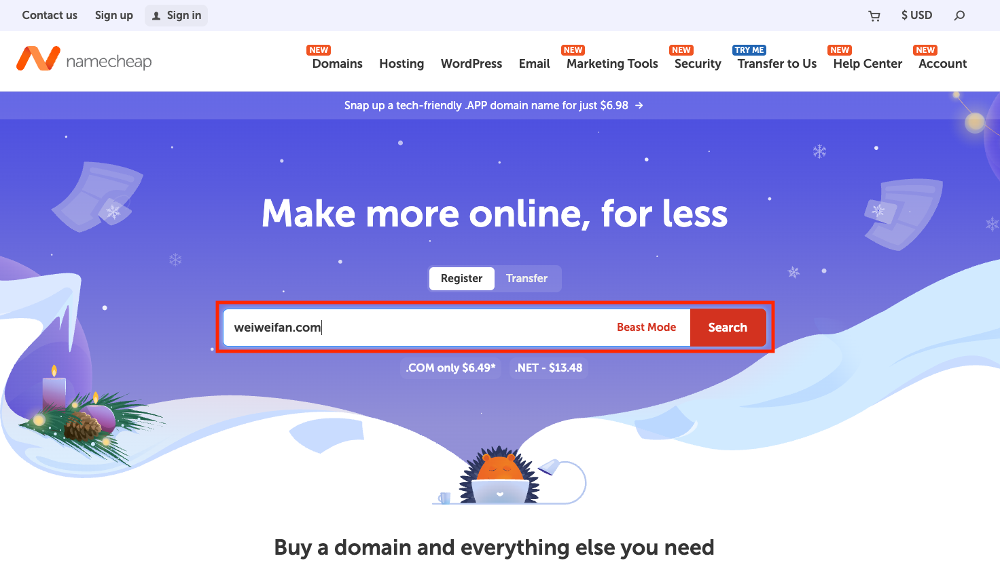

You’ll see results like the following:

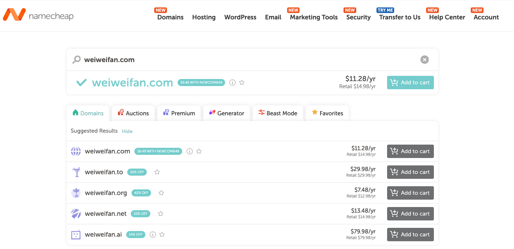

If the domain is available, you’ll see **Add to cart**. Different top-level domains have different prices; commonly chosen ones include `.com`, `.io`, `.net`, and `.me`.

Next, proceed through the registration and checkout process. You can leave **AUTO-RENEW** enabled to avoid forgetting to renew the domain after one year. At this stage, there is **no need to purchase an additional SSL certificate**, as GitHub Pages will automatically provide and configure HTTPS later.

> [!info] What is SSL?
> SSL (Secure Sockets Layer) is an encryption technology that secures data transmission between users and websites, preventing eavesdropping or tampering. Once enabled, a site switches from HTTP to HTTPS.

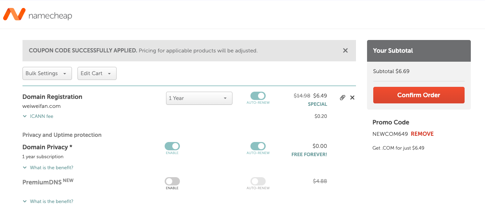

After a successful purchase, you’ll receive an order confirmation email:

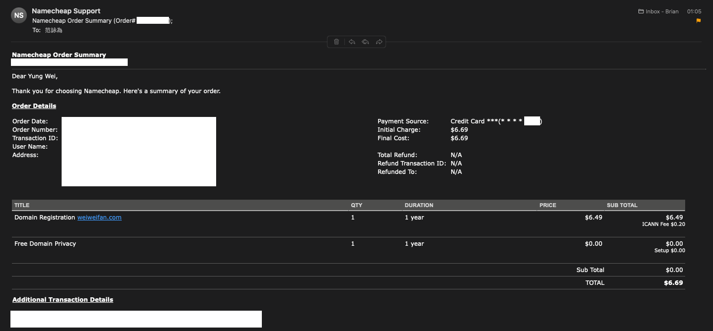

Don’t forget to click the verification link in the other email you receive:

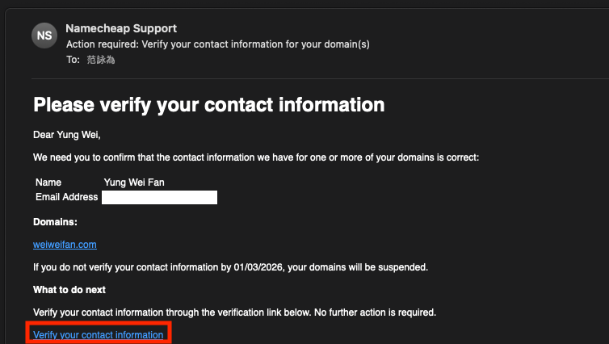

## 3. Configuring DNS on Namecheap

Next, we’ll configure DNS so that the domain name you enter can be correctly translated into an IP address.

Go to `Account` → `Dashboard`:

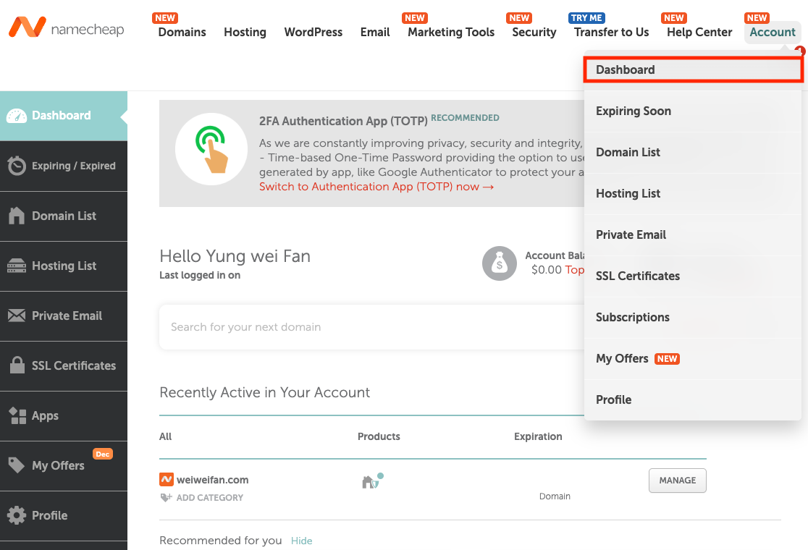

Find the domain you just purchased and click `MANAGE`:

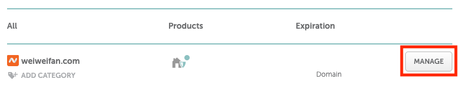

On the `Domain` page, select `Namecheap BasicDNS`:

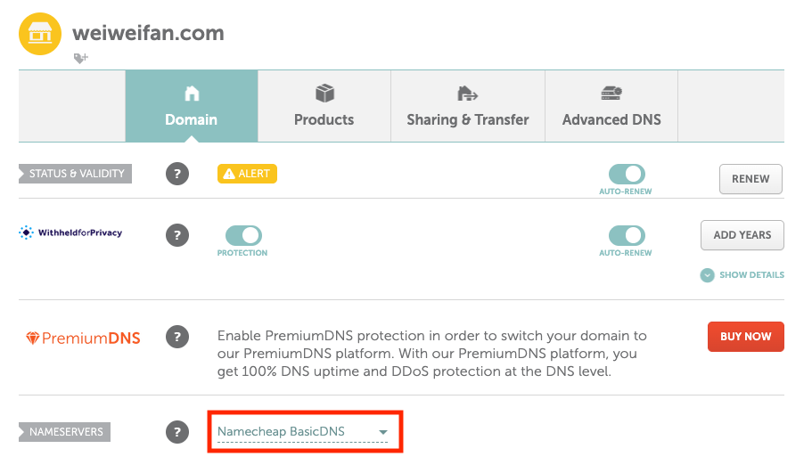

Switch to the `Advanced DNS` tab and add **A Records** using the following four IP addresses:

```
185.199.108.153
185.199.109.153
185.199.110.153
185.199.111.153
```

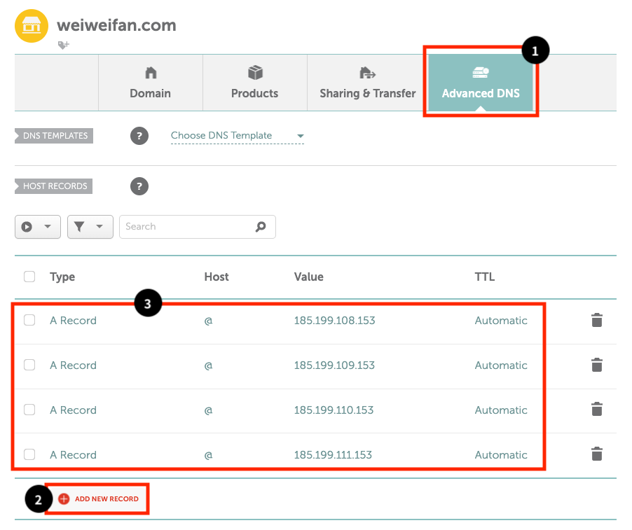

These are the official IP addresses used by GitHub Pages. By configuring them, you are pointing your domain to where GitHub Pages hosts your site.

Next, add a **CNAME Record** as shown below. For the `Value`, enter `<username>.github.io`, which was configured in the previous article.

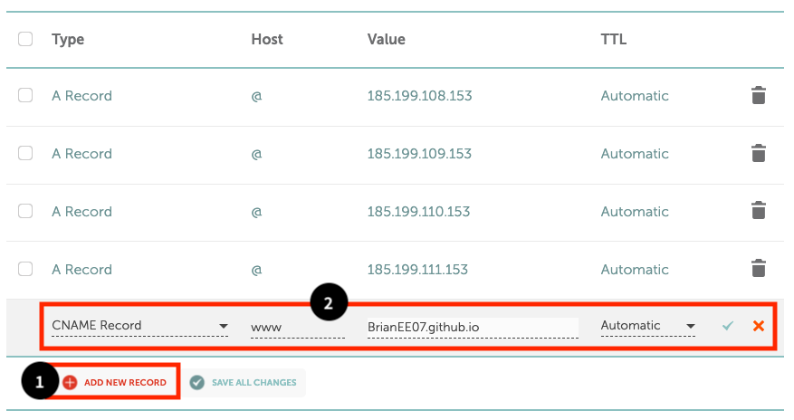

> [!NOTE] What’s the difference between an A Record and a CNAME?
> The **A Record** handles the apex domain (`weiweifan.com`), while the **CNAME** handles subdomains (`www.weiweifan.com`), allowing both to point to the same GitHub Pages site.

## 4. Setting a Custom Domain on GitHub Pages

We’re almost there. GitHub Pages provides built-in support for custom domains, and we just need to configure it.

First, go back to your local project and edit `hugo.toml` (if you followed the setup from previous articles, the file will be under `config/_default/`; with the default structure, it’s in the project root). Update the `baseURL` to your own domain:

```toml
baseURL = "https://weiweifan.com/"
```

Push the change to GitHub:

```shell
git add .
git commit -m "update baseURL to https://weiweifan.com/"
git push
```

Back on GitHub, go to your `<username>.github.io` repository → `Settings` → `Pages`. Enter your domain name under **Custom domain**, then click `Save`.

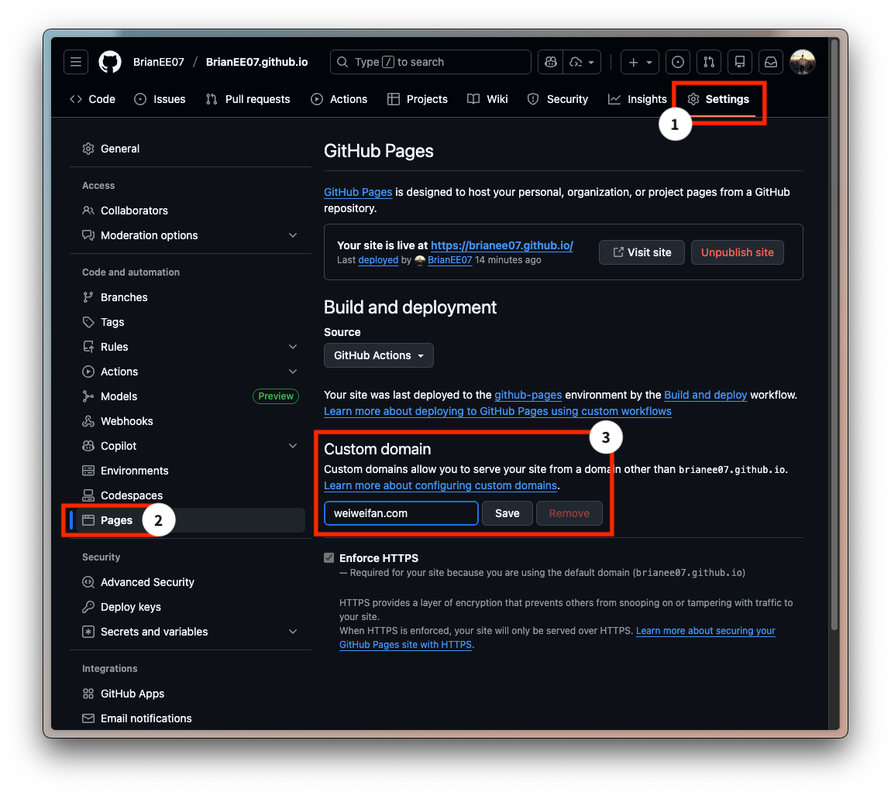

Wait for the DNS check to complete (this usually takes only a few minutes):

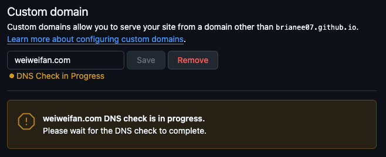

Once the check passes:

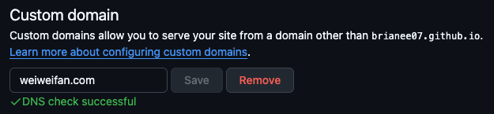

Then enable **Enforce HTTPS**. GitHub Pages will automatically request a free SSL certificate from [Let’s Encrypt](https://letsencrypt.org/), so no manual configuration is required. If the option is temporarily unavailable, refresh the page and try again. If it still doesn’t work, clear the **Custom domain** field, re-enter it, and wait a bit longer.

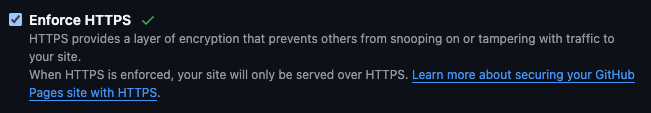

After everything is set up, visit https://weiweifan.com to confirm that the site loads correctly. You can also check https://www.weiweifan.com — both URLs should work.

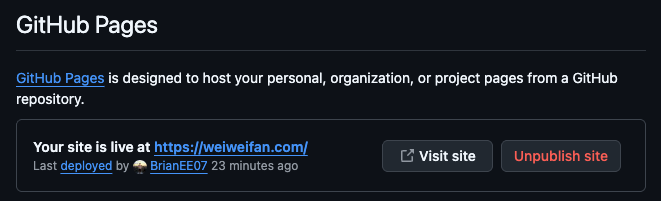

At this point, you can take a short break. As long as the domain itself does not change, switching hosting platforms later usually won’t immediately erase the SEO value you’ve already accumulated.

> The next article will introduce how to set up **Google Analytics** and **Google Search Console** to track traffic and user behavior on a static website, and help Google index your site more quickly and accurately.
> 
> 👉 Coming Soon
