> 上一篇文章中，我們把網頁內容這棟「房子」，架設在 GitHub Pages 這塊「土地」上。
> 
> 👉 [手把手自架個人網站｜Hugo × GitHub Pages – Part 2：首次上線，透過 GitHub Actions 自動部署 Hugo 網站](/posts/self-hosted-website-with-hugo-and-github-pages-part-2/)
> 
> 本篇將進一步介紹網域的基礎觀念、如何購買屬於自己的網域，以及 GitHub Pages 如何設定自訂網域。

## 一、什麼是網域？

如果把網站比喻成一棟房子，**網域（Domain Name）就像是你家的門牌**。

它的目的，就是取代難以記憶的 IP 位址，讓使用者能夠用人類比較好記的方式，找到你的網站（房子）。

舉例來說，電腦之間實際溝通時使用的是 IP 位址（例如 `142.250.72.206`），但對人類來說並不直覺；因此才會有像 `example.com` 這樣的網域名稱存在。

而後面會提到的 **DNS（Domain Name System）**，它的工作就是：

> 把你輸入的網域名稱，轉換成電腦實際能理解的 IP 位址。

在尚未設定自訂網域之前，使用 GitHub Pages 架設的網站，預設網址會長得像這樣：

```
https://<username>.github.io
```

只要你看到這個網址，就知道網站是架在 GitHub Pages 上。

有了自己的網域之後，網址會變成：

```
https://example.com
```

看起來不僅更簡潔，也更有「自己的網站」的感覺。

### 網域層級概念

一個完整的網域，通常可以拆成以下幾個層級：

| **層級** | **名稱**                   | **範例**                    | **說明**                   |
| ------ | ------------------------ | ------------------------- | ------------------------ |
| 頂級網域   | TLD（Top-Level Domain）    | `.com`、`.io`、`.org`、`.tw` | 網域結構中最右邊的一段，用來表示類型或地區    |
| 二級網域   | SLD（Second-Level Domain） | `example.com`（`example`）  | 實際購買並擁有的網域名稱，網站的主要識別     |
| 子網域    | Subdomain                | `www.example.com`（`www`）  | 建立在二級網域之上的延伸，用來區分不同服務或用途 |

可以發現，**網域的層級是透過「往左不斷加上前綴」來擴展的**，而最右邊的頂級網域，則是整個網域結構的起點。

### 為什麼要設定自己的網域？

設定自訂網域，通常有以下幾個實際好處：

- **更專業、可辨識**
    - 個人網站、技術部落格或作品集，看起來不再像是附屬在某個平台底下
- **與 Hosting 結構分開**
    - 網址屬於你，而不是 GitHub，之後就算更換 Hosting 平台，網址也不用跟著改
- **更適合長期經營**
    - 有利於 SEO 成效的累積，也更方便對外分享、使用在名片或履歷連結上

> [!info]- SEO 是什麼？
> SEO（Search Engine Optimization，搜尋引擎最佳化）是一系列優化網站內容與結構的方法，讓網站更容易被搜尋引擎理解與收錄，提升搜尋結果中的排名與曝光度。

---

## 二、從 Namecheap 購買自己的網域

> 這裡會需要小課金，不過一年大約幾百塊台幣，換算下來每個月就兩位數，為了漂亮的網址我覺得值得啦～

首先到 [Namecheap 官網](https://www.namecheap.com/) 搜尋自己喜歡的網域名稱（較大的網域供應商還有像是 [GoDaddy](https://www.godaddy.com/en)、[Gandi](https://www.gandi.net/en-US) 的等等，就看個人選擇），

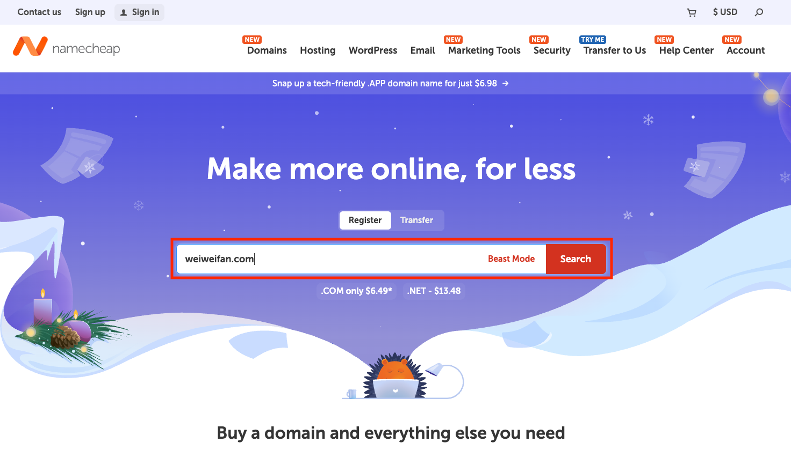

搜尋結果如下：

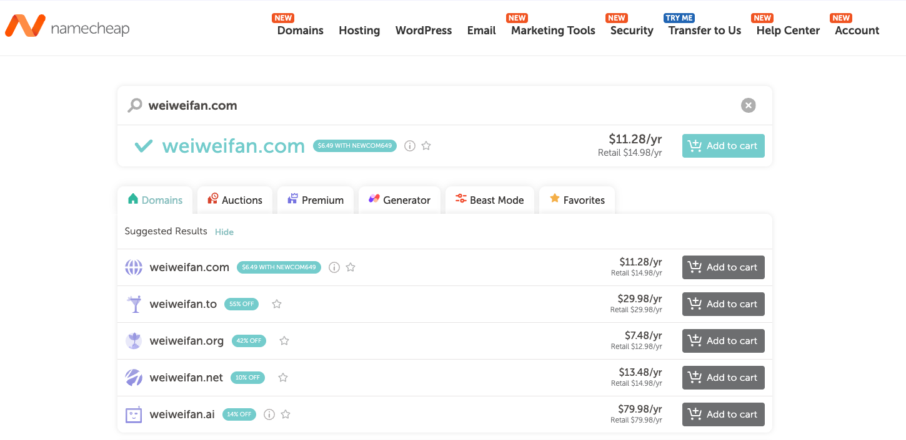

如果該網域尚未被註冊，頁面上會顯示 **Add to cart**。可以看到不同頂級域名也會有不同價格，通常會選 `.com`、`.io`、`.net`、`.me` 之類比較常見的。

接著就進入註冊與結帳流程。**AUTO-RENEW** 可以保留預設勾選，就不用擔心一年後忘記續費被買走。注意這個階段**不需要額外加購 SSL 憑證**，後續 GitHub Pages 會自動提供並設定好 HTTPS。

> [!info]- SSL 是什麼？
> SSL（Secure Sockets Layer）是一種網路加密技術，用來保護使用者與網站之間的資料傳輸安全，避免被竊聽或竄改，啟用後，網站會由 HTTP 變為 HTTPS。

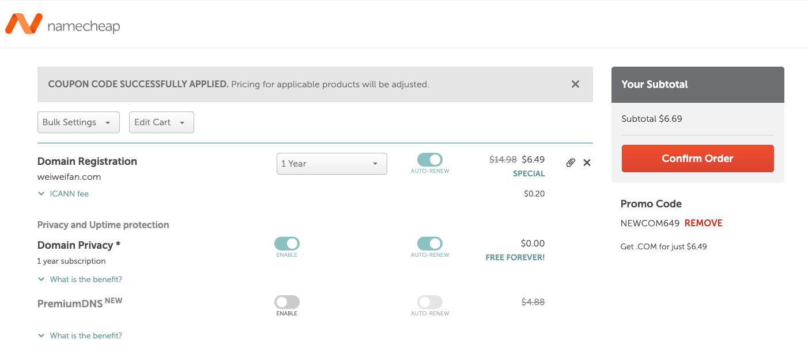

購買成功會收到訂單明細信件：

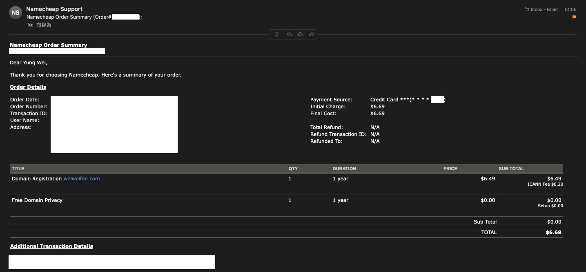

另外要記得去點另一封信中的驗證連結：

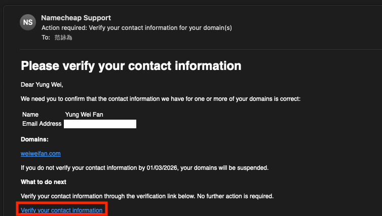

---

## 三、在 Namecheap 設定 DNS

接下來，我們要設定前面提過的 DNS，讓你輸入的網域名稱，能夠被正確轉換成 IP 位址。

前往 `Account` → `Dashboard`：

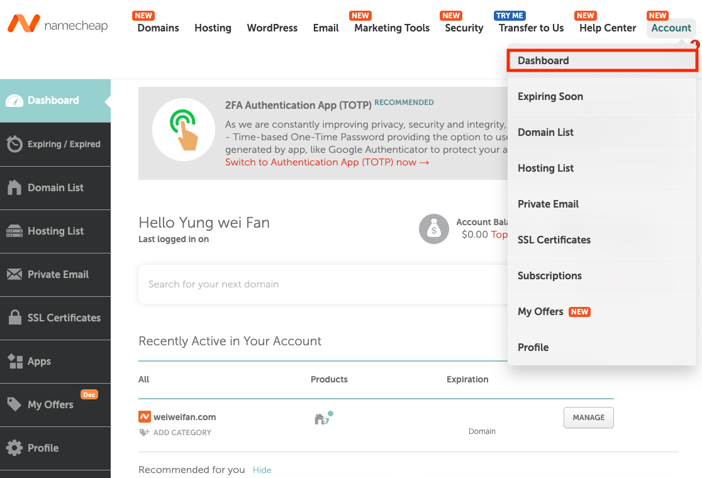

找到剛剛購買的網域，點擊 `MANAGE`：

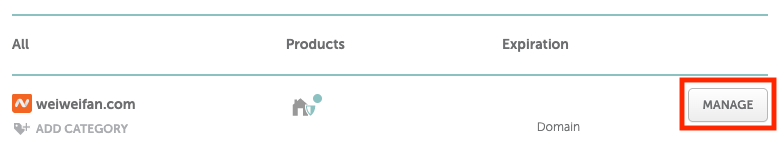

在 `Domain` 頁面，選擇 `Namecheap BasicDNS`：

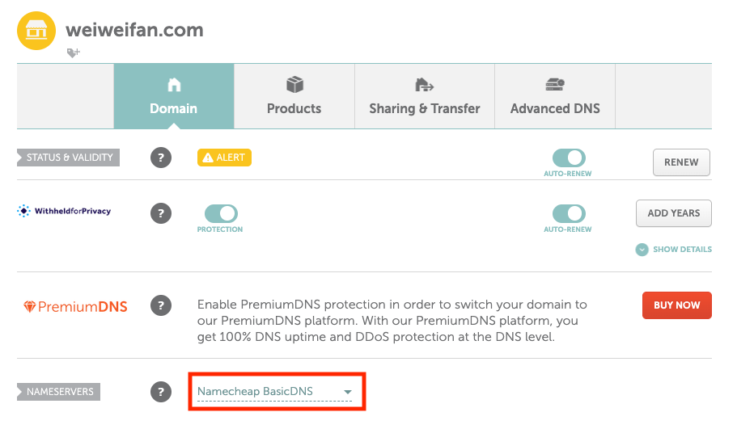

切換到 `Advanced DNS` 頁面， 添加 **A Record**，照下圖輸入，四個 IP 位址分別為：

```
185.199.108.153
185.199.109.153
185.199.110.153
185.199.111.153
```

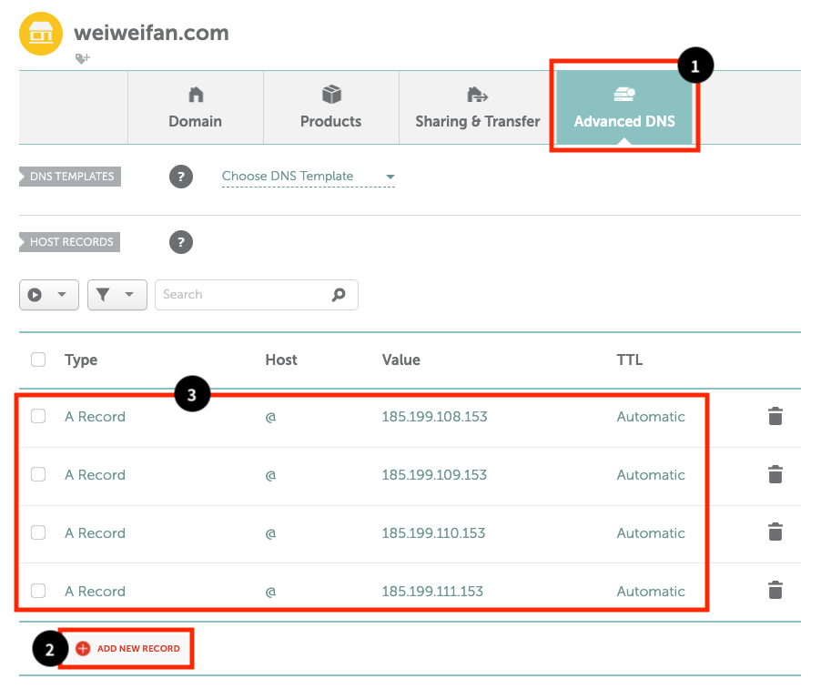

這些都是 GitHub Pages 使用的官方 IP 位址，設定後就等於把網域指到 GitHub Pages 放網站的地方。

添加 **CNAME Record**，照下圖輸入，`Value` 則是上一篇設定過的 `<帳號名稱>.github.io`。

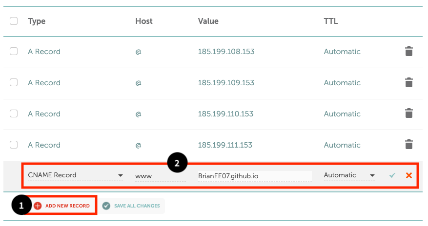

> [!NOTE]+ A Record、CNAME 差別？
> **A Record** 負責裸網域（`weiweifan.com`），**CNAME** 負責子網域（`www.weiweifan.com`），讓兩者都能指向同一個 GitHub Pages 網站。

---

## 四、GitHub Pages 自訂網域

來到最後一步啦，GitHub Pages 有提供自訂網域功能，這邊要設定一下。

先回到本地端，修改 `hugo.toml`（若依照前幾篇的設定，檔案會位於 `config/_default/`；若使用預設結構，則在專案根目錄底下），將其中的 `baseURL` 改為自己的網域網址：

```toml
baseURL = "https://weiweifan.com/"
```

推送到 GitHub：

```shell
git add .
git commit -m "update baseURL to https://weiweifan.com/"
git push
```

回到 GitHub，進到你的 `<帳號名稱>.github.io` Repo → `Settings` → `Pages`，**Custom domain** 輸入網域名稱，點擊 `Save` 儲存設定。

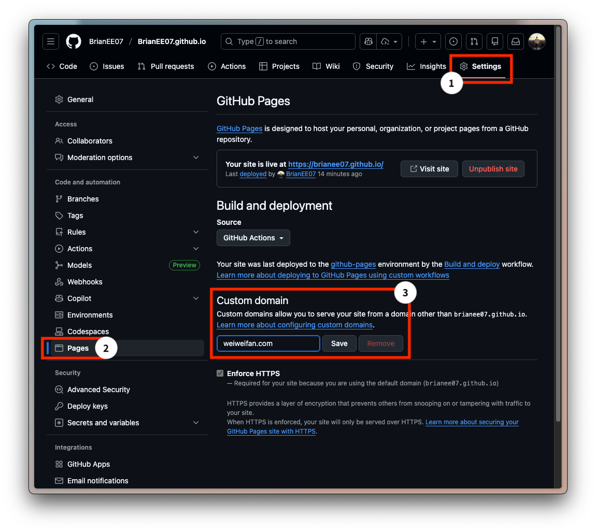

等待 DNS 檢查（通常很快只需幾分鐘），

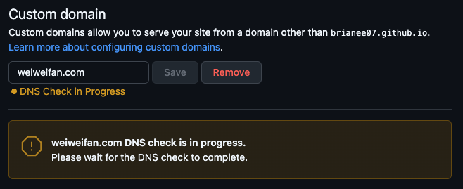

檢查成功！

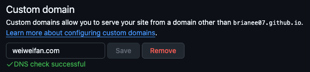

接著勾選 **Enforce HTTPS**，GitHub Pages 會自動向 [Let's Encrypt](https://letsencrypt.org/) 申請免費的 SSL 憑證，不需要自己設定。若暫時無法勾選 `Enforce HTTPS`，稍等一下重新整理頁面；若仍不行，可先清空 **Custom domain** 再重新填入，等待一段時間即可。

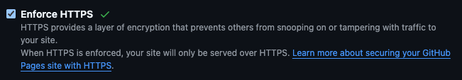

設定完成後，就可以前往 https://weiweifan.com 檢查看看是否正常顯示內容；同時也可確認 https://www.weiweifan.com 是否能正常開啟，兩個網址都應該可以看到網站了！

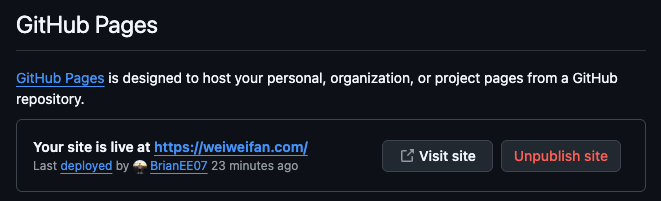

到這一步可以先喘口氣了。基本上只要網域本身不變，即使更換網站架設平台，原本累積的 SEO 成效通常也不會因此直接消失。

> 下一篇將介紹如何設定 **Google Analytics** 與 **Google Search Console**，追蹤靜態網站的流量與使用者行為，並協助 Google 更快且正確地收錄你的網站。
> 
> 👉 [手把手自架個人網站｜Hugo × GitHub Pages – Part 4：Google Analytics 與 Search Console 設定，追蹤流量並讓 Google 正確收錄網站](/posts/self-hosted-website-with-hugo-and-github-pages-part-4/)
