> In the previous article, we finished setting up our own domain name and obtained a dedicated URL for the website.
> 
> 👉 [Hugo × GitHub Pages – Part 3: Custom Domains on GitHub Pages — Buying a Domain from Namecheap and DNS Configuration](/en/posts/self-hosted-website-with-hugo-and-github-pages-part-3/)
> 
> In this article, we’ll continue by adding features that enhance the value of the website: using Google Analytics to track traffic on a static site, and using Google Search Console to help Google index the site more quickly and accurately.

## 1. Google Analytics: Tracking Traffic and Performance


Google Analytics (GA) is a website analytics tool provided by Google. It allows you to track **traffic sources, user behavior, and overall performance**. For static websites, it is one of the most basic and practical tools for understanding how your site is being used.

### Creating Google Analytics (GA4)

First, go to the [Google Analytics page](https://analytics.google.com/analytics/) (you’ll need to sign in with a Google account).

When creating an account, the **Account name** can be anything you like:

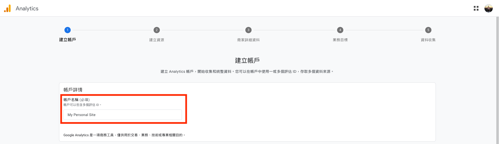

Next, set the **Property name**. Here, I simply used the website’s domain name:

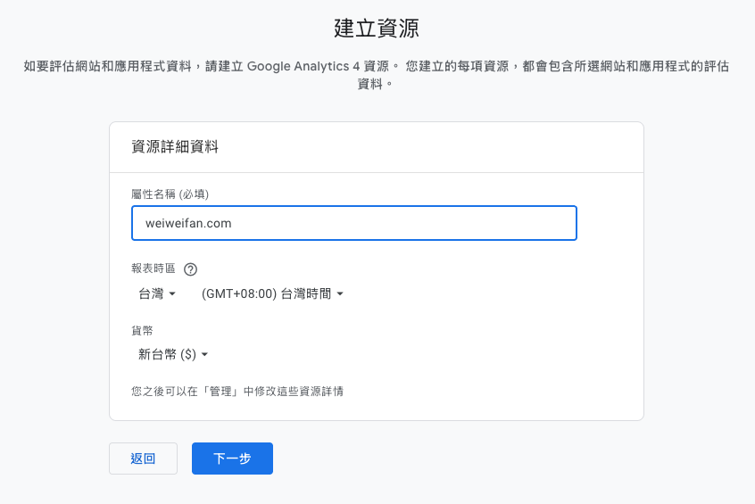

Fill in the remaining settings according to your own situation, and choose **Web** as the platform:

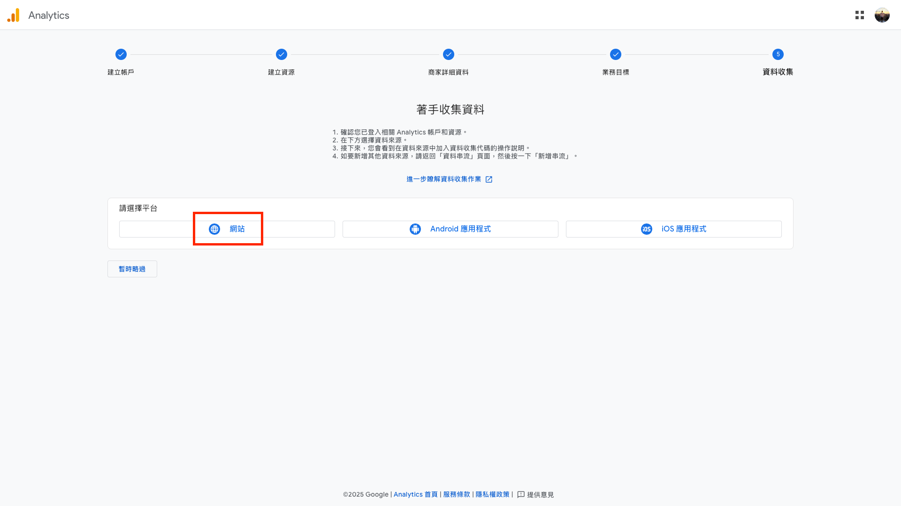

For the **Website URL**, enter your actual site URL. The **Stream name** can also be filled in freely:

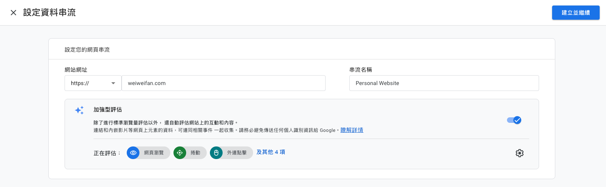

Click **Create and continue** in the top-right corner. You may see a code snippet appear—this can be ignored for now.

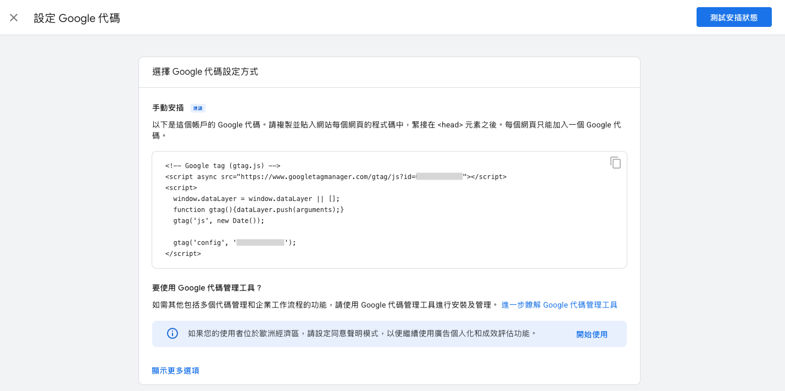

After closing the code screen, you’ll see another page. **What really matters is the “Measurement ID” shown in the top-right corner**, which looks like this:

```
G-XXXXXXXXXX
```

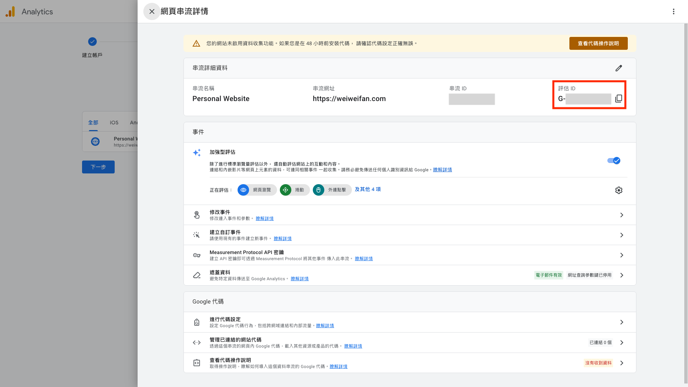

### Adding GA4 to a Hugo Website

Next, we need to add this GA4 Measurement ID to the Hugo site, so that:

> Every time your site is visited, user behavior data is actively sent to Google Analytics 4.

In general, you could manually insert the GA script shown earlier. However, **most Hugo themes already support Google Analytics out of the box**. Using the Blowfish theme as an example, the GA script is automatically inserted into the `<head>` section.

In your Hugo project `mysite/`, you can find the following in `themes/blowfish/layouts/partials/head.html`:

```html
{{/* Analytics */}}
{{ if hugo.IsProduction }}
	{{ partial "analytics/main.html" . }}
{{ end }}
```

Here, `hugo.IsProduction` means:

- Google Analytics is **not loaded** when running `hugo server` locally
- This prevents local testing activity from polluting real GA data

Looking further into `partials/analytics/main.html`, you’ll see the logic that enables GA:

```html
{{ if site.Config.Services.GoogleAnalytics.ID }}
	{{ partial "analytics/ga.html" . }}
{{ end }}
```

And inside `partials/analytics/ga.html`, the actual GA script is already defined:

```html
<script async src="https://www.googletagmanager.com/gtag/js?id={{ site.Config.Services.GoogleAnalytics.ID }}"></script>
<script>
	window.dataLayer = window.dataLayer || [];
	function gtag(){dataLayer.push(arguments);}
	gtag('js', new Date());
	gtag('config', '{{ site.Config.Services.GoogleAnalytics.ID }}');
</script>
```

So after all that, the setup is actually very simple. **We don’t need to modify any theme files**—we just need to provide the GA ID in a configuration file that we control.

With the Blowfish theme, go to the configuration file `hugo.toml` under `config/_default/` (note: not under the `themes/`directory).

Find the following setting, uncomment it, and replace it with your Measurement ID:

```toml
# googleAnalytics = "G-XXXXXXXXX"
```

If you’ve already set up GitHub Actions as described in the [previous article](/en/posts/self-hosted-website-with-hugo-and-github-pages-part-2/), you can now simply push the changes to GitHub and the site will be rebuilt and deployed automatically:

```shell
git add .
git commit -m "add google analytics"
git push
```

### Verifying That GA Is Working

You can confirm that Google Analytics is working by following these steps:

1. Open the GA4 dashboard
2. Open your website in a browser at the same time
3. If you see that **Data collection is enabled** and the **Active users** count is no longer zero, the setup is successful (there may be a 1–2 minute delay)

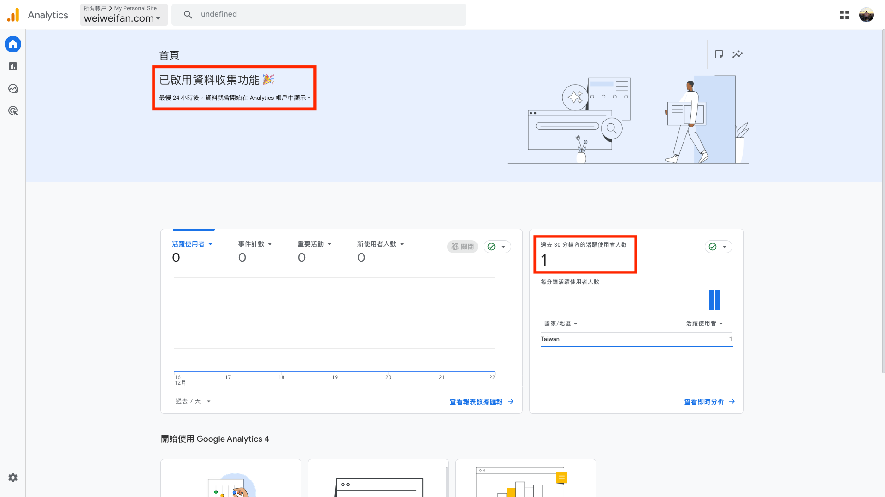

---

## 2. Google Search Console: “Let Google See Your Website”


Google Search Console is a website management tool provided by Google. It allows you to tell Google, “This website belongs to me,” and helps Google understand and index your site content more quickly and accurately. It is a critical part of SEO.

> [!info]- What is SEO?
> SEO (Search Engine Optimization) refers to a set of techniques used to optimize a website’s content and structure so that search engines can better understand and index it, improving its ranking and visibility in search results.

Before setting it up, you can try searching on Google:

```
site:<your-website-url>
```

For example:

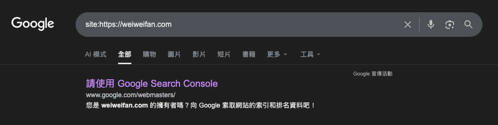

The result may not show your site immediately—especially for a newly launched website. In that case, others also **won’t be able to find your content via Google search**.

Typically, a site may be indexed within a few hours to a few days after launch. By using **Google Search Console**, you can proactively notify Google about your site’s existence and make the indexing process faster and more predictable.

### Creating a Google Search Console Property

Go to the [Google Search Console](https://search.google.com/search-console/about) page and click **Start now**.

When adding a property, you’ll see two options:

- **Domain** (left): Recommended if you use a custom domain and can modify DNS records (e.g., `weiweifan.com`)
- **URL prefix** (right): Use this if you’re still using a `github.io` URL and cannot modify DNS

If you choose **URL prefix**, you can verify ownership quickly using the GA setup from earlier. In my case, since I use a custom domain, I selected **Domain** and completed verification via DNS.

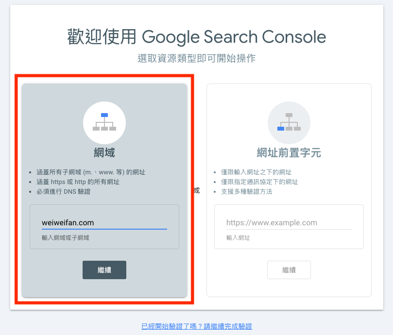

### Verifying Site Ownership (DNS Verification)

After choosing domain verification, Google will provide a **TXT Record**, for example:

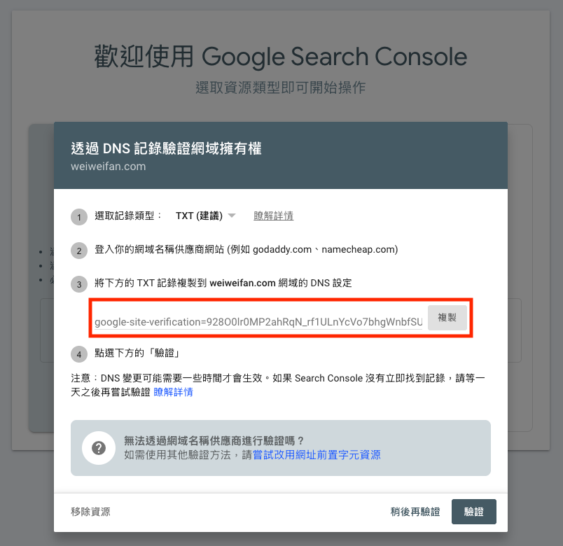

Go to the **Namecheap** domain management dashboard (`Account` → `Dashboard` → `Domain List` → `Advanced DNS`), and use the content you just copied to add a new DNS record:

| Field | Value                           |
| ----- | ------------------------------- |
| Type  | TXT Record                      |
| Host  | `@`                             |
| Value | `google-site-verification=xxxx` |
| TTL   | Auto / 300                      |

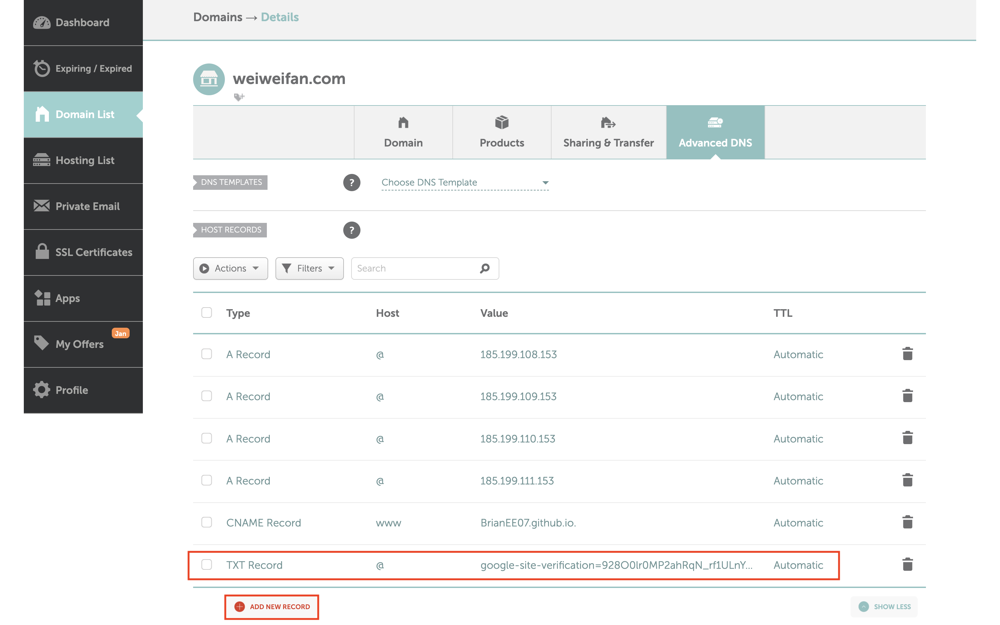

After saving the record, return to Search Console and click **Verify**.

Verification usually takes a few seconds to a few minutes. If it fails, the DNS record may not have propagated yet—wait a bit and try again.

### Submitting sitemap.xml

> [!info]+ What is sitemap.xml? 
> `sitemap.xml` is a structured list of your website’s pages provided for search engines. For example:
> 
> 👉 https://weiweifan.com/sitemap.xml
> 
> Hugo generates this file automatically, usually under `public/sitemap.xml`. By submitting it to Google, you help search engines understand your site structure more quickly.

Once verification is complete, click **Go to property**:

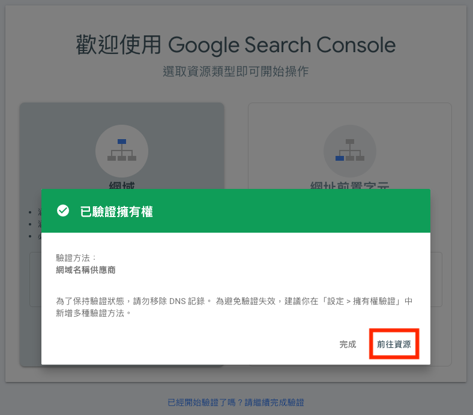

1. In the left menu, select **Sitemap**
2. Add a new sitemap: usually at `<your-website-url>/sitemap.xml`)
3. Click **Submit**

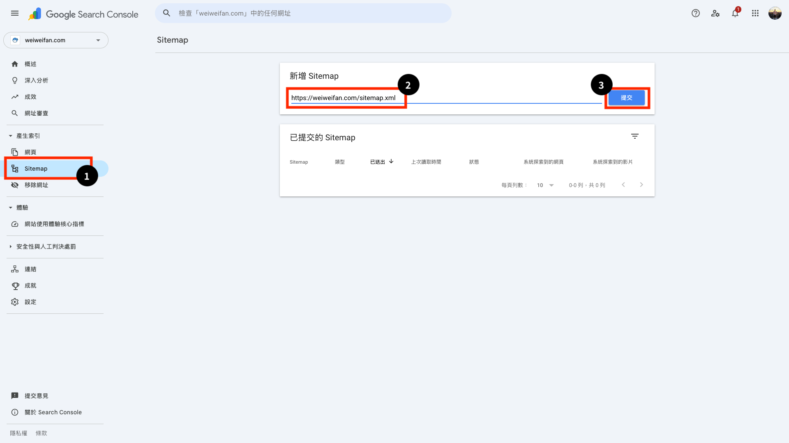

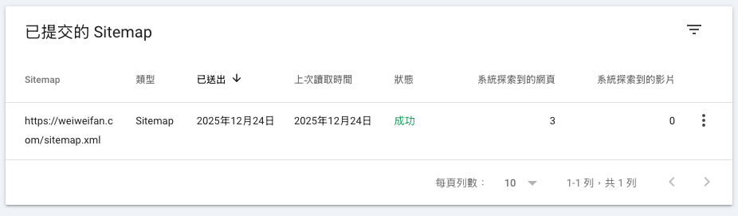

After that, search again on Google:

```
site:<your-website-url>
```

You should now see your site being indexed properly, rather than leaving Google to “search blindly.”

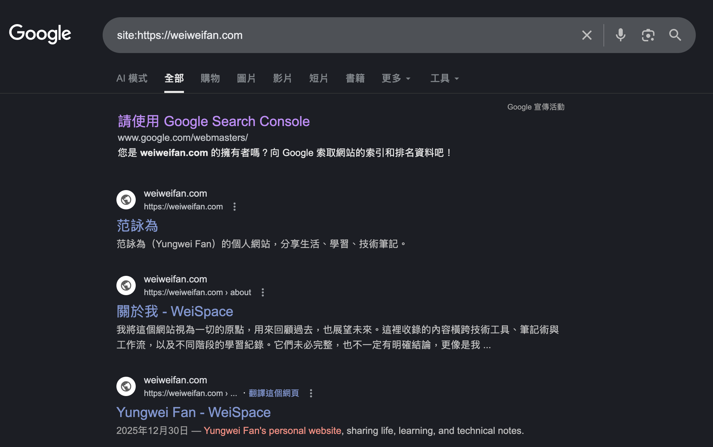

It may still take some time for individual articles to appear in search results—this is normal. You can also use the **URL Inspection** tool to request indexing manually. However, as long as your sitemap is configured correctly, most content will be indexed naturally over time.

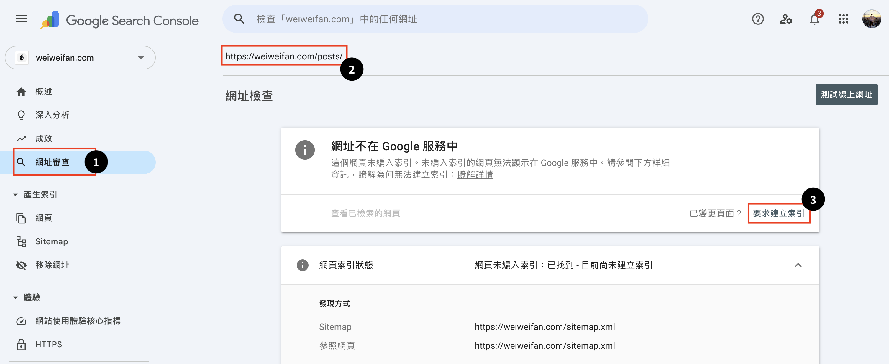

---

## 3. Conclusion

At this point, the basic setup of the website is essentially complete.

From **site creation, deployment, and custom domains to traffic tracking and search engine indexing**, we’ve now walked through the core workflow of a static website from start to finish.

Next, we’ll take a closer look at the Blowfish theme, focusing on interface layout optimizations and introducing more advanced ways to use Hugo.
