> 上一篇文章中，我們把設定好了自己的網域名稱，有了專屬的網址。
> 
> 👉 [手把手自架個人網站｜Hugo × GitHub Pages – Part 3：GitHub Pages 自訂網域，從 Namecheap 購買自己的網路門牌與 DNS 設定教學](/posts/self-hosted-website-with-hugo-and-github-pages-part-3/)
> 
> 本篇將接著介紹為網站加分的功能，用 Google Analytics 追蹤靜態網站的流量，並且用 Google Search Console 協助 Google 快速且正確地收錄網站內容。

## 一、Google Analytics 追蹤流量與成效


Google Analytics（簡稱 GA）是 Google 提供的網站分析工具，可以用來追蹤網站的**流量來源、使用者行為與整體成效**。對於靜態網站來說，它是最基本且實用的流量觀察工具。

### 建立 Google Analytics（GA4）

首先前往 [Google Analytics 頁面](https://analytics.google.com/analytics/)（需登入 Google 帳號）。

建立帳戶時，**「帳戶名稱」** 可以隨便填：

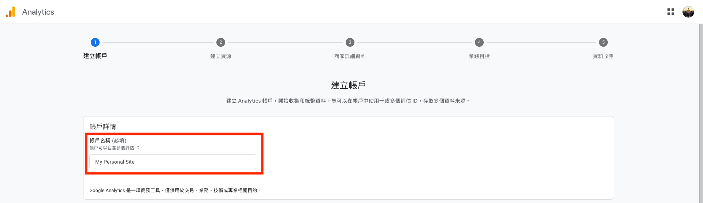

接著設定 **「屬性名稱」**，我這邊直接填寫網站的網域名稱：

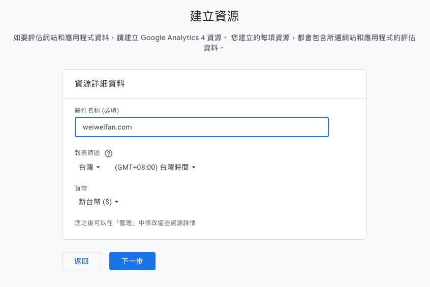

其餘設定依照自己的實際情況填寫即可，平台選擇 **「網站」**：

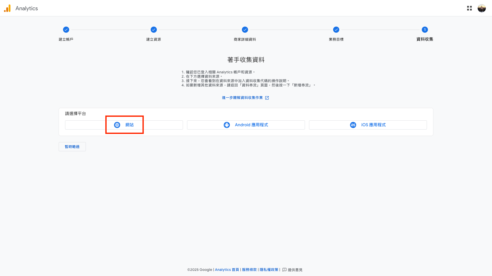

**「網站網址」** 填入你的網站實際網址，**「串流名稱」** 同樣可以隨意填寫：

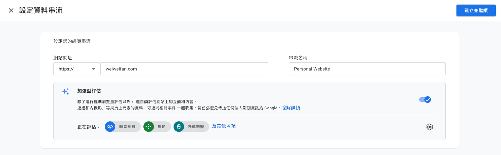

點擊右上角 **「建立並繼續」**，接著可能會跳出一段代碼，先不用理它。

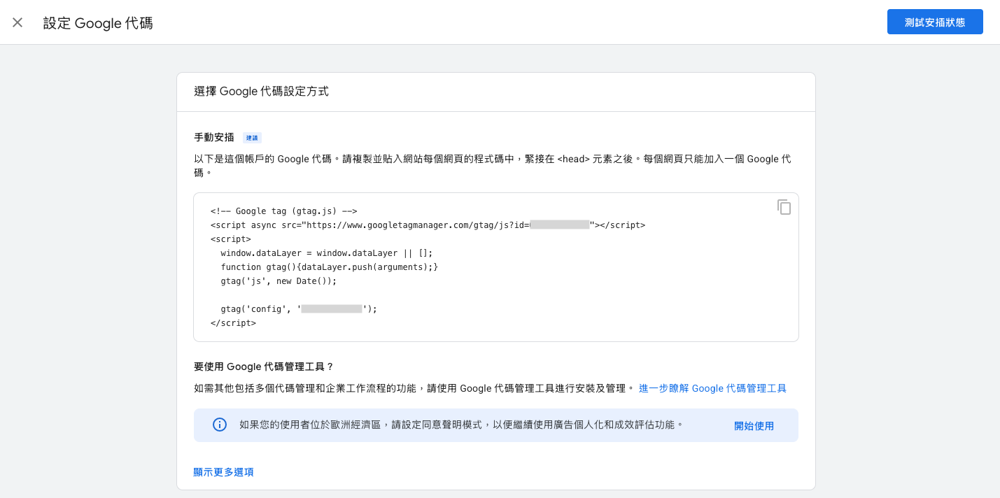

關閉代碼畫面後會跳出另一畫面，**真正重要的是右上角這組「評估 ID」**，格式會像這樣：

```
G-XXXXXXXXXX
```

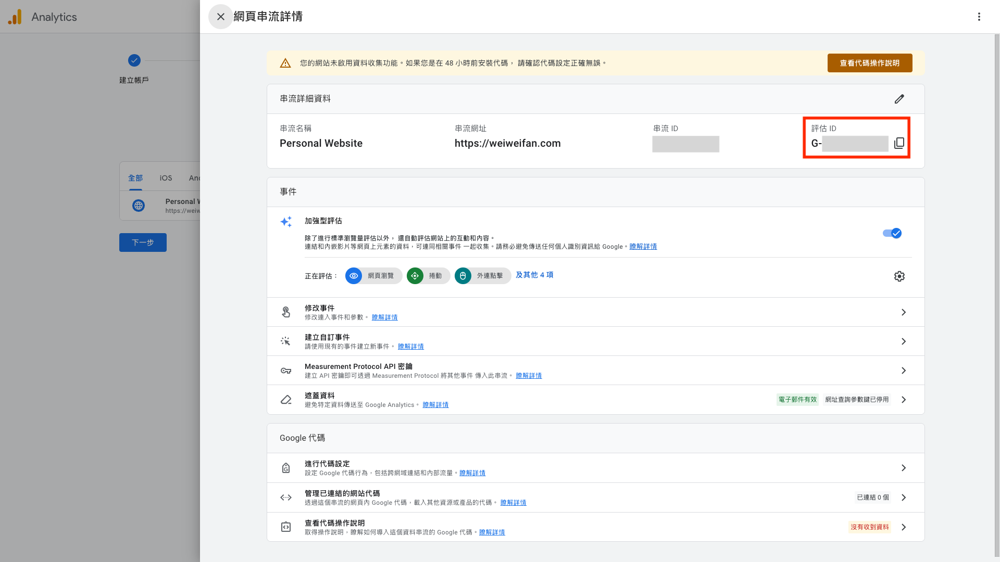

### 將 GA4 加入 Hugo 網站

接下來要把這組 GA4 的評估 ID 加入 Hugo 網站中，為了：

> 讓你的網站在每一次被瀏覽時，主動把「使用者行為資料」回傳給 Google Analytics 4。

一般來說，你可以選擇手動插入剛剛那段 GA 程式碼，但**多數 Hugo 主題其實已經內建支援**。以我使用的 Blowfish 主題為例，GA 程式碼會自動插入在 `<head>` 中。

回到 Hugo 專案 `mysite/`，可以看到 `themes/blowfish/layouts/partials/head.html` 裡面有：

```html
{{/* Analytics */}}
{{ if hugo.IsProduction }}
	{{ partial "analytics/main.html" . }}
{{ end }}
```

這裡的 `hugo.IsProduction` 表示：

- 使用 `hugo server` 本地預覽時**不會載入 GA**    
- 避免本機測試行為污染正式的 GA 數據

再往下查看 `partials/analytics/main.html` 會看到 GA 的判斷邏輯：

```html
{{ if site.Config.Services.GoogleAnalytics.ID }}
	{{ partial "analytics/ga.html" . }}
{{ end }}
```

再去看 `partials/analytics/ga.html`，就會發現實際的 GA 程式碼也早已寫好：

```html
<script async src="https://www.googletagmanager.com/gtag/js?id={{ site.Config.Services.GoogleAnalytics.ID }}"></script>
<script>
	window.dataLayer = window.dataLayer || [];
	function gtag(){dataLayer.push(arguments);}
	gtag('js', new Date());
	gtag('config', '{{ site.Config.Services.GoogleAnalytics.ID }}');
</script>
```

所以講了這麼多，其實很簡單，我們**不需要改動主題檔案**，只要在自己可控的設定檔中填入 GA ID 即可。

以 Blowfish 主題為例，請到 `config/_default/` 底下的設定檔 `hugo.toml`（注意不是 `themes/` 目錄）：

找到以下設定，取消註解並填入剛剛的評估 ID：

```toml
# googleAnalytics = "G-XXXXXXXXX"
```

如果已經照[先前文章](/posts/self-hosted-website-with-hugo-and-github-pages-part-2/)設定好 GitHub Actions，這時只要推送到 GitHub，網站就會自動重新編譯跟部署：

```shell
git add .
git commit -m "add google analytics"
git push
```

### 驗證 GA 是否成功載入

可以用以下方式確認 GA 是否正常運作：

1. 開啟 GA4 後台
2. 同時打開你的網站
3. 若看到 **「已啟用資料收集功能」** 且 **「過去活躍使用者人數」** 不再是 0，即代表設定成功（有時會延遲 1～2 分鐘）

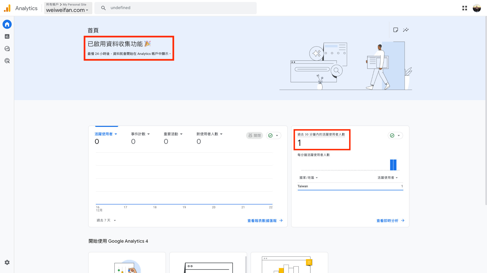

---

## 二、Google Search Console：「讓 Google 看到你的網頁」


Google Search Console 是 Google 提供的網站管理工具，可以用來告訴 Google：「這個網站是我的」，並協助 Google 更快、更正確地理解與收錄你的網站內容，是 SEO 中非常關鍵的一環。

> [!info]- SEO 是什麼？
> SEO（Search Engine Optimization，搜尋引擎最佳化）是一系列優化網站內容與結構的方法，讓網站更容易被搜尋引擎理解與收錄，提升搜尋結果中的排名與曝光度。

在設定之前，你可以先在 Google 搜尋：

```
site:<你的網站網址>
```

像是：

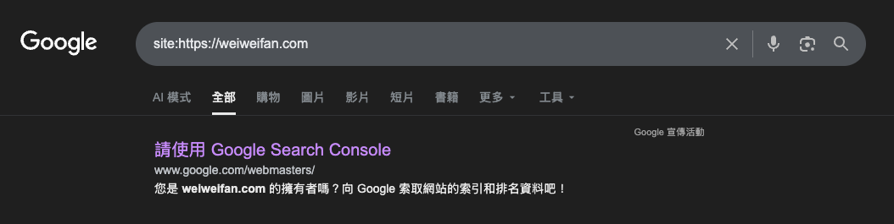

搜尋結果不一定會立刻出現你的網站，尤其是剛上線的新網站，Google 可能尚未完成收錄，其他人自然也**無法透過搜尋找到你的內容**。

一般來說，網站上線後數小時到數天內可能就會被收錄；而透過 **Google Search Console**，可以主動告訴 Google 網站的存在，讓收錄流程更快也更可控。

### 建立 Google Search Console 資源

前往 [Google Search Console](https://search.google.com/search-console/about)，點擊 **「立即開始」**。

在新增資源時，有兩種選擇：

- **網域**（左側）：若你有自訂網域，且可修改 DNS（例如 `weiweifan.com`），建議選這個
- **網址前置字元**（右側）：若仍使用 `github.io` 網址，且無法自行修改 DNS，請選這個

若選擇 **「網址前置字元」**，可以直接使用剛剛設定的 GA 驗證，快速通過驗證流程；而我因為使用的是自訂網域，所以選左側的 **「網域」**，並透過 DNS 驗證來完成設定。

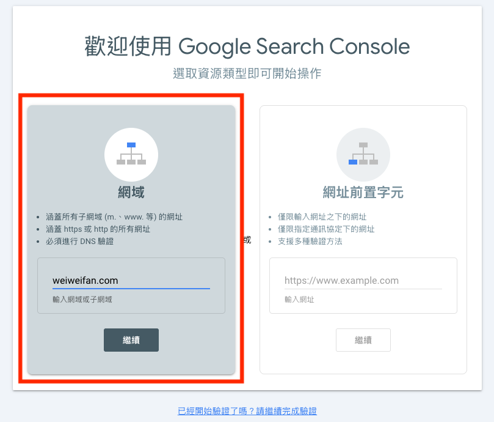

### 驗證網站擁有權（DNS 驗證）

選擇網域驗證後，Google 會提供一組 **TXT Record**，例如：

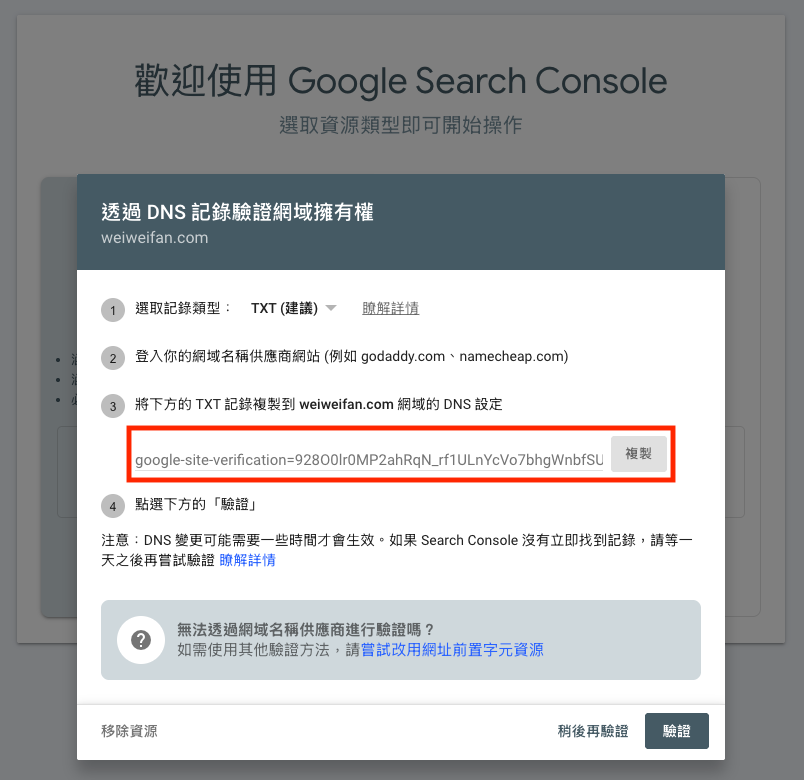

到域名供應商 **Namecheap** 的後台（`Account` → `Dashboard` → `Domain List` → `Advanced DNS`），用剛剛複製的內容，新增一筆 DNS 記錄：

| **欄位** | **填寫內容**                        |
| ------ | ------------------------------- |
| Type   | TXT Record                      |
| Host   | `@`                             |
| Value  | `google-site-verification=xxxx` |
| TTL    | Auto / 300                      |

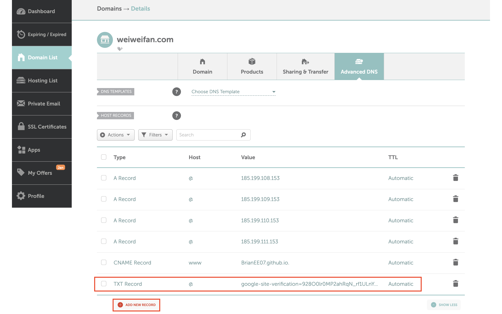

儲存後，回到 Search Console 點擊 **「驗證」**。

驗證通常只需幾秒到幾分鐘；若失敗，可能是 DNS 尚未生效，稍等一段時間再試即可。

### 提交 sitemap.xml

> [!info]+ 什麼是 sitemap.xml？
> `sitemap.xml` 是一份提供給搜尋引擎的網站結構清單，例如：
> 
> 👉 https://weiweifan.com/sitemap.xml
> 
> Hugo 會自動產生這個檔案，通常位於 `public/sitmap.xml`，而我們把這份 sitemap 主動提交給 Google，讓搜尋引擎更快理解整個網站的內容。

驗證完成後，點擊「前往資源」：

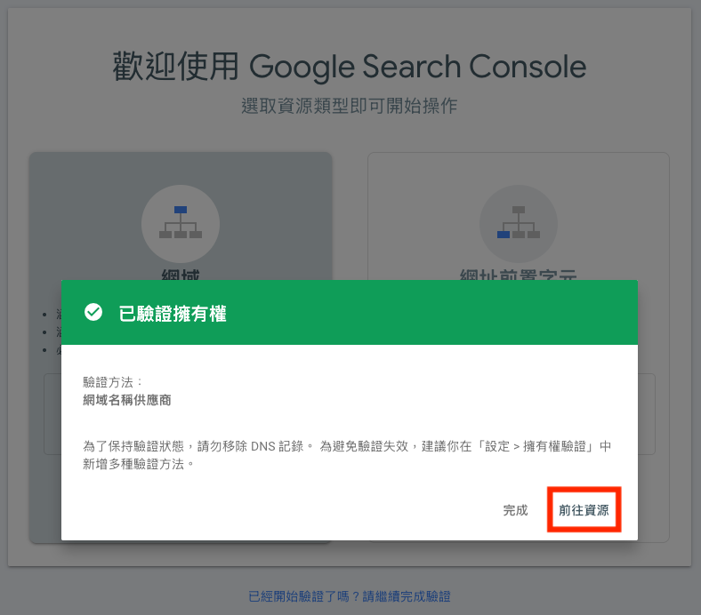

1. 左側選單 → **Sitemap**
2. 新增 Sitemap：通常在 `<你的網站網址>/sitemap.xml`
3. 點擊**提交**

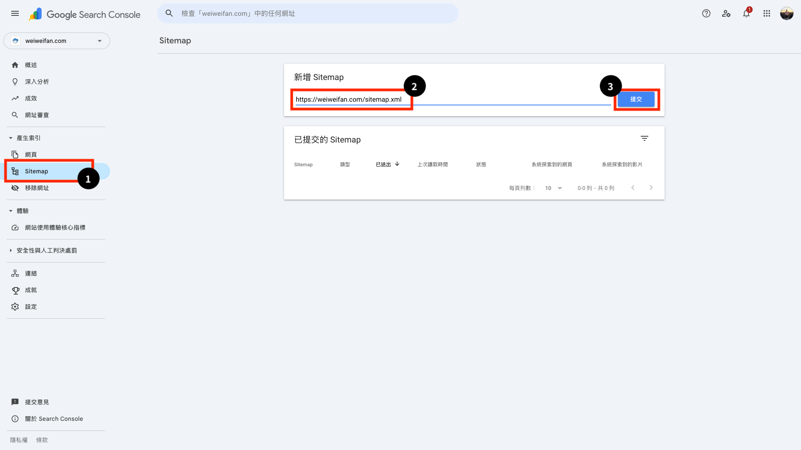

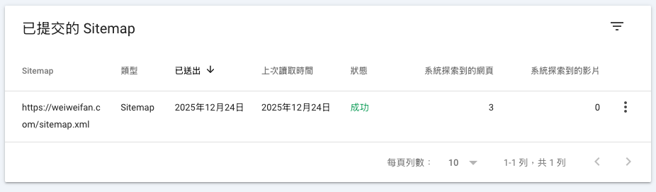

之後再回到 Google 搜尋：

```
site:<你的網站網址>
```

可以看到網站已被正確收錄，而不是讓 Google 自行「大海撈針」。

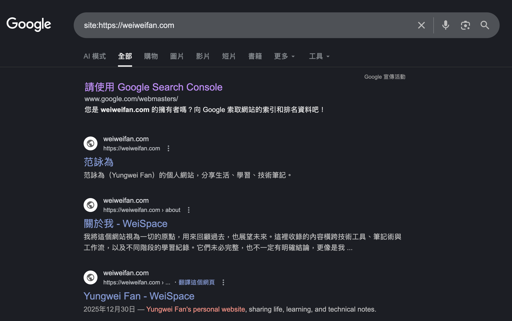

實際文章的收錄仍可能需要一些時間，這屬於正常現象。你也可以透過 **「網址審查」** 功能主動要求建立索引；不過只要 sitemap 設定正常，多數內容都會隨時間自然被收錄。

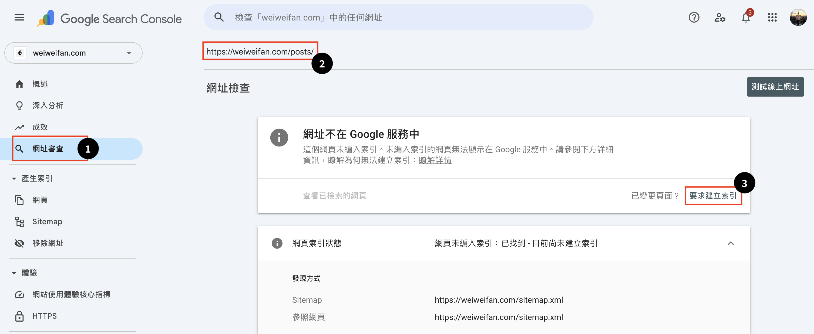

---

## 三、結語

到這裡為止，網站的基本設定其實已經差不多完成了。

從**架站、部署、自訂網域，到流量追蹤與搜尋引擎收錄**，整個靜態網站最核心的一條流程都已經跑過一遍。

接下來，我將針對 Blowfish 主題進一步帶你優化介面排版，並介紹 Hugo 的一些進階使用方式。
